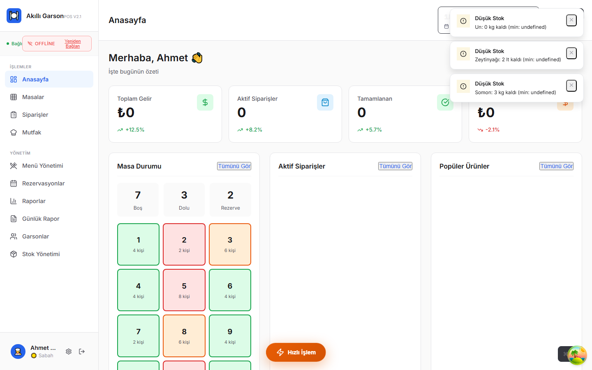
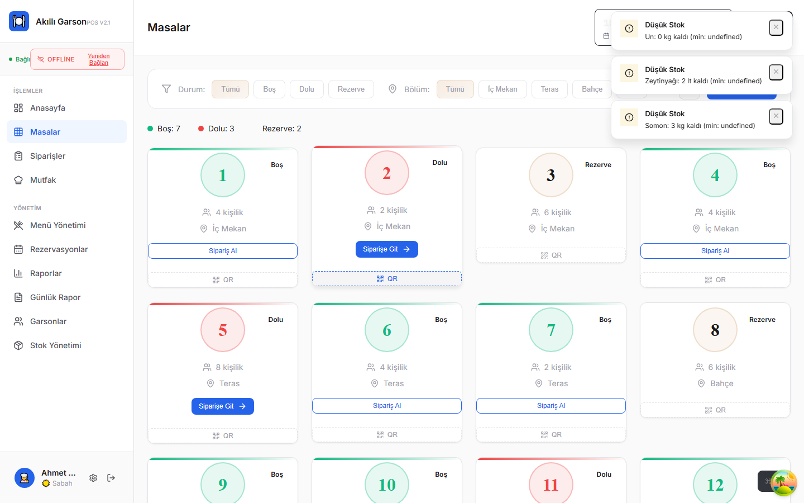
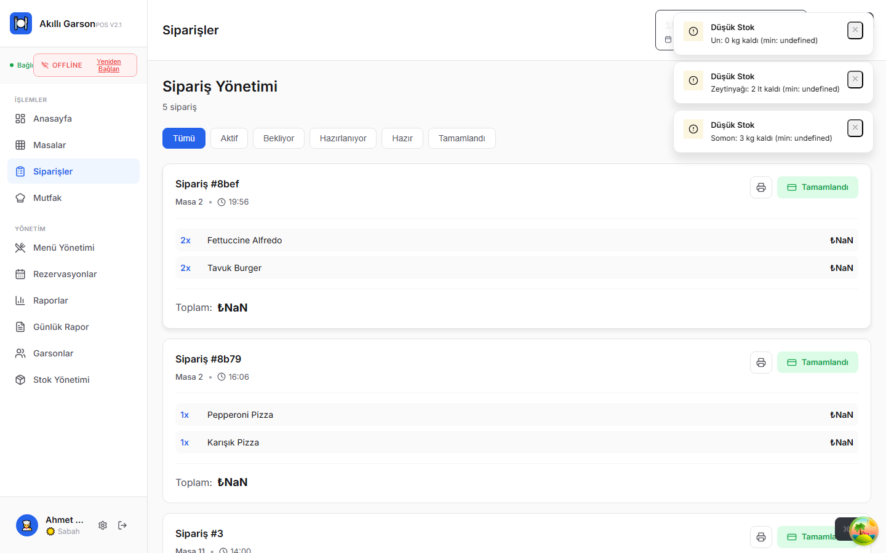
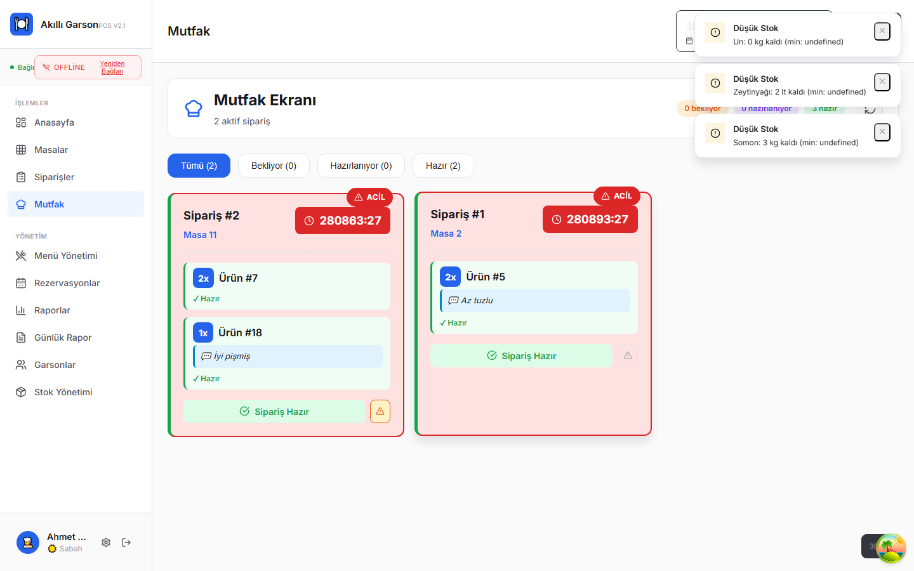
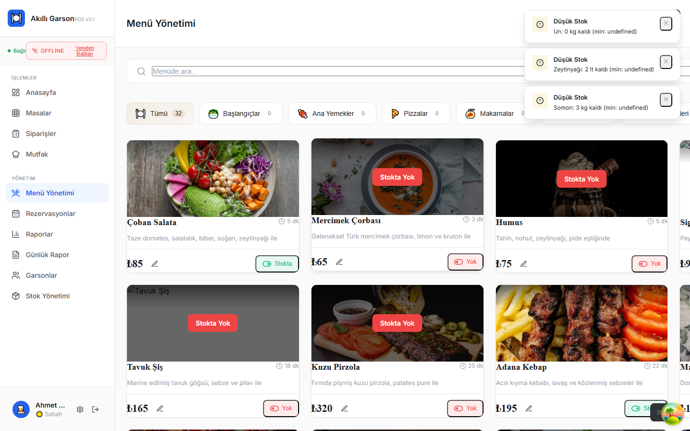
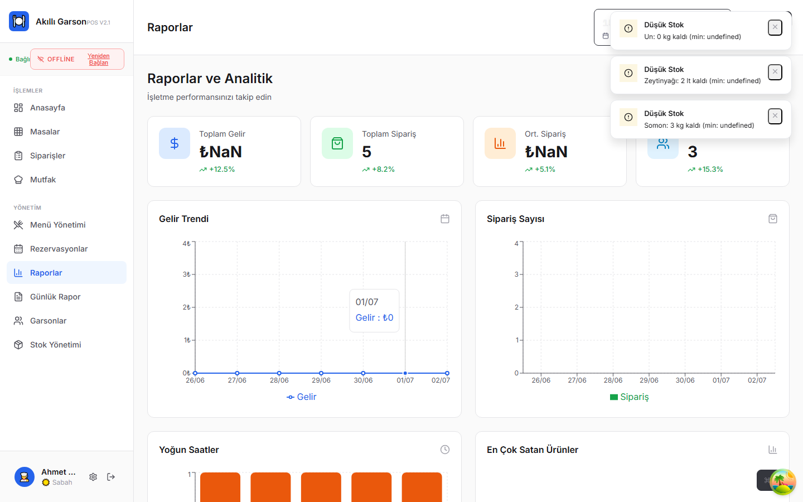
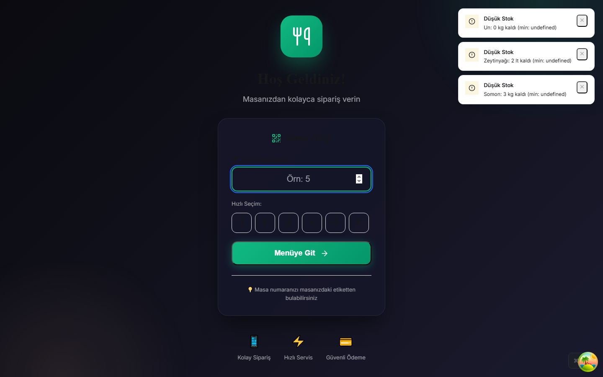
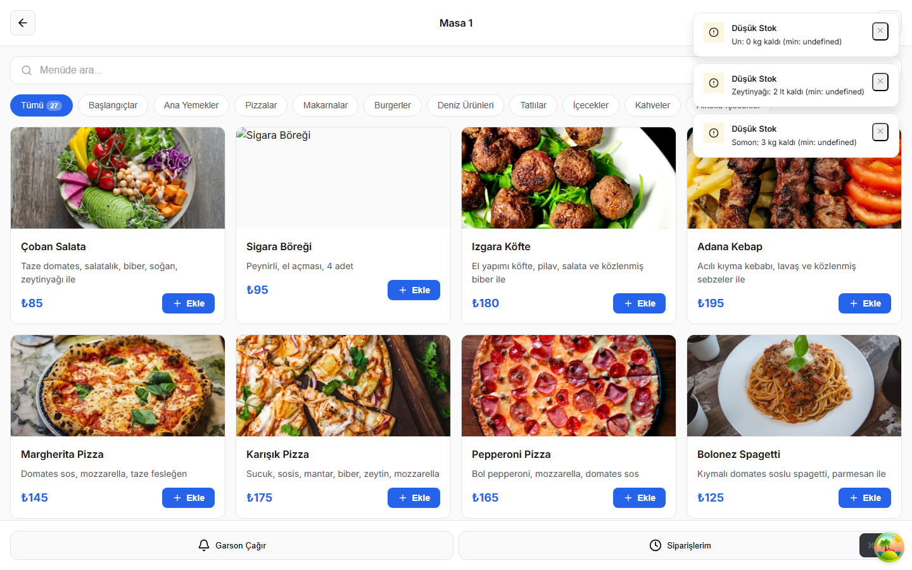
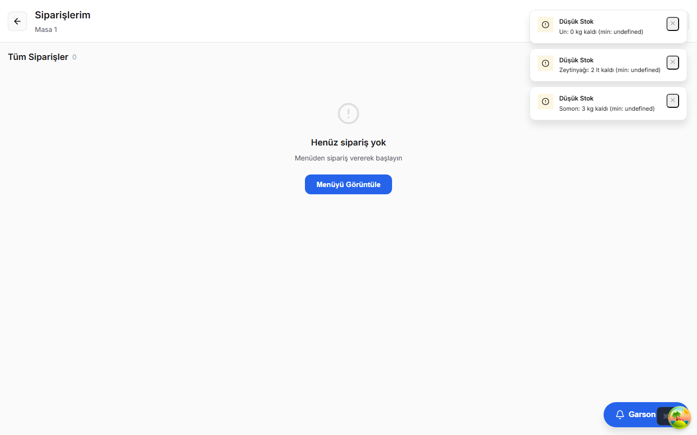
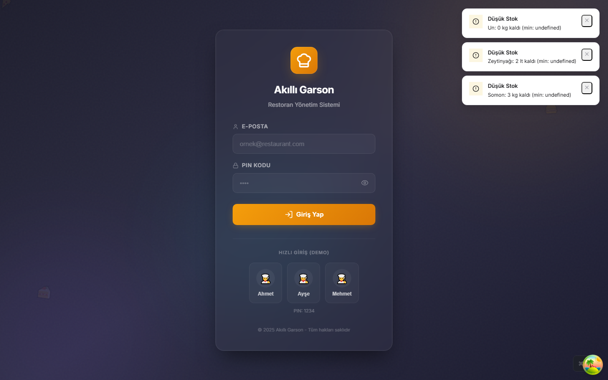

# Akıllı Garson

Modern, web tabanlı restoran POS (Point of Sale) ve sipariş yönetim sistemi.


---

## Projenin Amacı

**Akıllı Garson**, restoran ve kafe işletmelerinin günlük operasyonlarını dijitalleştirmek için geliştirilmiş bir yönetim platformudur.

Sistem; garson, mutfak, yönetici ve müşteri ihtiyaçlarını tek bir uygulamada birleştirir:

- **Personel paneli** — masa yönetimi, sipariş alma, ödeme, mutfak ekranı, rezervasyon, stok ve raporlama
- **Müşteri paneli** — QR kod ile menü görüntüleme, self-servis sipariş ve sipariş takibi
- **Gerçek zamanlı bildirimler** — WebSocket ile anlık sipariş, masa ve garson çağrısı güncellemeleri

Proje; KOBİ ölçekli restoranlar için hızlı kurulum, modern arayüz ve düşük maliyetli dijital dönüşüm hedefiyle tasarlanmıştır. Mevcut sürüm **MVP / demo** seviyesindedir; detaylı teknik raporlar için [`docs/`](./docs/) klasörüne bakabilirsiniz.

### Temel Yetenekler

| Modül | Açıklama |
|-------|----------|
| Dashboard | Canlı istatistikler, hızlı aksiyonlar, aktivite akışı |
| Masalar | Durum takibi, QR kod, transfer ve birleştirme |
| Siparişler | Ödeme, indirim, bahşiş, hesap bölme |
| Mutfak (KDS) | Sipariş hazırlama ve durum güncelleme |
| Menü & Stok | Ürün CRUD, envanter, düşük stok uyarıları |
| Rezervasyon | Masa atama ve durum entegrasyonu |
| Raporlar | Analytics, günlük rapor, CSV export |
| Müşteri QR Menü | Self-servis sipariş ve garson çağırma |

### Rol Yapısı

| Rol | Erişim |
|-----|--------|
| **Admin** | Tüm modüller |
| **Garson** | Masalar, siparişler, mutfak, menü, rezervasyon |
| **Mutfak** | Yalnızca mutfak ekranı |

---

## Kullanılan Teknolojiler

### Frontend

| Teknoloji | Kullanım |
|-----------|----------|
| [React 18](https://react.dev/) | UI framework |
| [Vite 6](https://vitejs.dev/) | Build tool ve dev server |
| [React Router 7](https://reactrouter.com/) | Sayfa yönlendirme |
| [TanStack Query 5](https://tanstack.com/query) | Sunucu state, cache, mutation |
| [Zustand 5](https://zustand-demo.pmnd.rs/) | Global client state |
| [Axios](https://axios-http.com/) | HTTP istemcisi |
| [Framer Motion](https://www.framer.com/motion/) | Animasyonlar |
| [Recharts](https://recharts.org/) | Grafikler ve analytics |
| [Lucide React](https://lucide.dev/) | İkon seti |
| [react-hot-toast](https://react-hot-toast.com/) | Bildirimler |
| [qrcode](https://www.npmjs.com/package/qrcode) | QR kod üretimi |

### Backend & Altyapı

| Teknoloji | Kullanım |
|-----------|----------|
| [json-server](https://github.com/typicode/json-server) | Mock REST API |
| [ws](https://github.com/websockets/ws) | WebSocket sunucusu |
| [lowdb](https://github.com/typicode/lowdb) | JSON dosya tabanlı veri |
| [concurrently](https://www.npmjs.com/package/concurrently) | Paralel dev script |

### Geliştirme Araçları

| Teknoloji | Kullanım |
|-----------|----------|
| [Playwright](https://playwright.dev/) | E2E test (planlanıyor) |
| PWA | `manifest.webmanifest` + service worker |

---

## Ekran Görüntüleri

> Yeniden almak için: `npm run screenshots` (API + frontend çalışırken)

### Personel Paneli

| Dashboard | Masalar | Siparişler |
|:---------:|:-------:|:----------:|
|  |  |  |

| Mutfak | Menü | Raporlar |
|:------:|:----:|:--------:|
|  |  |  |

### Müşteri Paneli

| QR Giriş | Menü | Sipariş Takibi |
|:--------:|:----:|:--------------:|
|  |  |  |

### Giriş Ekranı



---

## Kurulum

### Gereksinimler

- **Node.js** 18 veya üzeri
- **npm** 9 veya üzeri

### Adımlar

```bash
# 1. Repoyu klonlayın
git clone https://github.com/KULLANICI/akilli-garson.git
cd akilli-garson

# 2. Bağımlılıkları yükleyin
npm install

# 3a. API + Frontend birlikte (önerilen)
npm run dev:all

# 3b. Veya ayrı terminallerde
npm run server   # API + WebSocket → http://localhost:3001
npm run dev      # Frontend         → http://localhost:5173
```

### Demo Giriş Bilgileri

Tüm hesaplar için PIN: **`1234`**

| Email | Rol |
|-------|-----|
| ahmet@restaurant.com | Admin |
| ayse@restaurant.com | Garson |
| mehmet@restaurant.com | Mutfak |

### Müşteri Paneli

Tarayıcıda açın: `http://localhost:5173/customer?table=1`

### Production Build

```bash
npm run build
npm run preview
```

### Ortam Değişkenleri (Opsiyonel)

```env
VITE_API_URL=http://localhost:3001
VITE_WS_URL=ws://localhost:3001/ws
```

---

## Yol Haritası

Detaylı plan için [`docs/YOL-HARITASI.md`](./docs/YOL-HARITASI.md) dosyasına bakın.

| Faz | Konu | Durum |
|-----|------|-------|
| **Mevcut (v2.0)** | MVP — UI, mock API, RBAC, QR menü, ödeme modalı | ✅ Tamamlandı |
| **Faz 1** | Production backend, PostgreSQL, JWT auth, multi-tenant | 🔲 Planlandı |
| **Faz 2** | Termal yazıcı, POS entegrasyonu, offline mod, vardiya | 🔲 Planlandı |
| **Faz 3** | Yazar kasa / ÖKC, e-Fatura, KVKK uyumu | 🔲 Planlandı |
| **Faz 4** | SaaS abonelik, multi-şube, E2E testler, onboarding | 🔲 Planlandı |
| **Faz 5** | Sadakat, SMS/e-posta, platform entegrasyonları | 🔲 Planlandı |

### Kısa Vadeli Hedefler

- [ ] Playwright E2E test suite
- [ ] Vite proxy ve `.env.example`
- [ ] Tam i18n kapsamı (TR / EN)
- [ ] Production backend geçişi

---

## İletişim

| | |
|---|---|
| **Proje** | Akıllı Garson |
| **E-posta** | info@akilligarson.com |
| **GitHub** | [github.com/KULLANICI/akilli-garson](https://github.com/KULLANICI/akilli-garson) |
| **Dokümantasyon** | [`docs/PROJE-RAPORU.md`](./docs/PROJE-RAPORU.md) |

Sorular, öneriler veya katkılar için issue açabilir veya pull request gönderebilirsiniz.

---

## Lisans

Bu proje [MIT](./LICENSE) lisansı altında lisanslanmıştır.

---

## Dokümantasyon

| Dosya | İçerik |
|-------|--------|
| [`docs/PROJE-RAPORU.md`](./docs/PROJE-RAPORU.md) | Panel envanteri, özellikler, riskler |
| [`docs/TEKNIK-DURUM.md`](./docs/TEKNIK-DURUM.md) | Teknik altyapı ve eksikler |
| [`docs/YOL-HARITASI.md`](./docs/YOL-HARITASI.md) | Fazlar, öncelikler, milestone'lar |
