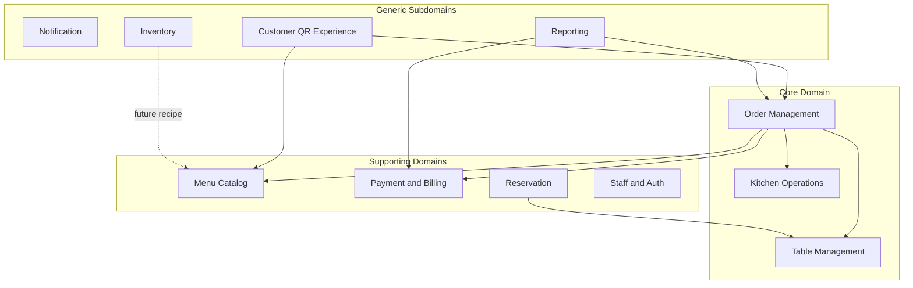

# Akıllı Garson — Domain Model Analizi

**Tarih:** 2 Temmuz 2026  
**Versiyon:** 1.0.0  
**Perspektif:** Software Architect / Domain Driven Design (DDD)  
**Kaynak:** `db.json`, `server/index.js`, `src/api/`, React sayfaları, hook katmanı, mevcut teknik dokümantasyon

---

## Yönetici Özeti

Akıllı Garson, **tek restoran varsayımıyla** çalışan masa bazlı dine-in POS ve QR self-servis sistemidir. Modül kapsamı geniş ve operasyonel ihtiyaçları iyi yansıtır; ancak domain modeli **anemic JSON CRUD + frontend iş kuralları** yapısındadır.

En kritik mimari sorunlar:

1. `Order` ile `KitchenOrder` kopuk iki aggregate (split brain)
2. Masa başına tek aktif hesap invariant'ı uygulanmıyor
3. Tutar alanları tutarsız (`total` / `totalAmount` / `finalTotal`)
4. İş kuralları sunucuda değil, React hook ve sayfalarında
5. `Restaurant` / tenant kök aggregate'i yok — SaaS'a hazır değil

---

## 1. Domain Analizi

### 1.1 Sipariş Yönetimi — Çekirdek Domain

| Özellik | Değerlendirme |
|---------|---------------|
| Kapsam | Sipariş oluşturma, durum makinesi, transfer/birleştirme, iptal, ödeme sonrası kapanış |
| Kod | `useOrders.js`, `Orders.jsx`, `TableOrder.jsx`, `CustomerMenu.jsx` |
| Durum | En yoğun iş mantığı burada; kurallar dağınık |
| Risk | `kitchenOrders` ile otomatik senkron yok |

### 1.2 Masa Yönetimi

| Özellik | Değerlendirme |
|---------|---------------|
| Kapsam | Durum (`available \| occupied \| reserved`), bölüm, kapasite, garson ataması, QR |
| Kod | `Tables.jsx`, `TableOrder.jsx`, `useTables.js` |
| Risk | Masa durumu sipariş/rezervasyon/ödeme hook'larından bağımsız PATCH ediliyor |

### 1.3 Menü Yönetimi

| Özellik | Değerlendirme |
|---------|---------------|
| Kapsam | Kategori, ürün, fiyat, availability, alerjen, hazırlık süresi |
| Kod | `Menu.jsx`, `menuApi`, `useMenu.js` |
| Eksik | Stok (`inventory`) ve reçete bağlantısı yok |

### 1.4 Mutfak Operasyonları (KDS)

| Özellik | Değerlendirme |
|---------|---------------|
| Kapsam | Mutfak ekranı, kalem bazlı durum, öncelik |
| Kod | `Kitchen.jsx`, `useKitchen.js`, `kitchenOrders` koleksiyonu |
| Risk | Sipariş oluşturulunca mutfak kaydı otomatik üretilmiyor |

### 1.5 Ödeme

| Özellik | Değerlendirme |
|---------|---------------|
| Kapsam | Nakit/kart/online, bahşiş, indirim, split payment, iade |
| Kod | `usePayments.js`, `Orders.jsx` ödeme modalı |
| Eksik | KDV dökümü, ÖKC, yasal fiş, Z raporu |

### 1.6 Rezervasyon

| Özellik | Değerlendirme |
|---------|---------------|
| Kapsam | Müşteri bilgisi, tarih/saat, masa atama, onay/iptal |
| Kod | `Reservations.jsx`, `useReservations.js` |
| Eksik | Zaman çakışması kontrolü, otomatik masa geçişi |

### 1.7 Personel (Waiters → Employee)

| Özellik | Değerlendirme |
|---------|---------------|
| Kapsam | Admin, garson, mutfak rolleri; masa ataması |
| Kod | `Waiters.jsx`, `useAuth.js`, `usePermissions.js` |
| Sorun | Entity adı yanıltıcı; RBAC yalnızca frontend'de |

### 1.8 Stok

| Özellik | Değerlendirme |
|---------|---------------|
| Kapsam | Hammadde miktarı, min stok, düşük stok uyarısı |
| Kod | `Inventory.jsx`, `useInventory.js` |
| Eksik | Sipariş → otomatik stok düşümü, reçete modeli |

### 1.9 Bildirim

| Özellik | Değerlendirme |
|---------|---------------|
| Katman 1 | `notifications` koleksiyonu (persisted) |
| Katman 2 | `NotificationProvider` (client-side polling) |
| Sorun | İki paralel bildirim modeli; domain event yok |

### 1.10 QR Müşteri Deneyimi

| Özellik | Değerlendirme |
|---------|---------------|
| Kapsam | QR/masa no giriş, menü, sepet, sipariş, garson çağırma, takip |
| Kod | `CustomerLogin.jsx`, `CustomerMenu.jsx`, `CustomerOrders.jsx` |
| Sorun | Oturum `localStorage`; Customer entity yok; güvenlik zayıf |

### 1.11 Raporlama / Analitik

| Özellik | Değerlendirme |
|---------|---------------|
| Kapsam | Dashboard, analytics, günlük rapor |
| Sorun | `dailyStats` demo veri; gerçek rapor orders'dan client-side hesaplanıyor |

### 1.12 Ayarlar / Konfigürasyon

| Özellik | Değerlendirme |
|---------|---------------|
| Kapsam | `settings` singleton: restoran adı, KDV, servis ücreti, çalışma saatleri |
| Sorun | Restaurant root entity değil; UI çoğunlukla client tercihleri |

---

## 2. Entity Analizi

### 2.1 Table (Masa)

**Sorumluluk:** Fiziksel oturma birimi; operasyonel durum taşıyıcısı.

**Kullanıldığı yerler:** `Tables.jsx`, `TableOrder.jsx`, `Reservations.jsx`, `Orders.jsx`, `CustomerLogin.jsx`

**İlişkili entity'ler:** Waiter (N:1), Order (1:N), Reservation (1:N), ServiceCall (1:N)

| Alan kategorisi | Detay |
|-----------------|-------|
| Mevcut alanlar | `id`, `number`, `capacity`, `status`, `section`, `waiterId` |
| Eksik alanlar | `restaurantId`, `activeOrderId`, `qrToken`, floor plan pozisyonu, `version` |
| Gereksiz alanlar | `waiterId` + `waiters.tablesAssigned` çift yönlü denormalizasyon |
| Gelecek alanlar | `zoneId`, `deviceBindings[]`, `lastOccupiedAt`, `currentGuestCount` |

---

### 2.2 Order (Sipariş / Hesap)

**Sorumluluk:** Masaya bağlı ticari işlem aggregate'i.

**Kullanıldığı yerler:** Tüm sipariş ekranları, dashboard, raporlar

**İlişkili entity'ler:** Table, Waiter, OrderItem[], Payment (1:N), KitchenOrder (kopuk)

| Alan kategorisi | Detay |
|-----------------|-------|
| Mevcut alanlar | `id`, `tableId`, `waiterId`, `items[]`, `status`, `priority`, `totalAmount`, `discount`, `notes`, `createdAt` |
| Eksik alanlar | Tutarlı `subtotal/taxAmount/serviceCharge/discountAmount`, `source`, `channel`, `closedAt`, `version`, `restaurantId` |
| Gereksiz/karışık | `total` vs `totalAmount` vs `finalTotal`; `discount` bazen yüzde bazen tutar |
| Gelecek alanlar | `splitBillGroupId`, `loyaltyCustomerId`, `externalOrderId`, `fiscalReceiptId` |

**Durum değerleri:** `pending`, `preparing`, `ready`, `served`, `completed`, `cancelled`, `paid`

---

### 2.3 OrderItem (Gömülü Entity / Value Object)

**Sorumluluk:** Sipariş kalemi.

| Alan kategorisi | Detay |
|-----------------|-------|
| Mevcut alanlar | `menuItemId`, `quantity`, `notes`, `status` (opsiyonel), `price` (opsiyonel) |
| Eksik alanlar | `unitPrice` snapshot, `lineTotal`, `modifiers[]`, `taxRate`, `kitchenStationId`, benzersiz `lineId` |
| Sorun | Kalem `status` hem Order hem KitchenOrder'da — duplicate state |
| Tip tutarsızlığı | `menuItemId` bazen number bazen string |

---

### 2.4 Category

**Sorumluluk:** Menü gruplama ve sıralama.

**Mevcut alanlar:** `id`, `name`, `icon`, `color`, `order`

**İlişki:** → MenuItem (1:N)

---

### 2.5 MenuItem

**Sorumluluk:** Satılabilir ürün.

**Mevcut alanlar:** `id`, `categoryId`, `name`, `description`, `price`, `image`, `preparationTime`, `isAvailable`, `calories`, `allergens`

| Alan kategorisi | Detay |
|-----------------|-------|
| Eksik alanlar | `sku`, `costPrice`, `taxCategory`, `kitchenStationId`, `modifiers[]`, `branchOverrides[]` |
| Gelecek alanlar | Reçete bağlantısı (Inventory N:N) |

---

### 2.6 Payment

**Sorumluluk:** Tahsilat kaydı.

**Mevcut alanlar:** `id`, `orderId`, `tableId`, `amount`, `tip`, `method`, `status`, `processedAt`, `receiptNumber`

| Alan kategorisi | Detay |
|-----------------|-------|
| Eksik alanlar | `currency`, `taxBreakdown[]`, `shiftId`, `gatewayTransactionId`, `fiscalStatus` |
| Gereksiz alanlar | `tableId` (Order üzerinden türetilebilir) |
| Gelecek alanlar | `invoiceId`, `refundPayments[]`, `tipAllocation` |

**Ödeme yöntemleri:** `cash`, `credit_card`, `debit_card`, `mobile`, `online`

---

### 2.7 Reservation

**Sorumluluk:** Gelecekteki masa rezervasyonu.

**Mevcut alanlar:** `id`, `tableId`, `customerName`, `customerPhone`, `customerEmail`, `guestCount`, `date`, `time`, `duration`, `status`, `notes`, `createdAt`

**Durumlar:** `pending`, `confirmed`, `completed`, `cancelled`

| Alan kategorisi | Detay |
|-----------------|-------|
| Eksik alanlar | `restaurantId`, `confirmationCode`, `noShow`, `depositAmount`, çakışma kontrolü için hesaplanmış `endTime` |
| Gelecek alanlar | SMS/email log, `waitlistPosition` |

---

### 2.8 Waiter → Employee (yeniden adlandırılmalı)

**Sorumluluk:** Personel kimliği, rol, performans.

**Mevcut alanlar:** `id`, `name`, `avatar`, `email`, `phone`, `shift`, `isActive`, `tablesAssigned`, `salesTotal`, `role`

**Roller:** `admin`, `waiter`, `kitchen`

| Alan kategorisi | Detay |
|-----------------|-------|
| Eksik alanlar | `pinHash`, `permissions[]`, `branchId`, `currentShiftId` |
| Gereksiz alanlar | `salesTotal` — event/projection olmalı, aggregate root'ta tutulmamalı |

---

### 2.9 KitchenOrder (KitchenTicket)

**Sorumluluk:** Mutfak üretim kuyruğu.

**Mevcut alanlar:** `id`, `orderId`, `items[]`, `priority`, `tableNumber`, `createdAt`, `completedAt`

| Alan kategorisi | Detay |
|-----------------|-------|
| Sorun | Order'dan otomatik türetilmiyor; iki paralel gerçeklik |
| Eksik alanlar | `stationId`, `printedAt`, oluşturma pipeline'ı |
| Gereksiz alanlar | `tableNumber` denormalize |

---

### 2.10 ServiceCall

**Sorumluluk:** Müşteri servis talebi.

**Tipler:** `waiter`, `bill`  
**Durumlar:** `pending`, `handled`

| Alan kategorisi | Detay |
|-----------------|-------|
| Eksik alanlar | `restaurantId`, `assignedWaiterId`, `acknowledgedAt`, `deviceId` |

---

### 2.11 InventoryItem

**Sorumluluk:** Hammadde stok takibi.

**Mevcut alanlar:** `id`, `name`, `unit`, `quantity`, `minStock`, `price`, `category`

| Alan kategorisi | Detay |
|-----------------|-------|
| Eksik alanlar | `supplierId`, `recipeLinks[]`, `expiryDate`, `lastCountedAt` |
| Sorun | Menü `isAvailable` ile inventory arasında bağ yok |

---

### 2.12 Discount

**Sorumluluk:** Promosyon / kampanya.

**Mevcut alanlar:** `id`, `name`, `type`, `value`, `code`, `minAmount`, `startDate`, `endDate`, `maxUses`, `usedCount`, `isActive`

| Alan kategorisi | Detay |
|-----------------|-------|
| Sorun | Ödeme modalındaki yüzde indirim bu entity'den bağımsız; `usedCount` siparişte artırılmıyor |

---

### 2.13 Notification

**Sorumluluk:** Persisted bildirim kaydı.

**Mevcut alanlar:** `id`, `type`, `title`, `message`, `read`, `createdAt`

| Alan kategorisi | Detay |
|-----------------|-------|
| Eksik alanlar | `recipientId`, `entityType/entityId`, `priority`, `expiresAt` |

---

### 2.14 DailyStats

**Sorumluluk:** Günlük özet metrikleri (demo).

**Mevcut alanlar:** `date`, `orders`, `revenue`, `avgOrderValue`, `topCategory`

**Sorun:** `DailyReport.jsx` orders'dan hesaplıyor — çift kaynak.

---

### 2.15 Settings (implicit Restaurant config)

**Mevcut alanlar:** `restaurantName`, `currency`, `taxRate`, `serviceCharge`, `openingTime`, `closingTime`, `reservationDuration`, `maxReservationDays`

**Sorun:** Restaurant root entity değil; singleton JSON objesi.

---

### 2.16 Customer (implicit — entity yok)

**Mevcut temsil:** `localStorage.customerTable`, rezervasyondaki müşteri alanları

**Eksik:** Tam Customer aggregate, KVKK onayı, sipariş geçmişi, sadakat

---

## 3. İlişki Analizi

```
Restaurant (implicit — settings)
 ├── Settings (1:1)
 ├── Tables (1:N)
 │    ├── Status: available | occupied | reserved
 │    ├── assigned Waiter (N:1) [denormalized]
 │    ├── Orders (1:N)
 │    ├── Reservations (1:N)
 │    └── ServiceCalls (1:N)
 ├── Categories (1:N)
 │    └── MenuItems (1:N)
 ├── Orders (1:N)  ←── core aggregate
 │    ├── OrderItems (1:N embedded)
 │    ├── Payments (1:N)
 │    ├── KitchenOrder (1:0..1)  ⚠️ kopuk
 │    └── Waiter (N:1, optional)
 ├── Employees/Waiters (1:N)
 │    └── tablesAssigned[] (N:N denormalized)
 ├── InventoryItems (1:N)  ⚠️ MenuItem ile bağ yok
 ├── Discounts (1:N)
 ├── Notifications (1:N)
 └── DailyStats (1:N)  ⚠️ projection olmalı

OrderItem ──► MenuItem (N:1, fiyat snapshot eksik)

KitchenOrder ──► Order (N:1, weak coupling)
     └── KitchenOrderItems (duplicate state)

Payment ──► Order (N:1)
Payment ──► Table (N:1, redundant)

Reservation ──► Table (N:1)
Reservation ──► Customer data (embedded)

ServiceCall ──► Table (N:1)

CustomerSession (localStorage) ──► Table (N:1, ephemeral)
```

### Cardinality Tablosu

| İlişki | Cardinality | Not |
|--------|-------------|-----|
| Restaurant → Table | 1:N | Restaurant entity yok |
| Table → Order (aktif) | 1:0..1 (olmalı) | Kod 1:N izin veriyor |
| Order → OrderItem | 1:N | Embedded array |
| Order → Payment | 1:N | Split payment destekli |
| Order → KitchenOrder | 1:0..1 | Sync yok |
| Category → MenuItem | 1:N | |
| MenuItem → Inventory | N:N | Reçete yok |
| Waiter → Table | N:N | İki yönlü denormalize |
| Table → Reservation | 1:N | Zaman çakışması kontrolsüz |
| Table → ServiceCall | 1:N | |

---

## 4. Domain Kuralları

### 4.1 Mevcut Kurallar (koddan çıkarılan)

#### Sipariş durum makinesi (staff)
```
pending → preparing → ready → served → completed
pending → cancelled
```

#### Aktif sipariş tanımı
`pending | preparing | ready | served`

#### Masa durumu güncellemeleri
- Sipariş oluşturulunca → masa `occupied`
- Sipariş `completed | paid | cancelled` → masa `available`
- Ödeme tamamlanınca → masa `available`
- Rezervasyon `confirmed` → masa `reserved`
- Rezervasyon `cancelled | completed` → masa `available`

#### Ödeme kuralları
- Bahşiş + yüzde indirim modalda hesaplanır
- Split payment: eşit bölme, her parça ayrı Payment kaydı
- Fiş no: `RCP-{year}-{timestamp}` client-side üretilir
- Ödeme sonrası sipariş `completed` + `paymentMethod` yazılır

#### Masa operasyonları
- **Transfer:** sipariş `tableId` değişir; kaynak `available`, hedef `occupied`
- **Merge:** kalemler birleştirilir; kaynak sipariş `cancelled`; kaynak masa `available`

#### Menü kuralları
- `isAvailable === false` ürünler müşteri/garson panelinde gösterilmez
- Müşteri panelinde %10 servis ücreti hardcoded

#### Rezervasyon kuralları
- Yeni rezervasyon `pending` ile oluşur
- Onayda masa `reserved` olur

#### Mutfak kuralları
- Aktif kitchen order: en az bir kalem `served` değil
- Öncelik: manuel veya elapsed time'a göre otomatik

#### İndirim kuralları (`calculateDiscount`)
- Aktif, tarih aralığında, min tutarı geçmeli
- `percentage` veya `fixed`

#### RBAC (frontend only)
| Rol | Erişim |
|-----|--------|
| admin | Tüm modüller |
| waiter | Operasyon + menü + rezervasyon |
| kitchen | Sadece `/kitchen` |

#### Müşteri kuralları
- `localStorage.customerTable` yoksa menüye erişilemez
- Müşteri yalnızca kendi masasının siparişlerini görür
- İptal: confirm → `cancelled`

#### Garson çağrısı
- Oluşturulunca `status: pending`
- Yanıtlanınca `status: handled`

---

### 4.2 Eksik Kurallar

| Kural | Durum |
|-------|-------|
| Bir masada aynı anda yalnızca bir aktif hesap | ❌ |
| Ödeme tamamlanan sipariş düzenlenemez | ❌ |
| Rezervasyon saati gelince otomatik masa geçişi | ❌ |
| Rezervasyon çakışma kontrolü | ❌ |
| Masa kapasitesi ≥ misafir sayısı | ❌ |
| Sipariş → otomatik mutfak fişi | ❌ |
| Mutfak durumu → sipariş durumu senkronu | ❌ |
| Fiyat sipariş anında snapshot | ❌ |
| Stok yetersizse sipariş reddi | ❌ |
| KDV / servis ücreti merkezi hesap | ⚠️ Kısmi |
| İndirim `usedCount` artışı | ❌ |
| Ödeme tutarı = sipariş tutarı doğrulaması | ❌ |
| İptal yetki seviyesi | ❌ |
| Müşteri iptali yalnızca `pending` iken | ⚠️ Zayıf |
| PIN doğrulama sunucuda | ❌ |
| Audit log | ❌ |
| Optimistic locking / idempotency | ❌ |
| QR token ile masa doğrulama | ❌ |

---

## 5. Eksik Domain Modeli

| Entity | Neden Gerekli |
|--------|---------------|
| **Restaurant (Tenant)** | Multi-tenant SaaS kök aggregate; tüm veriye `restaurantId` |
| **Branch** | Çok şube; şube bazlı menü, fiyat, stok, personel |
| **Shift / CashSession** | Vardiya aç/kapa, kasa sayımı, Z raporu |
| **Receipt / FiscalDocument** | Yasal fiş, ÖKC, e-Arşiv |
| **Tax / TaxLine** | KDV dökümü, farklı vergi oranları |
| **Modifier / ModifierGroup** | Ürün özelleştirme ("ekstra peynir", "az pişmiş") |
| **Recipe / BillOfMaterials** | Menü ↔ inventory; otomatik stok düşümü |
| **KitchenStation** | Bar/ızgara/tatlı ayrı KDS ekranları |
| **Printer / PrintJob** | ESC/POS, mutfak/adisyon yazıcı yönlendirme |
| **Customer** | Sadakat, KVKK, sipariş geçmişi |
| **Device / Terminal** | Kiosk, tablet, POS cihaz kimliği |
| **AuditLog / DomainEvent** | Compliance, dispute çözümü |
| **OrderChannel** | QR, kiosk, Yemeksepeti kaynak ayrımı |
| **Waitlist** | Walk-in müşteri kuyruğu |
| **Subscription / Plan** | SaaS faturalandırma |
| **IntegrationAccount** | Muhasebe, delivery platform API |

---

## 6. Teknik Borç (Domain Perspektifi)

### 6.1 Anemic Domain / Frontend'de İş Kuralları
Sipariş durum makinesi, masa güncelleme, ödeme hesaplama, merge/transfer mantığı hook ve page component'lerinde. Sunucu saf CRUD + WebSocket broadcast.

### 6.2 Duplicate Aggregate & Split Brain
- `orders` vs `kitchenOrders` — iki truth source
- `Order.items[].status` vs `KitchenOrder.items[].status`
- `notifications` (DB) vs `NotificationProvider` (in-memory)

### 6.3 Tutarsız Veri Modeli
- `total` / `totalAmount` / `finalTotal` alan karmaşası
- ID tipleri: string vs number
- `menuItemId` string/number karışık

### 6.4 Yanlış Modelleme
- `waiters` = tüm personel (admin, mutfak dahil)
- `salesTotal` employee üzerinde — projection olmalı
- `tables.waiterId` + `waiters.tablesAssigned` çift yönlü FK
- `dailyStats` ayrı koleksiyon ama rapor orders'dan hesaplanıyor

### 6.5 Eksik Abstraction
- Domain service yok (PricingService, TableAssignmentService, OrderLifecycleService)
- Value object yok: Money, OrderStatus, TableStatus

### 6.6 Güvenlik = Domain İhlali
- Auth/RBAC presentation layer'da
- Müşteri oturumu güvenilir değil

### 6.7 Transaction Boundary Yok
- Merge: 4 ayrı PATCH
- Ödeme + sipariş kapanış + masa boşaltma ayrı mutation'lar

### 6.8 Overloaded Components
- `Orders.jsx`: listeleme + ödeme + indirim + split + transfer/merge

---

## 7. Gelecek İçin Hazırlık

### 7.1 Multi-Tenant SaaS
- `Restaurant` kök aggregate; tüm entity'lere `tenantId`
- Auth token'a tenant context; API middleware izolasyonu
- Subscription limits: masa, kullanıcı, şube sayısı

### 7.2 Çok Şube
- `Branch` aggregate
- Merkez menü + branch override (fiyat, availability)
- Konsolide dashboard = read model / projection

### 7.3 Mobil Uygulama
- Garson mobil modu, push notification
- Pagination, delta sync, offline queue
- `Device` entity + push token

### 7.4 Kiosk
- `OrderChannel.KIOSK`, ön ödemeli akış
- Device-bound session

### 7.5 Online Sipariş / Delivery
- `OrderType`: DINE_IN | TAKEAWAY | DELIVERY
- `Customer`, `DeliveryAddress`, `DeliveryZone`

### 7.6 Yemek Platformları
- `ExternalOrder` anti-corruption layer
- Platform menü eşleme, idempotent webhook

### 7.7 Muhasebe Entegrasyonu
- `FiscalDocument`, `AccountingExport`
- Gün sonu kapanış event'i → Logo/Mikro export

### Hedef Mimari (özet)

```
┌─────────────────────────────────────────────────┐
│           Application Layer (API)               │
│  OrderService | PaymentService | TableService   │
└────────────────────┬────────────────────────────┘
                     │ domain events
┌────────────────────▼────────────────────────────┐
│  Aggregates: Order, Table, Payment, KitchenTicket│
│  Value Objects: Money, OrderStatus, TaxLine      │
└────────────────────┬────────────────────────────┘
                     │
┌────────────────────▼────────────────────────────┐
│  Projections: Dashboard, DailyReport, KitchenKDS │
└─────────────────────────────────────────────────┘
```

---

## 8. Sonuç

### ✅ Güçlü Tasarlanmış Alanlar

1. Modül kapsamı geniş — POS, mutfak, rezervasyon, stok, QR, raporlar
2. Sipariş durum makinesi sezgisel (`pending → served → completed`)
3. Masa transfer ve merge gerçek restoran ihtiyacına uygun
4. Menü modeli iyi başlangıç (kategori, alerjen, hazırlık süresi)
5. Ödeme esnekliği (split, bahşiş, iade hook'ları)
6. Discount entity SaaS için iyi temel
7. WebSocket olay iskeleti domain event potansiyeli taşıyor
8. RBAC rol matrisi operasyonel gerçekliğe uygun
9. QR müşteri akışı uçtan uca mevcut
10. Hook/API ayrımı production backend geçişine uygun

### ⚠️ Riskli Alanlar

1. Order ↔ KitchenOrder kopukluğu
2. Masa–sipariş bütünlüğü (çoklu aktif hesap)
3. Tutar alanları tutarsız — raporlarda yanlış ciro riski
4. Frontend-only business rules
5. Auth/RBAC güvenlik açığı
6. Müşteri oturumu güvensiz
7. Transaction yok — merge/transfer/ödeme yarım kalabilir
8. Stok ↔ menü disconnect
9. İki bildirim sistemi
10. dailyStats vs computed stats — rapor güvenilirliği düşük

### ❌ Eksik Domainler

| Domain | Durum |
|--------|-------|
| Restaurant / Tenant | Kök aggregate yok |
| Branch | Çok şube yok |
| Shift / Cash Management | Vardiya, kasa, Z raporu yok |
| Fiscal Compliance | ÖKC, e-Fatura, KDV fişi yok |
| Recipe / BOM | Stok otomasyonu yok |
| Modifier | Ürün özelleştirme yok |
| Kitchen Station | İstasyon bazlı KDS yok |
| Customer (proper) | Sadakat, KVKK yok |
| Device / Terminal | Cihaz yönetimi yok |
| Audit / Domain Events | İzlenebilirlik yok |
| Delivery / External Orders | Platform entegrasyonu yok |
| Subscription / Billing | SaaS modeli yok |

### 🚀 İlk Düzeltilmesi Gereken 10 Konu

| # | Konu | Gerekçe |
|---|------|---------|
| 1 | Restaurant + tenantId tüm aggregate'lere | SaaS ve veri izolasyonu temeli |
| 2 | Order aggregate birleştirme (KitchenTicket = projection) | Split brain'i ortadan kaldırır |
| 3 | Domain kurallarını backend'e taşıma | Güvenilir tek truth source |
| 4 | Masa başına tek aktif Order invariant'ı | POS'un en kritik iş kuralı |
| 5 | Money/pricing value object + fiyat snapshot | Tutar tutarlılığı, KDV hazırlığı |
| 6 | Transactional use case'ler (PayOrder, MergeTables) | Veri bütünlüğü |
| 7 | Employee entity + sunucu RBAC + PIN hash | Ticari güvenlik |
| 8 | Order → Kitchen event pipeline | Mutfak operasyonunun gerçekliği |
| 9 | Customer session güvenliği (QR token) | QR kanalının güvenilirliği |
| 10 | AuditLog + Domain Events | Compliance, debug, rapor projection |

---

## Bounded Context Haritası



---

## db.json Koleksiyon Envanteri

| Koleksiyon | Kayıt | Aggregate Rolü |
|------------|-------|----------------|
| `tables` | 12 | Table |
| `categories` | 10 | Category |
| `menuItems` | 32 | MenuItem |
| `orders` | 5 | Order |
| `reservations` | 4 | Reservation |
| `payments` | 1 | Payment |
| `waiters` | 3 | Employee |
| `serviceCalls` | 0 | ServiceCall |
| `notifications` | 3 | Notification |
| `kitchenOrders` | 2 | KitchenTicket |
| `dailyStats` | 7 | Projection (demo) |
| `inventory` | 9 | InventoryItem |
| `discounts` | 3 | Discount |
| `settings` | 1 obje | RestaurantConfig |

---

## İlgili Dokümanlar

- [Tam Proje Raporu](./TAM-RAPOR.md)
- [Mimari Tasarım](./MIMARI-TASARIM.md)
- [İş Kuralları ve State Machines](./IS-KURALLARI.md)

---

*Bu rapor Akıllı Garson v2.0.0 kod tabanına dayanarak hazırlanmıştır. Kod, migration veya SQL içermez.*
