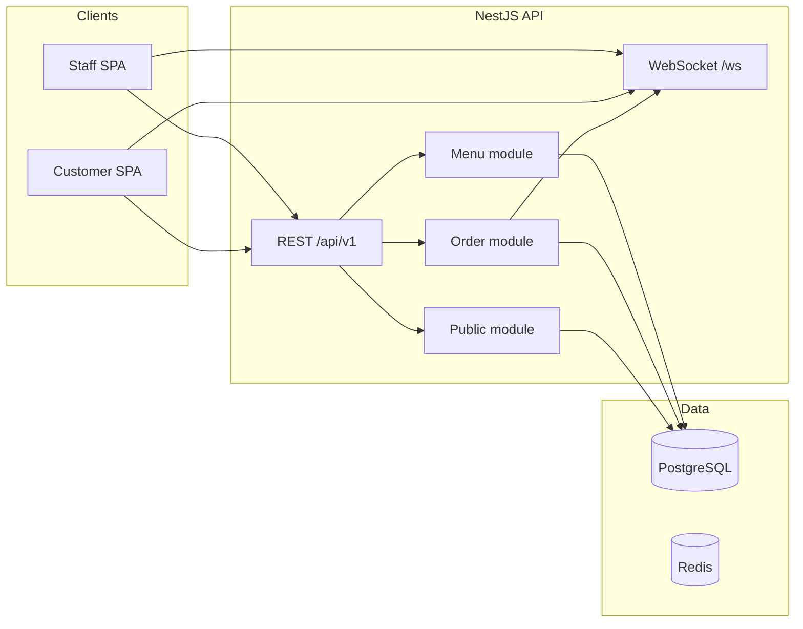

# Akıllı Garson — Executive Summary

**Product:** Akıllı Garson — Restaurant Management Platform  
**Version:** 1.0.0-rc2 (Release Candidate 2)  
**Document date:** July 2026  
**Audience:** Technical reviewers and product stakeholders

---

## 1. Product Overview

Akıllı Garson is a **Restaurant Management Platform** for dine-in scenarios. It connects a customer-facing QR menu and ordering flow with staff tools for order management, kitchen display, menu administration, and operational dashboards.

| Layer | Stack |
|-------|-------|
| Frontend | React 18, Vite 6, TanStack Query, Zustand |
| Backend | NestJS 11, Prisma 6, PostgreSQL 16 |
| Infrastructure | Redis 7, WebSocket (`/ws`), Docker Compose (local) |

The backend is organized as a **modular monolith** with Domain-Driven Design (DDD) in the Menu and Order bounded contexts. The data model is **multi-tenant ready** via a `Restaurant` root aggregate and `restaurantId` on business tables.

**Release scope (RC2 / Demo Edition):** Core dine-in flows including customer service calls, order notes, and short order numbers are implemented end-to-end. Additional modules (tables CRUD, payments, reservations, inventory, analytics) exist as roadmap UI and are not part of the live product surface.

---

## 2. Problem and Solution

### Operational context

Restaurants operating dine-in service typically coordinate ordering across customers, wait staff, kitchen, and cashier roles. Manual handoffs introduce latency, visibility gaps, and inconsistent order state.

### What the system addresses today

| Area | Implementation |
|------|----------------|
| Customer self-service ordering | Public menu and order APIs via table QR token |
| Order visibility | Staff order list, customer order history, dashboard metrics |
| Kitchen coordination | Kitchen display driven by order-level status from the Orders API |
| Menu administration | Category listing, item creation, price updates (staff API) |
| Realtime updates | WebSocket broadcast on order creation and status changes |

### Out of scope (current release)

Table management REST API, payment recording, reservations, inventory, service-call API, backend authentication (JWT), and production deployment automation are **not implemented**. The Prisma schema and frontend navigation include placeholders for several of these capabilities.

---

## 3. Architecture Summary

**Design patterns in production code:**

- **Clean Architecture** — presentation / application / domain / infrastructure layers in the Menu module
- **Repository ports** — application layer depends on interfaces; Prisma adapters in infrastructure
- **Manual CQRS** — explicit command/query classes and use-case executors (no `@nestjs/cqrs`)
- **Domain events** — in-process publisher; order events bridged to WebSocket rooms
- **Order line snapshots** — `OrderLine` stores menu name, SKU, and price at order time (no FK to live `MenuItem`)
- **Frontend adapters** — `adapters.js` maps API enums and minor-unit money to UI models

**Feature modules (backend):** `menu`, `order`, `public`, `health`, `realtime`

**REST endpoints:** 16 documented in Swagger (`GET /docs`)

---

## 4. Data Model

Eight Prisma models form the current schema:

| Model | Role |
|-------|------|
| `Restaurant` | Tenant root |
| `Table` | QR entry point (`tableToken`) |
| `MenuCategory`, `MenuItem`, `MenuCategoryPlacement`, `MenuPrice` | Menu aggregate |
| `Order`, `OrderLine` | Order aggregate with snapshot lines |

Three migrations are applied: menu schema, tables, orders. Soft delete (`deletedAt`) is used on selected entities. Optimistic locking uses a `version` column on key aggregates.

**Tenant resolution:**

- Staff API: `X-Restaurant-Id` header (application-layer filter)
- Public API: tenant derived from `tableToken`

---

## 5. Live Product Flows

### Customer (QR)

1. Open `/customer?token=qr-masa-1` (or scan QR)
2. Load public menu — `GET /api/v1/public/menu/:tableToken`
3. Build cart in client state; submit — `POST /api/v1/public/orders`
4. Track orders on `/customer/orders`; receive WebSocket updates on the table room

### Staff

1. Sign in via demo local session (PIN-based; no backend JWT)
2. Dashboard — metrics derived from orders API
3. Orders — list, filter, update status — `PATCH /orders/:id/status`
4. Kitchen — active orders; **order-level** status transitions (`open` → `in_kitchen` → `partially_served`)
5. Menu — list items, add products, update prices

### Demo seed data

Command: `cd api && npm run seed:demo`

Provides restaurant **Lezzet Durağı**, four tables (`qr-masa-1` … `qr-masa-4`), four menu categories, twelve menu items, and six orders in mixed statuses for dashboard and kitchen demos.

---

## 6. Security and Quality Posture

| Area | Current state |
|------|----------------|
| Authentication | Demo PIN on frontend only; JWT env placeholders; no NestJS auth module |
| Authorization | Frontend role checks; no backend RBAC guards |
| Tenant isolation | Header-based; not cryptographically bound to identity |
| Input validation | `class-validator` + NestJS `ValidationPipe` |
| HTTP hardening | Helmet, compression, CORS (development-oriented) |
| Rate limiting | Not implemented |
| Automated tests | One menu integration suite (10 cases); no unit tests; Playwright installed, no E2E suite |
| CI/CD | Not configured |

These constraints define the system as a **demonstration and development release**, not a hardened production deployment.

---

## 7. Known Limitations

1. **No backend authentication** — staff identity is client-side only  
2. **No payments module** — order closure is status-based; payment UI is roadmap or simulated  
3. **No tables REST API** — `Table` model exists; staff table management is roadmap  
4. **Kitchen operates at order granularity** — no per-line kitchen ticket aggregate  
5. **Menu archive / availability** — use cases exist; not all exposed via HTTP  
6. **Order line mutations** — add/remove line items not supported on API  
7. **Frontend in JavaScript** — no compile-time contract with backend DTOs  
8. **Roadmap sidebar entries** — navigate to preview pages, not live modules  

---

## 8. Roadmap (Summary)

| Horizon | Focus |
|---------|--------|
| **Near term** | Tables API, JWT auth, order integration tests, CI pipeline, menu archive endpoints |
| **Mid term** | Payments module, service calls, E2E tests, API container image, staging deploy |
| **Long term** | Multi-restaurant onboarding, branch/channel pricing, kitchen stations, analytics aggregation, billing |

Detailed phased plan: [YOL-HARITASI.md](./YOL-HARITASI.md)

---

## 9. Local Deployment

| Service | Command | Port |
|---------|---------|------|
| PostgreSQL + Redis | `cd api/docker && docker compose up -d` | 5432, 6379 |
| API | `cd api && npm run start:dev` | 3001 |
| Frontend | `npm run dev` | 5173 |

**References:** [README.md](../README.md) · [MASTER_PROJECT_REPORT.md](./MASTER_PROJECT_REPORT.md) · [api/README.md](../api/README.md)

---

*This summary reflects the codebase as of Release Candidate 1. For endpoint-level detail, database diagrams, and frontend structure, see the full project report.*
