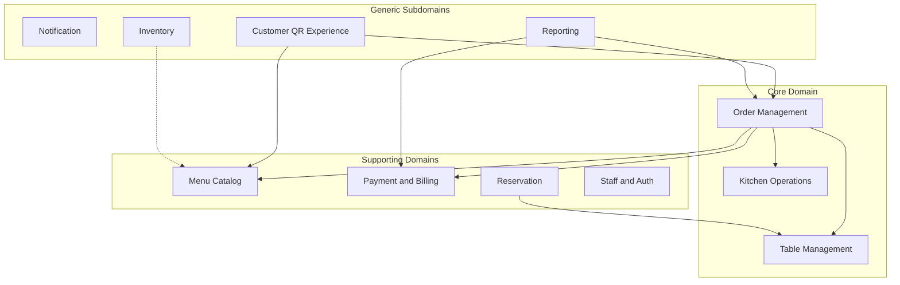

# Akıllı Garson — Tam Proje Raporu

**Proje:** Akıllı Garson (Restoran POS / QR Sipariş Sistemi)  
**Versiyon:** 2.0.0  
**Tarih:** 2 Temmuz 2026  
**Teknoloji:** React 18, Vite 6, TanStack Query, Zustand, json-server (mock API), WebSocket

> Bu dosya; Proje Raporu, Teknik Durum, Geliştirme Yol Haritası ve Domain Model Analizi dokümanlarının birleştirilmiş halidir.

---

## İçindekiler

1. [Yönetici Özeti](#1-yönetici-özeti)
2. [Proje Durum Raporu](#2-proje-durum-raporu)
3. [Teknik Durum Raporu](#3-teknik-durum-raporu)
4. [Geliştirme Yol Haritası](#4-geliştirme-yol-haritası)
5. [Domain Model Analizi (DDD)](#5-domain-model-analizi-ddd)
6. [Proje Çalıştırma](#6-proje-çalıştırma)

**Ek raporlar:** [Domain Analizi](./DOMAIN-ANALIZI.md) · [İş Kuralları](./IS-KURALLARI.md) · [Mimari Tasarım](./MIMARI-TASARIM.md)

---

# 1. Yönetici Özeti

Akıllı Garson, restoran operasyonlarını dijitalleştirmeyi hedefleyen **web tabanlı bir POS uygulamasıdır**. Personel paneli, müşteri self-servis paneli, mutfak ekranı, rezervasyon, stok, raporlama ve canlı bildirim modüllerini içeren **işlevsel bir MVP / demo** seviyesindedir.

| | |
|---|---|
| **Güçlü yan** | Modern arayüz, geniş modül kapsamı, rol bazlı erişim, QR müşteri menüsü |
| **Zayıf yan** | Mock backend, demo auth (sabit PIN), mali uyumluluk ve donanım entegrasyonu eksik |
| **Mevcut konum** | Demo / MVP — pilot restoran ve yatırımcı sunumu için uygun |
| **Hedef konum** | KOBİ restoranlar için SaaS POS |

**Sayılar:** 2 uygulama yüzeyi · 14 işlevsel ekran · 3 rol · 11 personel modülü

**Ticari satış için minimum gereksinimler:**
1. Production backend + güvenli kimlik doğrulama
2. Termal yazıcı + mutfak fişi
3. POS / yazar kasa entegrasyonu
4. Offline sipariş desteği
5. KVKK uyumu ve audit log
6. E2E test + staging ortamı

**Domain açısından en kritik 5 sorun:**
1. `Order` ↔ `KitchenOrder` kopuk iki aggregate (split brain)
2. Masa başına tek aktif hesap kuralı uygulanmıyor
3. Tutar alanları tutarsız (`total` / `totalAmount` / `finalTotal`)
4. İş kuralları sunucuda değil, frontend'de
5. `Restaurant` / tenant kök aggregate'i yok

**Önerilen ilk adım:** Faz 1 (Backend + Auth + Multi-tenant); mevcut React frontend API katmanı korunarak kademeli geçiş.

---

# 2. Proje Durum Raporu

## 2.1 Mevcut Panel Envanteri

| Kategori | Adet | Açıklama |
|----------|------|----------|
| Ana uygulama yüzeyi | **2** | Personel paneli + Müşteri paneli |
| Personel modülü | **11** | Sidebar menüsündeki ana işlevler |
| Müşteri sayfası | **3** | QR / self-servis akışı |
| Personel rol profili | **3** | Admin, Garson, Mutfak |
| Toplam işlevsel ekran | **14** | Login ve masa siparişi dahil |

### Personel Paneli (Korumalı — `/login` sonrası)

**Ana Operasyon Modülleri**

| # | Modül | Rota | Açıklama |
|---|--------|------|----------|
| 1 | Anasayfa | `/` | Dashboard, özet metrikler, hızlı aksiyonlar |
| 2 | Masalar | `/tables` | Masa durumu (boş/dolu/rezerve), QR |
| 3 | Masa Siparişi | `/tables/:tableId/order` | Masaya özel sipariş girişi |
| 4 | Siparişler | `/orders` | Aktif siparişler, ödeme, transfer/birleştirme |
| 5 | Mutfak | `/kitchen` | Sipariş hazırlama ekranı (KDS) |

**Yönetim Modülleri**

| # | Modül | Rota | Açıklama |
|---|--------|------|----------|
| 6 | Menü Yönetimi | `/menu` | Ürün CRUD, kategori yönetimi |
| 7 | Rezervasyonlar | `/reservations` | Rezervasyon oluşturma, onay, masa atama |
| 8 | Raporlar | `/analytics` | Grafikler, satış analizi |
| 9 | Günlük Rapor | `/daily-report` | Gün sonu özeti, CSV export |
| 10 | Garson Yönetimi | `/waiters` | Personel CRUD |
| 11 | Stok Yönetimi | `/inventory` | Stok takibi, düşük stok uyarıları |

**Sistem Modülleri**

| Modül | Rota | Açıklama |
|--------|------|----------|
| Ayarlar | `/settings` | Tema, dil, bildirim tercihleri |
| Giriş | `/login` | Email + PIN ile personel girişi |

### Müşteri Paneli (Herkese Açık)

| # | Sayfa | Rota | Açıklama |
|---|--------|------|----------|
| 1 | Masa Girişi | `/customer` | QR kod ile masa numarası okuma |
| 2 | Menü & Sipariş | `/customer/menu` | Ürün seçimi, sepet, sipariş verme |
| 3 | Sipariş Takibi | `/customer/orders` | Aktif sipariş durumu, iptal |

### Rol Bazlı Erişim Matrisi

| Modül / Rota | Admin | Garson | Mutfak |
|--------------|:-----:|:------:|:------:|
| Anasayfa `/` | ✅ | ✅ | ❌ |
| Masalar `/tables` | ✅ | ✅ | ❌ |
| Masa siparişi `/tables/:id/order` | ✅ | ✅ | ❌ |
| Siparişler `/orders` | ✅ | ✅ | ❌ |
| Mutfak `/kitchen` | ✅ | ✅ | ✅ |
| Menü `/menu` | ✅ | ✅ | ❌ |
| Rezervasyonlar `/reservations` | ✅ | ✅ | ❌ |
| Raporlar `/analytics` | ✅ | ❌ | ❌ |
| Günlük Rapor `/daily-report` | ✅ | ❌ | ❌ |
| Garsonlar `/waiters` | ✅ | ❌ | ❌ |
| Stok `/inventory` | ✅ | ❌ | ❌ |
| Ayarlar `/settings` | ✅ | ❌ | ❌ |

**Demo hesaplar (`db.json`):**

| Email | Rol | PIN |
|-------|-----|-----|
| ahmet@restaurant.com | admin | 1234 |
| ayse@restaurant.com | waiter | 1234 |
| mehmet@restaurant.com | kitchen | 1234 |

## 2.2 Mevcut Teknik Altyapı

| Bileşen | Durum | Not |
|---------|--------|-----|
| Frontend | ✅ Hazır | React 18, lazy loading, PWA iskeleti |
| API | ⚠️ Mock | `json-server` / `server/index.js` (REST + WS) |
| Kimlik doğrulama | ⚠️ Demo | Sabit PIN `1234`, istemci tarafı kontrol |
| WebSocket | ⚠️ Kısmi | Sunucu yazıldı, tam entegrasyon devam ediyor |
| i18n | ⚠️ Kısmi | TR/EN dosyaları var, tüm UI kapsanmıyor |
| RBAC | ⚠️ Frontend | Sunucu tarafı yetki kontrolü yok |
| E2E testler | ❌ Yok | Playwright kurulu, test yazılmadı |
| Ödeme kaydı | ⚠️ Mock | `payments` koleksiyonuna yazılıyor, gerçek POS yok |
| Yazıcı | ⚠️ Temel | Tarayıcı print; termal/ESC-POS yok |
| Offline | ❌ Yok | İnternet kesintisinde çalışmaz |
| Multi-tenant | ❌ Yok | Tek restoran varsayımı |

## 2.3 Tamamlanan Özellikler

- Modern, responsive arayüz (mobil sidebar, karanlık tema)
- Dashboard, canlı saat, aktivite akışı, komut paleti
- Masa yönetimi ve QR kod üretimi
- Sipariş oluşturma, durum güncelleme, mutfak ekranı
- Ödeme modalı (nakit/kart/online, indirim, bahşiş, hesap bölme)
- Masa transferi ve masa birleştirme (sipariş merge)
- Garson çağırma (serviceCalls API)
- Rezervasyon → masa durumu entegrasyonu
- Menü CRUD, stok takibi, garson CRUD
- Günlük rapor + CSV export, kategori satış tablosu
- Bildirim sistemi (ses, tercihler, düşük stok, garson çağrısı)
- Müşteri paneli (menü, sipariş, iptal, toast bildirimleri)
- Rol bazlı navigasyon ve rota koruması
- Code splitting, PWA manifest + service worker
- Sesli komut bileşeni (Layout entegrasyonu)

## 2.4 Kısmen Tamamlanan Özellikler

| Özellik | Durum |
|---------|--------|
| WebSocket sunucusu | Kod var, npm script ve tam doğrulama eksik |
| Playwright E2E | Paket kurulu, test dosyası yok |
| Vite proxy / `.env` | Yapılandırılmadı |
| i18n | Birçok sayfa hâlâ sabit Türkçe metin kullanıyor |
| Auth güvenliği | Token demo, PIN hash yok |
| Fiş / yazdırma | Tarayıcı print; profesyonel fiş formatı yok |
| Stok otomasyonu | Manuel; sipariş → otomatik stok düşümü yok |

## 2.5 Ticari Ürün İçin Gerekli Geliştirmeler

### Kritik Öncelik (Satış Öncesi Zorunlu)

**A. Backend ve Veri Mimarisi**
- Production-grade backend (Node/Nest, .NET, Go)
- PostgreSQL / MySQL, multi-tenant (`tenantId`)
- API versioning, rate limiting, input validation
- Yedekleme, migration, disaster recovery, audit log

**B. Güvenlik ve Kimlik Doğrulama**
- PIN hash (bcrypt/argon2), JWT + refresh token
- RBAC sunucu tarafında, brute-force koruması
- HTTPS, CORS, CSP, KVKK uyumu

**C. Ödeme ve Mali Uyumluluk (Türkiye)**
- Gerçek POS (iyzico, PayTR), ÖKC, e-Fatura/e-Arşiv
- Fiş numarası, KDV dökümü, Z raporu

**D. Donanım Entegrasyonu**
- Termal yazıcı (ESC/POS), kasa çekmecesi, barkod/QR okuyucu

**E. Dayanıklılık ve Offline**
- Offline sipariş kuyruğu, WebSocket reconnect, optimistic locking

### Operasyonel Öncelik

- Vardiya/kasa yönetimi, garson performans raporu
- Mutfak istasyonları, hazırlık süresi, otomatik stok düşümü
- Modifier/ekstra/alerjen yönetimi
- SMS/e-posta rezervasyon, bekleme listesi, sadakat programı
- Saatlik satış, maliyet-marj analizi, çok şubeli dashboard

### Ürünleştirme ve SaaS

- Multi-şube, franchise, abonelik paketleri
- Onboarding sihirbazı, canlı destek, tam i18n
- E2E test, CI/CD, Sentry, TypeScript
- Tablet-first mutfak, kiosk modu, marka özelleştirme

## 2.6 Rekabet ve Konumlandırma

**Rakip farklılaştırma:**
- QR müşteri menüsü + garson çağırma (mevcut)
- Sesli komut ve komut paleti
- Modern UX, hızlı kurulum, düşük maliyet
- Türkiye mali mevzuatına tam uyum (henüz yok — kritik boşluk)

## 2.7 Riskler

| Risk | Olasılık | Etki | Önlem |
|------|----------|------|-------|
| Mock backend ile canlıya çıkış | Yüksek | Kritik | Faz 1 tamamlanmadan satış yapılmamalı |
| Mali uyumsuzluk (ceza) | Orta | Kritik | ÖKC / e-Fatura entegrasyonu |
| Yoğun saatte çökme | Orta | Yüksek | Yük testi + offline mod |
| Veri güvenliği ihlali | Orta | Kritik | KVKK + güvenli auth |
| Donanım uyumsuzluğu | Yüksek | Orta | ESC/POS standart yazıcı desteği |

---

# 3. Teknik Durum Raporu

## 3.1 Teknoloji Yığını

| Katman | Teknoloji | Versiyon |
|--------|-----------|----------|
| UI Framework | React | 18.3 |
| Build Tool | Vite | 6.0 |
| Routing | React Router | 7.1 |
| State (server) | TanStack Query | 5.62 |
| State (client) | Zustand | 5.0 |
| HTTP Client | Axios | 1.7 |
| Animasyon | Framer Motion | 11.15 |
| Grafikler | Recharts | 2.14 |
| İkonlar | Lucide React | 0.468 |
| Bildirimler | react-hot-toast | 2.4 |
| QR Kod | qrcode | 1.5 |
| Mock API | json-server | 1.0 beta |
| WebSocket | ws | 8.21 |
| E2E (planlı) | Playwright | 1.61 |

## 3.2 Proje Yapısı

```
Akıllı Garson/
├── src/
│   ├── api/              # Axios instance + API servisleri
│   ├── components/       # UI bileşenleri, Layout, providers
│   ├── hooks/            # React Query hooks (orders, auth, payments...)
│   ├── locales/          # i18n (tr.js, en.js)
│   ├── pages/            # Sayfa bileşenleri (staff + customer)
│   ├── store/            # Zustand global state
│   └── utils/            # Yardımcı fonksiyonlar
├── server/
│   └── index.js          # Birleşik REST + WebSocket sunucusu
├── public/               # PWA manifest, service worker
├── db.json               # Mock veritabanı
└── docs/                 # Proje dokümantasyonu
```

## 3.3 Bileşen Durum Matrisi

| Bileşen | Durum | Detay |
|---------|-------|-------|
| Frontend SPA | ✅ Production-ready UI | Lazy loading, code splitting, PWA iskeleti |
| REST API | ⚠️ Mock | `server/index.js`, port 3001 |
| WebSocket | ⚠️ Kısmi | `ws://localhost:3001/ws`, broadcast olayları tanımlı |
| Auth | ❌ Demo | Sabit PIN `1234`, client-side doğrulama |
| RBAC | ⚠️ Frontend only | `usePermissions.js`, sunucu kontrolü yok |
| Ödeme | ⚠️ Mock | `payments` koleksiyonu, gerçek POS yok |
| Yazıcı | ⚠️ Temel | `printReceipt()` tarayıcı print |
| i18n | ⚠️ Kısmi | Locale dosyaları var, tüm UI çevrilmedi |
| PWA | ⚠️ İskelet | manifest + SW kayıtlı, offline cache sınırlı |
| E2E Test | ❌ Yok | Playwright kurulu, test yazılmadı |
| CI/CD | ❌ Yok | Pipeline tanımlı değil |
| Multi-tenant | ❌ Yok | Tek restoran (`db.json`) |
| Offline | ❌ Yok | Network kesintisinde durur |

## 3.4 API Endpoints (Mock)

| Endpoint | Açıklama |
|----------|----------|
| `/waiters` | Garson/personel listesi |
| `/tables` | Masa durumları |
| `/orders` | Siparişler |
| `/menuItems` | Menü ürünleri |
| `/categories` | Menü kategorileri |
| `/payments` | Ödeme kayıtları |
| `/reservations` | Rezervasyonlar |
| `/inventory` | Stok kalemleri |
| `/serviceCalls` | Garson çağrıları |
| `/kitchenOrders` | Mutfak siparişleri |
| `/discounts` | Kampanyalar |
| `/notifications` | Bildirimler |
| `/dailyStats` | Günlük istatistik (demo) |
| `/settings` | Restoran ayarları |
| `/ws` | WebSocket bağlantı noktası |

## 3.5 WebSocket Olayları

| Olay | Tetikleyici |
|------|-------------|
| `CONNECTED` | İstemci bağlandığında |
| `ORDER_CREATED` | POST `/orders` |
| `ORDER_UPDATED` | PATCH/PUT `/orders` |
| `TABLE_UPDATED` | PATCH/PUT `/tables` |
| `PAYMENT_COMPLETED` | POST `/payments` |
| `CALL_WAITER` | POST `/serviceCalls` |
| `RESERVATION_NEW` | POST `/reservations` |
| `STOCK_ALERT` | POST/PATCH `/inventory` |
| `DATA_CHANGED` | Diğer kaynaklar |

## 3.6 Kimlik Doğrulama Akışı (Mevcut)

```
Login.jsx → useLogin() → authApi.login()
  ├── GET /waiters (tüm liste)
  ├── Email eşleşmesi (client-side)
  ├── PIN === '1234' kontrolü (sabit, hash yok)
  └── Zustand'a activeWaiter kaydet + demo token
```

**Güvenlik açıkları:**
- PIN hash'lenmiyor
- Token sunucuda doğrulanmıyor
- Waiters listesi herkese açık API'den alınıyor
- RBAC yalnızca frontend'de

## 3.7 Veri Modeli (db.json Koleksiyonları)

| Koleksiyon | Kayıt | Ana Alanlar |
|------------|-------|-------------|
| `tables` | 12 | id, number, capacity, status, section, waiterId |
| `categories` | 10 | id, name, icon, color, order |
| `menuItems` | 32 | id, categoryId, name, price, isAvailable, allergens |
| `orders` | 5 | id, tableId, items[], status, totalAmount, createdAt |
| `reservations` | 4 | id, tableId, customerName, date, time, status |
| `payments` | 1 | id, orderId, amount, method, receiptNumber |
| `waiters` | 3 | id, name, email, role, shift, tablesAssigned |
| `kitchenOrders` | 2 | id, orderId, items[], priority, tableNumber |
| `inventory` | 9 | id, name, quantity, minStock, unit |
| `discounts` | 3 | id, name, type, value, code, isActive |
| `notifications` | 3 | id, type, title, message, read |
| `dailyStats` | 7 | date, orders, revenue, avgOrderValue |
| `serviceCalls` | 0 | id, tableId, type, status |
| `settings` | 1 obje | restaurantName, taxRate, currency |

## 3.8 Bilinen Eksikler ve Teknik Borç

**Yüksek Öncelik**
- [ ] Production backend (PostgreSQL + Node/Nest)
- [ ] JWT auth + PIN hash
- [ ] Sunucu tarafı RBAC middleware
- [ ] `.env` yapılandırması (`VITE_API_URL`, `VITE_WS_URL`)
- [ ] Vite dev proxy (`/api` → 3001)

**Orta Öncelik**
- [ ] Playwright E2E test suite
- [ ] Tam i18n kapsamı
- [ ] TypeScript migrasyonu (opsiyonel)
- [ ] Error boundary + Sentry entegrasyonu
- [ ] API response validation (Zod)

**Düşük Öncelik**
- [ ] Storybook bileşen kataloğu
- [ ] Unit test coverage
- [ ] Docker compose (dev ortamı)
- [ ] API dokümantasyonu (Swagger/OpenAPI)

## 3.9 Ortam Değişkenleri (Önerilen)

```env
# Frontend (.env)
VITE_API_URL=http://localhost:3001
VITE_WS_URL=ws://localhost:3001/ws

# Backend (.env)
PORT=3001
DATABASE_URL=postgresql://...
JWT_SECRET=...
NODE_ENV=development
```

---

# 4. Geliştirme Yol Haritası

**Hedef:** Restoranlara satılabilir SaaS POS ürünü  
**Toplam tahmini süre (Faz 1–4):** 24–34 hafta (~6–8 ay)

## 4.1 Faz Özeti

| Faz | Konu | Süre | Öncelik |
|-----|------|------|---------|
| **Faz 1** | Temel Altyapı | 8–12 hafta | 🔴 P0 |
| **Faz 2** | Operasyonel Çekirdek | 6–8 hafta | 🔴 P0 |
| **Faz 3** | Mali Uyumluluk | 4–6 hafta | 🔴 P0 |
| **Faz 4** | SaaS Ürünleştirme | 6–8 hafta | 🟠 P1 |
| **Faz 5** | Büyüme & Entegrasyon | Sürekli | 🟡 P2 |

## 4.2 Faz 1 — Temel Altyapı (8–12 hafta)

**Amaç:** Mock backend'den production-grade altyapıya geçiş.

- Backend seçimi (NestJS / Express + TypeScript)
- PostgreSQL şema + migration (Prisma / TypeORM)
- Multi-tenant: `restaurants` tablosu, `restaurantId` filtresi
- PIN hash, JWT access + refresh, brute-force koruması
- Sunucu tarafı RBAC middleware, audit log
- Frontend API geçişi, env-based baseURL
- Staging, CI/CD (GitHub Actions), Docker compose

**Çıktılar:** Production backend, güvenli auth, staging deploy

## 4.3 Faz 2 — Operasyonel Çekirdek (6–8 hafta)

**Amaç:** Günlük restoran operasyonları.

- Termal yazıcı (ESC/POS), mutfak/adisyon fişi
- POS gateway (iyzico / PayTR), webhook'lar
- Offline mod (IndexedDB kuyruk, sync, conflict resolution)
- Vardiya yönetimi, kasa sayımı
- Mutfak istasyonları, hazırlık süresi, gecikme uyarıları
- Stok otomasyonu, reçete bazlı malzeme takibi

**Çıktılar:** Termal fiş, kart ödemesi, offline sipariş

## 4.4 Faz 3 — Mali Uyumluluk (4–6 hafta)

**Amaç:** Türkiye mali mevzuatına uyum.

- ÖKC entegrasyonu, fiş numarası, KDV dökümü
- e-Fatura / e-Arşiv (GİB)
- Z raporu, X raporu, kasa kapanış mutabakatı
- KVKK: aydınlatma metni, veri silme API'si
- İade/iptal mali kayıtları, indirim audit log

**Çıktılar:** Yasal fiş, Z raporu, KVKK dokümantasyonu

## 4.5 Faz 4 — SaaS Ürünleştirme (6–8 hafta)

**Amaç:** Çoklu restoran, abonelik, profesyonel destek.

- Abonelik paketleri (Basic / Pro / Enterprise)
- Multi-şube: merkez menü + şube override
- Onboarding sihirbazı (menü import, masa planı)
- E2E test suite (Playwright), CI entegrasyonu
- Tam i18n, destek altyapısı (SSS, ticket)

**Çıktılar:** 15 dk kurulum, otomatik faturalandırma, yeşil CI

## 4.6 Faz 5 — Büyüme ve Entegrasyon (Sürekli)

- Sadakat programı, SMS/e-posta bildirimleri
- Kampanya motoru, bekleme listesi, alerjen filtreleri
- Yemek platformu entegrasyonları (Yemeksepeti, Getir)
- Muhasebe entegrasyonu (Logo, Mikro)
- Kiosk modu, franchise paneli, API marketplace

## 4.7 Öncelik Matrisi

| ID | Konu | Faz | Tahmini Süre |
|----|------|-----|--------------|
| P0-1 | Gerçek backend + PostgreSQL | 1 | 8–12 hf |
| P0-2 | Güvenli auth (JWT, PIN hash) | 1 | 2–3 hf |
| P0-3 | Sunucu tarafı RBAC | 1 | 1–2 hf |
| P0-4 | Termal yazıcı (ESC/POS) | 2 | 2–4 hf |
| P0-5 | POS / yazar kasa entegrasyonu | 3 | 4–6 hf |
| P1-1 | Offline sipariş modu | 2 | 4–6 hf |
| P1-2 | Vardiya / kasa yönetimi | 2 | 3–4 hf |
| P1-3 | E2E testler (Playwright) | 4 | 2–3 hf |
| P1-4 | Stok otomasyonu | 2 | 2–3 hf |
| P2-1 | Multi-şube konsol | 4 | 6–8 hf |
| P2-2 | Abonelik / faturalandırma | 4 | 4–6 hf |
| P2-3 | e-Fatura / e-Arşiv | 3 | 4–6 hf |

## 4.8 Milestone'lar

```
M1 ─── Backend canlı (Faz 1)
  │     ✓ PostgreSQL + API + JWT + Multi-tenant
M2 ─── Pilot restoran (Faz 2)
  │     ✓ Yazıcı + Offline + 1 gerçek restoran
M3 ─── Yasal uyum (Faz 3)
  │     ✓ ÖKC + KVKK
M4 ─── SaaS lansman (Faz 4)
  │     ✓ Abonelik + Onboarding + E2E
M5 ─── 10+ restoran (Faz 5)
        ✓ Multi-şube + Entegrasyonlar
```

## 4.9 Kaynak Tahmini

| Rol | Faz 1–2 | Faz 3–4 |
|-----|---------|---------|
| Full-stack developer | 1–2 | 1–2 |
| Frontend developer | 1 | 0.5 |
| DevOps | 0.5 | 0.5 |
| QA | 0.5 | 1 |
| Ürün / proje yönetimi | 0.5 | 0.5 |

## 4.10 Başarı Kriterleri

**Faz 1:** Mock backend kaldırılmış, RBAC sunucuda, staging deploy  
**Faz 2:** Termal fiş, 1 saat offline, 1 pilot restoran  
**Faz 3:** Yasal fiş, Z raporu, KVKK yayında  
**Faz 4:** 15 dk kurulum, otomatik faturalandırma, CI yeşil

---

# 5. Domain Model Analizi (DDD)

**Perspektif:** Software Architect / Domain Driven Design  
**Kaynak:** `db.json`, `server/index.js`, `src/api/`, React sayfaları, hook katmanı

## 5.1 Domain Analizi (Bounded Contexts)

| # | Domain | Durum | Kritik Risk |
|---|--------|-------|-------------|
| 1 | Sipariş Yönetimi | Çekirdek domain | KitchenOrder sync yok |
| 2 | Masa Yönetimi | Aktif | Çoklu aktif hesap |
| 3 | Menü Yönetimi | İyi | Inventory bağlantısı yok |
| 4 | Mutfak Operasyonları | Kısmi | Ayrı aggregate, otomatik oluşmuyor |
| 5 | Ödeme | Mock | KDV, ÖKC, yasal fiş yok |
| 6 | Rezervasyon | Aktif | Çakışma kontrolü yok |
| 7 | Personel (Waiters) | Aktif | RBAC frontend only |
| 8 | Stok | Manuel | Otomatik düşüm yok |
| 9 | Bildirim | İki katman | DB + in-memory polling |
| 10 | QR Müşteri Deneyimi | Aktif | localStorage, güvensiz |
| 11 | Raporlama | Client-side | dailyStats çift kaynak |
| 12 | Ayarlar | Singleton | Restaurant entity yok |

## 5.2 Entity Analizi

### Table (Masa)
- **Sorumluluk:** Fiziksel oturma birimi, operasyonel durum
- **Mevcut:** `id`, `number`, `capacity`, `status`, `section`, `waiterId`
- **Eksik:** `restaurantId`, `activeOrderId`, `qrToken`, `version`
- **Gereksiz:** `waiterId` + `waiters.tablesAssigned` çift yönlü denormalizasyon

### Order (Sipariş)
- **Sorumluluk:** Masaya bağlı ticari işlem aggregate'i
- **Durumlar:** `pending`, `preparing`, `ready`, `served`, `completed`, `cancelled`, `paid`
- **Eksik:** Tutarlı `subtotal/taxAmount/serviceCharge`, `source`, `channel`, `version`
- **Karışık:** `total` vs `totalAmount` vs `finalTotal`

### OrderItem (Gömülü)
- **Mevcut:** `menuItemId`, `quantity`, `notes`, `status?`, `price?`
- **Eksik:** `unitPrice` snapshot, `lineTotal`, `modifiers[]`, `lineId`
- **Sorun:** Status hem Order hem KitchenOrder'da duplicate

### Category & MenuItem
- **MenuItem mevcut:** name, price, categoryId, isAvailable, allergens, preparationTime
- **Eksik:** sku, costPrice, taxCategory, kitchenStationId, modifiers, branchOverrides

### Payment
- **Mevcut:** orderId, tableId, amount, tip, method, status, receiptNumber
- **Eksik:** taxBreakdown, shiftId, gatewayTransactionId, fiscalStatus

### Reservation
- **Durumlar:** pending, confirmed, completed, cancelled
- **Eksik:** confirmationCode, noShow, depositAmount, endTime (çakışma için)

### Waiter → Employee
- **Roller:** admin, waiter, kitchen
- **Eksik:** pinHash, permissions, branchId, currentShiftId
- **Gereksiz:** salesTotal (projection olmalı)

### KitchenOrder (KitchenTicket)
- **Sorun:** Order'dan otomatik türetilmiyor; split brain
- **Eksik:** stationId, printedAt, oluşturma pipeline

### ServiceCall, InventoryItem, Discount, Notification, DailyStats, Settings, Customer
- ServiceCall: waiter/bill tipleri; eksik assignedWaiterId
- Inventory: menü ile bağ yok
- Discount: ödeme modalından bağımsız; usedCount artmıyor
- Notification: recipientId, entityRef eksik
- DailyStats: demo veri, orders'dan da hesaplanıyor
- Settings: singleton, Restaurant entity değil
- Customer: entity yok, localStorage temsil

## 5.3 İlişki Analizi

```
Restaurant (implicit — settings)
 ├── Settings (1:1)
 ├── Tables (1:N)
 │    ├── Orders (1:N)          ⚠️ aktif 1:0..1 olmalı
 │    ├── Reservations (1:N)
 │    └── ServiceCalls (1:N)
 ├── Categories (1:N) → MenuItems (1:N)
 ├── Orders (1:N)
 │    ├── OrderItems (embedded)
 │    ├── Payments (1:N)
 │    └── KitchenOrder (1:0..1) ⚠️ kopuk
 ├── Employees/Waiters (1:N)
 ├── InventoryItems (1:N)       ⚠️ MenuItem bağ yok
 ├── Discounts (1:N)
 ├── Notifications (1:N)
 └── DailyStats (1:N)           ⚠️ projection olmalı
```

### Cardinality

| İlişki | Cardinality | Not |
|--------|-------------|-----|
| Table → Order (aktif) | 1:0..1 olmalı | Kod 1:N izin veriyor |
| Order → Payment | 1:N | Split payment destekli |
| Order → KitchenOrder | 1:0..1 | Sync yok |
| MenuItem → Inventory | N:N | Reçete yok |
| Waiter → Table | N:N | Denormalize |

## 5.4 Domain Kuralları

### Mevcut Kurallar

**Sipariş durum makinesi:**
```
pending → preparing → ready → served → completed
pending → cancelled
```

**Masa durumu:**
- Sipariş oluşunca → `occupied`
- completed/paid/cancelled veya ödeme → `available`
- Rezervasyon confirmed → `reserved`; cancelled/completed → `available`

**Ödeme:** bahşiş + indirim modalda; split eşit bölme; fiş no client-side  
**Merge:** kalemler birleşir, kaynak cancelled, kaynak masa available  
**Transfer:** tableId değişir, kaynak available, hedef occupied  
**Menü:** isAvailable=false gizlenir; müşteri paneli %10 servis hardcoded  
**RBAC:** admin=tümü, waiter=operasyon, kitchen=sadece mutfak

### Eksik Kurallar

| Kural | Durum |
|-------|-------|
| Masa başına tek aktif hesap | ❌ |
| Ödenen sipariş düzenlenemez | ❌ |
| Rezervasyon çakışma kontrolü | ❌ |
| Sipariş → otomatik mutfak fişi | ❌ |
| Fiyat snapshot | ❌ |
| Stok yetersizse red | ❌ |
| PIN sunucuda doğrulama | ❌ |
| QR token masa doğrulama | ❌ |
| Audit log | ❌ |
| Transaction boundary | ❌ |

## 5.5 Eksik Domain Modeli

| Entity | Neden |
|--------|-------|
| Restaurant (Tenant) | Multi-tenant SaaS kök aggregate |
| Branch | Çok şube |
| Shift / CashSession | Vardiya, kasa, Z raporu |
| Receipt / FiscalDocument | ÖKC, e-Arşiv |
| Tax / TaxLine | KDV dökümü |
| Modifier / ModifierGroup | Ürün özelleştirme |
| Recipe / BOM | Stok otomasyonu |
| KitchenStation | İstasyon bazlı KDS |
| Printer / PrintJob | ESC/POS |
| Customer | Sadakat, KVKK |
| Device / Terminal | Kiosk, tablet |
| AuditLog / DomainEvent | Compliance |
| OrderChannel | QR, kiosk, delivery |
| Subscription / Plan | SaaS faturalandırma |

## 5.6 Teknik Borç (Domain)

1. **Anemic domain** — iş kuralları frontend hook/page'lerde
2. **Split brain** — orders vs kitchenOrders, notifications çift model
3. **Tutarsız veri** — total/totalAmount, string/number ID'ler
4. **Yanlış modelleme** — waiters=personel, salesTotal aggregate'ta
5. **Eksik abstraction** — Money, OrderStatus value object yok
6. **Güvenlik** — auth/RBAC presentation layer'da
7. **Transaction yok** — merge/transfer/ödeme ayrı PATCH'ler
8. **Overloaded components** — Orders.jsx çok fazla sorumluluk

## 5.7 Gelecek Hazırlığı

| Hedef | Gerekli Değişiklik |
|-------|-------------------|
| Multi-Tenant SaaS | Restaurant kök aggregate, tenantId her yerde |
| Çok Şube | Branch, merkez menü + override |
| Mobil | Device entity, offline queue, push |
| Kiosk | OrderChannel.KIOSK, device-bound session |
| Delivery | OrderType, Customer, DeliveryAddress |
| Yemek Platformları | ExternalOrder ACL, webhook ingestion |
| Muhasebe | FiscalDocument, AccountingExport event |

### Hedef Mimari

```
Application Layer (API)
  OrderService | PaymentService | TableService
        ↓ domain events
Aggregates: Order, Table, Payment, KitchenTicket
Value Objects: Money, OrderStatus, TaxLine
        ↓
Projections: Dashboard, DailyReport, KitchenKDS
```

## 5.8 Domain Sonuç

### ✅ Güçlü Tasarlanmış Alanlar

1. Geniş modül kapsamı (POS, mutfak, QR, rezervasyon, stok, rapor)
2. Sezgisel sipariş durum makinesi
3. Masa transfer/merge gerçek ihtiyaca uygun
4. Menü modeli iyi başlangıç (alerjen, hazırlık süresi)
5. Ödeme esnekliği (split, bahşiş, iade)
6. Discount entity SaaS temeli
7. WebSocket domain event potansiyeli
8. RBAC rol matrisi operasyonel
9. QR müşteri akışı uçtan uca
10. Hook/API ayrımı backend geçişine uygun

### ⚠️ Riskli Alanlar

1. Order ↔ KitchenOrder kopukluğu
2. Masa–sipariş bütünlüğü
3. Tutar alanları tutarsız
4. Frontend-only business rules
5. Auth/RBAC güvenlik açığı
6. Müşteri oturumu güvensiz
7. Transaction yok
8. Stok ↔ menü disconnect
9. İki bildirim sistemi
10. dailyStats vs computed stats

### ❌ Eksik Domainler

Restaurant/Tenant · Branch · Shift/Cash · Fiscal Compliance · Recipe/BOM · Modifier · Kitchen Station · Customer · Device · Audit/Events · Delivery/External · Subscription

### 🚀 İlk Düzeltilmesi Gereken 10 Konu

| # | Konu | Gerekçe |
|---|------|---------|
| 1 | Restaurant + tenantId | SaaS temeli |
| 2 | Order + KitchenTicket birleştirme | Split brain |
| 3 | Kuralları backend'e taşıma | Tek truth source |
| 4 | Masa başına tek aktif Order | Kritik POS kuralı |
| 5 | Money + fiyat snapshot | Tutar tutarlılığı |
| 6 | Transactional use case'ler | Veri bütünlüğü |
| 7 | Employee + sunucu RBAC + PIN hash | Güvenlik |
| 8 | Order → Kitchen event pipeline | Mutfak gerçekliği |
| 9 | QR token session | QR güvenliği |
| 10 | AuditLog + Domain Events | Compliance |

### Bounded Context Haritası



---

# 6. Proje Çalıştırma

```bash
npm install          # Bağımlılıkları yükle
npm run server       # API + WebSocket (port 3001)
npm run dev          # Frontend (port 5173)
npm run dev:all      # İkisi birlikte
npm run build        # Production build
npm run preview      # Build önizleme
```

**Demo giriş:** PIN `1234` (tüm hesaplar)

**API:** `http://localhost:3001`  
**WebSocket:** `ws://localhost:3001/ws`  
**Frontend:** `http://localhost:5173`

---

*Bu rapor Akıllı Garson v2.0.0 kod tabanına dayanarak hazırlanmıştır.*
