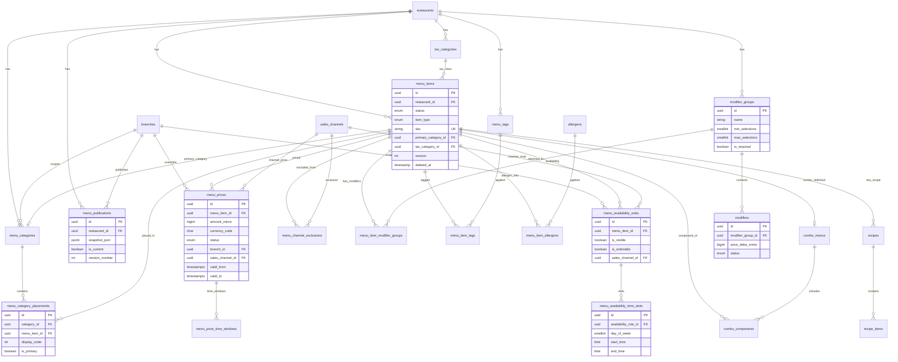

# Menu Domain — PostgreSQL Veritabanı Tasarımı

> **Tarih:** 2 Temmuz 2026  
> **Versiyon:** 1.0.0  
> **Perspektif:** Senior Database Architect / Prisma Uzmanı  
> **Durum:** Database Design Document — kod yok  
> **Referans:** [MENU-DOMAIN-TASARIMI.md](./MENU-DOMAIN-TASARIMI.md) · [MIMARI-TASARIM.md](./MIMARI-TASARIM.md)

---

## Yönetici Özeti

Bu doküman, Menu Bounded Context için PostgreSQL 16+ veri modelini tanımlar. Tasarım **multi-tenant SaaS** (`restaurant_id` her tabloda), **optimistic locking**, **soft delete**, **minor-unit Money** ve **normalize availability** prensiplerine dayanır.

**Tablo sayısı:** 22 ana tablo + 2 referans/lookup tablo  
**Schema namespace önerisi:** `menu` (PostgreSQL schema) veya `public` prefix (`menu_*`)

---

## 0. Global Konvansiyonlar

### 0.1 Ortak Audit Alanları (tüm tablolarda)

| Alan | Tip | Açıklama |
|------|-----|----------|
| `created_at` | `TIMESTAMPTZ NOT NULL DEFAULT now()` | Oluşturulma |
| `updated_at` | `TIMESTAMPTZ NOT NULL DEFAULT now()` | Son güncelleme (trigger ile) |
| `created_by` | `UUID NULL` | FK → `employees.id` (Auth BC) |
| `updated_by` | `UUID NULL` | FK → `employees.id` |

### 0.2 Soft Delete (tüm ana tablolarda)

| Alan | Tip | Açıklama |
|------|-----|----------|
| `deleted_at` | `TIMESTAMPTZ NULL` | NULL = aktif; dolu = soft deleted |

> **Not:** Domain `Archived` status kullanır. Uygulama: `status = 'archived'` **ve** `deleted_at` set edilir. Sorgular `WHERE deleted_at IS NULL` partial index kullanır.

### 0.3 Optimistic Locking (aggregate root tablolarda)

| Alan | Tip | Açıklama |
|------|-----|----------|
| `version` | `INTEGER NOT NULL DEFAULT 1` | Her UPDATE'te `version = version + 1`; WHERE version = :expected |

### 0.4 Multi-Tenant

| Alan | Tip | Açıklama |
|------|-----|----------|
| `restaurant_id` | `UUID NOT NULL` | FK → `restaurants.id`; tüm sorgularda zorunlu filtre |

### 0.5 PK Stratejisi

- **UUID v7/v4** (`UUID` tipi) — dağıtık ID, tenant arası çakışma yok
- Junction tablolarda composite PK veya surrogate UUID (Prisma uyumu için surrogate tercih edilebilir)

---

## 1. PostgreSQL ENUM Tipleri (State Machine)

### 1.1 `menu_item_status`

```
draft | active | out_of_stock | hidden | archived
```

**Kullanım:** `menu_items.status`

### 1.2 `menu_category_status`

```
active | hidden | archived
```

**Kullanım:** `menu_categories.status`

### 1.3 `modifier_group_status`

```
active | archived
```

### 1.4 `modifier_status`

```
active | unavailable | archived
```

### 1.5 `menu_price_status`

```
scheduled | active | expired | superseded
```

### 1.6 `menu_availability_status`

```
active | expired
```

### 1.7 `recipe_status`

```
draft | active | superseded | archived
```

### 1.8 `combo_menu_status`

```
draft | active | archived
```

### 1.9 `menu_item_type`

```
simple | combo
```

### 1.10 `menu_tag_type`

```
allergen | diet | campaign | custom
```

### 1.11 `sales_channel_code`

```
dine_in | qr | takeaway | delivery | aggregator
```

> **Prisma notu:** PostgreSQL native ENUM vs lookup tablo kararı implementasyon öncesi netleştirilmeli (Bölüm 12).

---

## 2. Money Value Object — PostgreSQL Temsili

### 2.1 Önerilen Model: Minor Units + Currency Code

| Alan | Tip | Açıklama |
|------|-----|----------|
| `amount_minor` | `BIGINT NOT NULL` | Kuruş/cent cinsinden tam sayı (ör. 85,50 TL → `8550`) |
| `currency_code` | `CHAR(3) NOT NULL` | ISO 4217 (`TRY`, `USD`, `EUR`) |

**Neden FLOAT/NUMERIC değil?**
- `FLOAT`/`DOUBLE` — yuvarlama hatası; POS sistemlerinde kabul edilemez
- `NUMERIC(19,4)` — doğru ama uygulama katmanında Money VO ile redundant; yine de alternatif olarak kullanılabilir

**Minor units tercih gerekçesi:**
- Integer aritmetik hızlı ve deterministik
- Kurumsal ödeme platformlarında yaygın minor-units pattern'i kullanılır
- CHECK constraint kolay: `amount_minor >= 0` (base price için)

### 2.2 Modifier Price Delta (negatif olabilir)

| Alan | Tip | CHECK |
|------|-----|-------|
| `price_delta_minor` | `BIGINT NOT NULL DEFAULT 0` | İndirim modifier için negatif izin verilir; opsiyonel `CHECK (price_delta_minor >= -99999999)` |

### 2.3 Para Birimi Tutarlılığı

- `menu_prices`, `modifiers`, `combo_menus` tablolarında `currency_code` restaurant settings ile uyumlu olmalı
- Cross-currency MVP dışı; CHECK veya application guard: tüm fiyatlar aynı `currency_code`

### 2.4 Composite Type Alternatifi (ileri seviye)

PostgreSQL `CREATE TYPE menu_money AS (amount_minor BIGINT, currency_code CHAR(3))` — domain clarity artırır ama Prisma desteği sınırlı. **Prisma için ayrı kolonlar tercih edilir.**

### 2.5 Tax Rate Temsili

| Alan | Tip | Açıklama |
|------|-----|----------|
| `rate_bps` | `INTEGER NOT NULL` | Basis points (1000 = %10,00); ondalık hatası yok |
| `is_tax_inclusive` | `BOOLEAN NOT NULL DEFAULT false` | Fiyat KDV dahil mi |

---

## 3. Tablo Tasarımları

---

### 3.1 `sales_channels` (Lookup / Referans)

Satış kanalı tanımları. SaaS genelinde seed data; tenant override opsiyonel.

| Alan | Tip | Kısıt |
|------|-----|-------|
| **PK** `id` | UUID | PRIMARY KEY |
| `code` | sales_channel_code | NOT NULL |
| `name` | VARCHAR(100) | NOT NULL |
| `restaurant_id` | UUID | NULL (NULL = platform global) |
| `is_active` | BOOLEAN | DEFAULT true |
| + audit, soft delete | | |

| Unique | `(restaurant_id, code)` — partial WHERE deleted_at IS NULL |
| Index | `idx_sales_channels_restaurant` ON (restaurant_id) WHERE deleted_at IS NULL |
| Check | `restaurant_id IS NOT NULL OR code IN (...)` — global kanallar |

---

### 3.2 `menu_categories`

| Alan | Tip | Kısıt |
|------|-----|-------|
| **PK** `id` | UUID | PRIMARY KEY |
| `restaurant_id` | UUID | NOT NULL, FK → restaurants |
| `branch_id` | UUID | NULL, FK → branches (şube özel kategori) |
| `name` | VARCHAR(150) | NOT NULL |
| `slug` | VARCHAR(150) | NOT NULL |
| `description` | TEXT | NULL |
| `icon` | VARCHAR(50) | NULL |
| `color` | VARCHAR(7) | NULL, CHECK `color ~ '^#[0-9A-Fa-f]{6}$'` |
| `display_order` | INTEGER | NOT NULL DEFAULT 0, CHECK `display_order >= 0` |
| `status` | menu_category_status | NOT NULL DEFAULT 'active' |
| + audit, soft delete, version | | |

| FK | `restaurant_id` → restaurants(id) ON DELETE RESTRICT |
| FK | `branch_id` → branches(id) ON DELETE SET NULL |
| Unique | `(restaurant_id, slug)` WHERE deleted_at IS NULL |
| Unique | `(restaurant_id, branch_id, name)` WHERE deleted_at IS NULL AND branch_id IS NOT NULL |
| Index | `idx_menu_categories_restaurant_order` ON (restaurant_id, display_order) WHERE deleted_at IS NULL AND status = 'active' |
| Index | `idx_menu_categories_branch` ON (restaurant_id, branch_id) WHERE deleted_at IS NULL |
| Check | `branch_id IS NULL OR branch_id` tenant'a ait (application/trigger) |

**Index gerekçesi:** QR menü kategori listesi `restaurant_id + display_order` ile sıralı çekilir.

---

### 3.3 `menu_items` ⭐ (Aggregate Root)

| Alan | Tip | Kısıt |
|------|-----|-------|
| **PK** `id` | UUID | PRIMARY KEY |
| `restaurant_id` | UUID | NOT NULL, FK → restaurants |
| `item_type` | menu_item_type | NOT NULL DEFAULT 'simple' |
| `sku` | VARCHAR(50) | NOT NULL |
| `name` | VARCHAR(200) | NOT NULL |
| `slug` | VARCHAR(200) | NULL |
| `description` | TEXT | NULL |
| `image_url` | VARCHAR(2048) | NULL |
| `status` | menu_item_status | NOT NULL DEFAULT 'draft' |
| `primary_category_id` | UUID | NULL, FK → menu_categories |
| `tax_category_id` | UUID | NULL, FK → tax_categories |
| `kitchen_station_id` | UUID | NULL (Kitchen BC ref) |
| `preparation_time_seconds` | INTEGER | NULL, CHECK `> 0` |
| `calories_kcal` | INTEGER | NULL, CHECK `>= 0` |
| `search_vector` | TSVECTOR | GENERATED veya trigger-maintained |
| + audit, soft delete, version | | |

| FK | `restaurant_id`, `primary_category_id`, `tax_category_id` |
| Unique | `(restaurant_id, sku)` WHERE deleted_at IS NULL |
| Unique | `(restaurant_id, slug)` WHERE deleted_at IS NULL AND slug IS NOT NULL |
| Index | `idx_menu_items_restaurant_status` ON (restaurant_id, status) WHERE deleted_at IS NULL |
| Index | `idx_menu_items_primary_category` ON (primary_category_id) WHERE deleted_at IS NULL |
| Index | `idx_menu_items_search` GIN (search_vector) |
| Index | `idx_menu_items_name_trgm` GIN (name gin_trgm_ops) — fuzzy arama |
| Check | `status != 'active' OR (primary_category_id IS NOT NULL AND tax_category_id IS NOT NULL)` |
| Check | `preparation_time_seconds IS NULL OR preparation_time_seconds BETWEEN 1 AND 86400` |

**Index gerekçesi:**
- Garson/QR menü: `restaurant_id + status IN ('active','out_of_stock','hidden')`
- Full-text / trigram: ürün arama
- Primary category: kategori bazlı listeleme

---

### 3.4 `menu_category_placements` (N:M Junction)

Category ↔ MenuItem ilişkisi. Primary placement `is_primary = true`.

| Alan | Tip | Kısıt |
|------|-----|-------|
| **PK** `id` | UUID | PRIMARY KEY |
| `restaurant_id` | UUID | NOT NULL, FK → restaurants |
| `category_id` | UUID | NOT NULL, FK → menu_categories |
| `menu_item_id` | UUID | NOT NULL, FK → menu_items |
| `display_order` | INTEGER | NOT NULL DEFAULT 0, CHECK `>= 0` |
| `is_primary` | BOOLEAN | NOT NULL DEFAULT false |
| + audit (soft delete opsiyonel — junction hard delete tercih) | | |

| FK | category_id → menu_categories, menu_item_id → menu_items |
| Unique | `(category_id, menu_item_id)` |
| Unique | `(menu_item_id)` WHERE is_primary = true — **tek primary** |
| Index | `idx_placements_category_order` ON (category_id, display_order) |
| Index | `idx_placements_menu_item` ON (menu_item_id) |
| Index | `idx_placements_restaurant` ON (restaurant_id) |
| Check | category ve menu_item aynı restaurant_id (trigger) |

**Tutarlılık kuralı:** `menu_items.primary_category_id` = placement where `is_primary = true` (DB trigger veya transaction içi uygulama).

---

### 3.5 `menu_prices`

Context-aware fiyat kayıtları.

| Alan | Tip | Kısıt |
|------|-----|-------|
| **PK** `id` | UUID | PRIMARY KEY |
| `restaurant_id` | UUID | NOT NULL |
| `menu_item_id` | UUID | NOT NULL, FK → menu_items |
| `branch_id` | UUID | NULL, FK → branches |
| `sales_channel_id` | UUID | NULL, FK → sales_channels |
| `amount_minor` | BIGINT | NOT NULL, CHECK `>= 0` |
| `currency_code` | CHAR(3) | NOT NULL DEFAULT 'TRY' |
| `status` | menu_price_status | NOT NULL DEFAULT 'active' |
| `priority` | SMALLINT | NOT NULL DEFAULT 0 — yüksek = öncelikli |
| `valid_from` | TIMESTAMPTZ | NULL |
| `valid_to` | TIMESTAMPTZ | NULL |
| `label` | VARCHAR(100) | NULL — "Happy Hour", "Şube A" |
| `superseded_by_id` | UUID | NULL, FK → menu_prices(id) |
| + audit, soft delete, version | | |

| FK | menu_item_id, branch_id, sales_channel_id, superseded_by_id |
| Unique | `(menu_item_id, branch_id, sales_channel_id, valid_from, valid_to)` WHERE status IN ('active','scheduled') AND deleted_at IS NULL — overlap uygulama/trigger |
| Index | `idx_menu_prices_resolve` ON (menu_item_id, branch_id, sales_channel_id, status, valid_from, valid_to) WHERE deleted_at IS NULL |
| Index | `idx_menu_prices_restaurant_active` ON (restaurant_id, status) WHERE status = 'active' AND deleted_at IS NULL |
| Index | `idx_menu_prices_scheduled` ON (valid_from) WHERE status = 'scheduled' — scheduler job |
| Check | `valid_to IS NULL OR valid_to > valid_from` |
| Check | `branch_id IS NULL OR branch_id` aynı restaurant |

**Fiyat çözümleme sorgusu** bu tablonun en kritik index'ini kullanır (Bölüm 9).

---

### 3.6 `menu_price_time_windows` (Happy Hour — normalize)

Zaman bazlı fiyat için `menu_prices` kaydına bağlı tekrarlayan pencereler.

| Alan | Tip | Kısıt |
|------|-----|-------|
| **PK** `id` | UUID | PRIMARY KEY |
| `menu_price_id` | UUID | NOT NULL, FK → menu_prices ON DELETE CASCADE |
| `day_of_week` | SMALLINT | NOT NULL, CHECK `day_of_week BETWEEN 0 AND 6` |
| `start_time` | TIME | NOT NULL |
| `end_time` | TIME | NOT NULL |
| `restaurant_id` | UUID | NOT NULL — denormalize tenant filter |

| Index | `idx_price_windows_price` ON (menu_price_id) |
| Index | `idx_price_windows_dow` ON (menu_price_id, day_of_week) |
| Check | `end_time > start_time` OR overnight flag (Bölüm 12'de netleştirilecek) |

---

### 3.7 `menu_availability_rules` (Normalize — Header)

| Alan | Tip | Kısıt |
|------|-----|-------|
| **PK** `id` | UUID | PRIMARY KEY |
| `restaurant_id` | UUID | NOT NULL |
| `menu_item_id` | UUID | NOT NULL, FK → menu_items |
| `sales_channel_id` | UUID | NULL — NULL = tüm kanallar |
| `branch_id` | UUID | NULL — NULL = tüm şubeler |
| `is_visible` | BOOLEAN | NOT NULL DEFAULT true |
| `is_orderable` | BOOLEAN | NOT NULL DEFAULT true |
| `date_from` | DATE | NULL — mevsimsel başlangıç |
| `date_to` | DATE | NULL |
| `status` | menu_availability_status | NOT NULL DEFAULT 'active' |
| `priority` | SMALLINT | NOT NULL DEFAULT 0 |
| + audit, soft delete, version | | |

| FK | menu_item_id, sales_channel_id, branch_id |
| Index | `idx_avail_rules_item` ON (menu_item_id, status) WHERE deleted_at IS NULL |
| Index | `idx_avail_rules_resolve` ON (menu_item_id, sales_channel_id, branch_id, status) |
| Check | `date_to IS NULL OR date_to >= date_from` |
| Check | `NOT (is_visible = false AND is_orderable = false)` — anlamsız kural engeli (opsiyonel) |

---

### 3.8 `menu_availability_time_slots` (Normalize — Slots)

Tekrarlayan gün/saat pencereleri. `menu_availability_rules` 1:N.

| Alan | Tip | Kısıt |
|------|-----|-------|
| **PK** `id` | UUID | PRIMARY KEY |
| `availability_rule_id` | UUID | NOT NULL, FK → menu_availability_rules ON DELETE CASCADE |
| `restaurant_id` | UUID | NOT NULL |
| `day_of_week` | SMALLINT | NOT NULL, CHECK 0–6 |
| `start_time` | TIME | NOT NULL |
| `end_time` | TIME | NOT NULL |

| Index | `idx_avail_slots_rule` ON (availability_rule_id) |
| Index | `idx_avail_slots_dow` ON (availability_rule_id, day_of_week, start_time, end_time) |
| Check | `end_time > start_time` (veya overnight — Bölüm 12) |

**Normalizasyon gerekçesi:** Bir ürünün haftanın 7 günü farklı saatleri olabilir; tek JSON kolon sorgulanamaz ve indexlenemez.

---

### 3.9 `menu_channel_exclusions`

Belirli kanaldan ürün hariç tutma (delivery exclude).

| Alan | Tip | Kısıt |
|------|-----|-------|
| **PK** `id` | UUID | PRIMARY KEY |
| `restaurant_id` | UUID | NOT NULL |
| `menu_item_id` | UUID | NOT NULL |
| `sales_channel_id` | UUID | NOT NULL |

| Unique | `(menu_item_id, sales_channel_id)` |
| Index | `idx_channel_exclusions_item` ON (menu_item_id) |

---

### 3.10 `modifier_groups`

| Alan | Tip | Kısıt |
|------|-----|-------|
| **PK** `id` | UUID | PRIMARY KEY |
| `restaurant_id` | UUID | NOT NULL |
| `name` | VARCHAR(150) | NOT NULL |
| `description` | TEXT | NULL |
| `min_selections` | SMALLINT | NOT NULL DEFAULT 0, CHECK `>= 0` |
| `max_selections` | SMALLINT | NOT NULL DEFAULT 1, CHECK `>= 1` |
| `is_required` | BOOLEAN | NOT NULL DEFAULT false |
| `display_order` | INTEGER | NOT NULL DEFAULT 0 |
| `status` | modifier_group_status | NOT NULL DEFAULT 'active' |
| + audit, soft delete, version | | |

| Unique | `(restaurant_id, name)` WHERE deleted_at IS NULL |
| Index | `idx_modifier_groups_restaurant` ON (restaurant_id, status) WHERE deleted_at IS NULL |
| Check | `max_selections >= min_selections` |
| Check | `is_required = false OR min_selections >= 1` |

---

### 3.11 `modifiers`

| Alan | Tip | Kısıt |
|------|-----|-------|
| **PK** `id` | UUID | PRIMARY KEY |
| `restaurant_id` | UUID | NOT NULL |
| **FK** `modifier_group_id` | UUID | NOT NULL, FK → modifier_groups |
| `name` | VARCHAR(150) | NOT NULL |
| `price_delta_minor` | BIGINT | NOT NULL DEFAULT 0 |
| `currency_code` | CHAR(3) | NOT NULL DEFAULT 'TRY' |
| `is_default_selected` | BOOLEAN | NOT NULL DEFAULT false |
| `display_order` | INTEGER | NOT NULL DEFAULT 0 |
| `status` | modifier_status | NOT NULL DEFAULT 'active' |
| `affects_inventory` | BOOLEAN | NOT NULL DEFAULT false |
| + audit, soft delete, version | | |

| FK | modifier_group_id → modifier_groups ON DELETE RESTRICT |
| Unique | `(modifier_group_id, name)` WHERE deleted_at IS NULL |
| Index | `idx_modifiers_group_order` ON (modifier_group_id, display_order) WHERE deleted_at IS NULL AND status = 'active' |
| Index | `idx_modifiers_restaurant` ON (restaurant_id) |

**ModifierGroup ↔ Modifier:** Klasik 1:N parent-child. Grup silinmez (archived); modifier'lar RESTRICT ile korunur.

---

### 3.12 `menu_item_modifier_groups` (N:M Attachment + Override)

| Alan | Tip | Kısıt |
|------|-----|-------|
| **PK** `id` | UUID | PRIMARY KEY |
| `restaurant_id` | UUID | NOT NULL |
| **FK** `menu_item_id` | UUID | NOT NULL |
| **FK** `modifier_group_id` | UUID | NOT NULL |
| `display_order` | INTEGER | NOT NULL DEFAULT 0 |
| `min_selections_override` | SMALLINT | NULL |
| `max_selections_override` | SMALLINT | NULL |
| `is_required_override` | BOOLEAN | NULL |
| + audit | | |

| Unique | `(menu_item_id, modifier_group_id)` |
| Index | `idx_item_mod_groups_item` ON (menu_item_id, display_order) |
| Index | `idx_item_mod_groups_group` ON (modifier_group_id) |
| Check | override değerleri NULL veya geçerli min/max |

**Sorgu:** Modifier getirme → `menu_item_id` ile junction + join modifier_groups + modifiers.

---

### 3.13 `menu_tags`

| Alan | Tip | Kısıt |
|------|-----|-------|
| **PK** `id` | UUID | PRIMARY KEY |
| `restaurant_id` | UUID | NOT NULL |
| `name` | VARCHAR(100) | NOT NULL |
| `tag_type` | menu_tag_type | NOT NULL |
| `color` | VARCHAR(7) | NULL |
| `icon` | VARCHAR(50) | NULL |
| + audit, soft delete, version | | |

| Unique | `(restaurant_id, name, tag_type)` WHERE deleted_at IS NULL |
| Index | `idx_menu_tags_restaurant_type` ON (restaurant_id, tag_type) |

---

### 3.14 `menu_item_tags` (N:M)

| Alan | Tip | Kısıt |
|------|-----|-------|
| **PK** `id` | UUID | PRIMARY KEY |
| `menu_item_id` | UUID | NOT NULL |
| `menu_tag_id` | UUID | NOT NULL |
| `restaurant_id` | UUID | NOT NULL |

| Unique | `(menu_item_id, menu_tag_id)` |
| Index | `idx_item_tags_item` ON (menu_item_id) |
| Index | `idx_item_tags_tag` ON (menu_tag_id) |

---

### 3.15 `allergens` (Structured Referans)

| Alan | Tip | Kısıt |
|------|-----|-------|
| **PK** `id` | UUID | PRIMARY KEY |
| `code` | VARCHAR(20) | NOT NULL — `GLUTEN`, `MILK`, EU-14 |
| `name` | VARCHAR(100) | NOT NULL |
| `restaurant_id` | UUID | NULL — global seed |

| Unique | `(code)` WHERE restaurant_id IS NULL |
| Unique | `(restaurant_id, code)` WHERE restaurant_id IS NOT NULL |

---

### 3.16 `menu_item_allergens` (N:M)

| Alan | Tip | Kısıt |
|------|-----|-------|
| **PK** `id` | UUID | PRIMARY KEY |
| `menu_item_id` | UUID | NOT NULL |
| `allergen_id` | UUID | NOT NULL |
| `restaurant_id` | UUID | NOT NULL |

| Unique | `(menu_item_id, allergen_id)` |
| Index | `idx_item_allergens_item` ON (menu_item_id) |

---

### 3.17 `tax_categories` (Settings BC Referans — Menu FK)

| Alan | Tip | Kısıt |
|------|-----|-------|
| **PK** `id` | UUID | PRIMARY KEY |
| `restaurant_id` | UUID | NOT NULL |
| `code` | VARCHAR(20) | NOT NULL |
| `name` | VARCHAR(100) | NOT NULL |
| `rate_bps` | INTEGER | NOT NULL, CHECK `rate_bps >= 0 AND rate_bps <= 10000` |
| `is_tax_inclusive` | BOOLEAN | NOT NULL DEFAULT false |
| `is_default` | BOOLEAN | NOT NULL DEFAULT false |
| + audit, soft delete | | |

| Unique | `(restaurant_id, code)` WHERE deleted_at IS NULL |

> Menu BC bu tabloya FK tutar; master ownership Settings BC'de kalır.

---

### 3.18 `recipes`

| Alan | Tip | Kısıt |
|------|-----|-------|
| **PK** `id` | UUID | PRIMARY KEY |
| `restaurant_id` | UUID | NOT NULL |
| **FK** `menu_item_id` | UUID | NOT NULL |
| `version` | INTEGER | NOT NULL DEFAULT 1 — recipe versiyon |
| `status` | recipe_status | NOT NULL DEFAULT 'draft' |
| `yield_quantity` | DECIMAL(10,3) | NOT NULL DEFAULT 1 |
| `waste_factor_bps` | INTEGER | DEFAULT 0 — fire oranı basis points |
| + audit, soft delete | | |

| Unique | `(menu_item_id, version)` |
| Index | `idx_recipes_item_active` ON (menu_item_id, status) WHERE status = 'active' |
| Check | aynı menu_item için tek `active` recipe (partial unique index) |

---

### 3.19 `recipe_items`

| Alan | Tip | Kısıt |
|------|-----|-------|
| **PK** `id` | UUID | PRIMARY KEY |
| `restaurant_id` | UUID | NOT NULL |
| **FK** `recipe_id` | UUID | NOT NULL, FK → recipes ON DELETE CASCADE |
| `inventory_item_id` | UUID | NOT NULL — Inventory BC ref |
| `quantity` | DECIMAL(12,4) | NOT NULL, CHECK `> 0` |
| `unit_code` | VARCHAR(20) | NOT NULL — `gr`, `ml`, `adet` |
| `is_optional` | BOOLEAN | NOT NULL DEFAULT false |

| Index | `idx_recipe_items_recipe` ON (recipe_id) |
| Index | `idx_recipe_items_inventory` ON (inventory_item_id) — cascade 86 sorgusu |

---

### 3.20 `combo_menus`

| Alan | Tip | Kısıt |
|------|-----|-------|
| **PK** `id` | UUID | PRIMARY KEY |
| `restaurant_id` | UUID | NOT NULL |
| **FK** `menu_item_id` | UUID | NOT NULL UNIQUE — combo = menu_items kaydı |
| `amount_minor` | BIGINT | NOT NULL, CHECK `>= 0` |
| `currency_code` | CHAR(3) | NOT NULL |
| `status` | combo_menu_status | NOT NULL DEFAULT 'draft' |
| + audit, soft delete, version | | |

| FK | menu_item_id → menu_items WHERE item_type = 'combo' |
| Check | combo menu_item.item_type = 'combo' (trigger) |

---

### 3.21 `combo_components`

| Alan | Tip | Kısıt |
|------|-----|-------|
| **PK** `id` | UUID | PRIMARY KEY |
| `restaurant_id` | UUID | NOT NULL |
| **FK** `combo_menu_id` | UUID | NOT NULL, FK → combo_menus |
| **FK** `component_menu_item_id` | UUID | NOT NULL, FK → menu_items |
| `quantity` | SMALLINT | NOT NULL DEFAULT 1, CHECK `> 0` |
| `display_order` | INTEGER | NOT NULL DEFAULT 0 |
| `allow_modifier_override` | BOOLEAN | DEFAULT false |

| Unique | `(combo_menu_id, component_menu_item_id)` |
| Index | `idx_combo_components_combo` ON (combo_menu_id, display_order) |
| Check | component item_type = 'simple' |

---

### 3.22 `menu_publications`

Publish metadata.

| Alan | Tip | Kısıt |
|------|-----|-------|
| **PK** `id` | UUID | PRIMARY KEY |
| `restaurant_id` | UUID | NOT NULL |
| `branch_id` | UUID | NULL |
| `version_number` | INTEGER | NOT NULL |
| `published_at` | TIMESTAMPTZ | NOT NULL DEFAULT now() |
| `published_by` | UUID | NULL |
| `item_count` | INTEGER | NOT NULL |
| `checksum_sha256` | CHAR(64) | NOT NULL — bütünlük |
| `is_current` | BOOLEAN | NOT NULL DEFAULT true |
| `snapshot_json` | JSONB | NOT NULL — denormalize menü |
| + audit | | |

| Unique | `(restaurant_id, branch_id, version_number)` |
| Unique | `(restaurant_id, branch_id)` WHERE is_current = true — tek aktif publish |
| Index | `idx_publications_current` ON (restaurant_id, branch_id, is_current) WHERE is_current = true |
| Index | `idx_publications_json` GIN (snapshot_json) — opsiyonel, jsonb_path |

**Tasarım kararı:** QR menü **JOIN hell'den kaçınmak** için `snapshot_json` okur. Normalize tablolar write-side truth; publish anında materialize edilir.

---

### 3.23 `menu_portion_sizes` (Opsiyonel — Faz 2)

| Alan | Tip | Açıklama |
|------|-----|----------|
| PK `id` | UUID | |
| `menu_item_id` | UUID | FK |
| `name` | VARCHAR(50) | Yarım, Tam, Büyük |
| `amount_minor` | BIGINT | Porsiyon fiyat override |
| `display_order` | INTEGER | |

---

## 4. ModifierGroup ↔ Modifier İlişki Özeti

```
modifier_groups (1) ──────< modifiers (N)
       │
       │ N:M via menu_item_modifier_groups
       ▼
   menu_items
```

| İlişki | Kardinalite | Junction | Not |
|--------|-------------|----------|-----|
| ModifierGroup → Modifier | 1:N | — | modifier_group_id FK |
| MenuItem → ModifierGroup | N:M | menu_item_modifier_groups | Override kuralları junction'da |
| Modifier → Inventory | N:1 (opsiyonel) | recipe_items ayrı | affects_inventory flag |

**Silme politikası:**
- ModifierGroup archived → modifiers status güncellenir, hard delete yok
- MenuItem'tan detach → junction silinir, grup/modifier kalır

---

## 5. Availability Normalizasyon Diyagramı

```
menu_items (1)
    │
    ├──< menu_availability_rules (N)     ← kanal, şube, visible/orderable, tarih aralığı
    │         │
    │         └──< menu_availability_time_slots (N)   ← day_of_week + start/end TIME
    │
    └──< menu_channel_exclusions (N)     ← hızlı kanal exclude
```

**Değerlendirme algoritması (uygulama katmanı):**
1. Channel exclusion var mı? → exclude
2. `menu_items.status` orderable mı?
3. Matching availability_rule bul (channel, branch, date, priority)
4. Rule'un time_slot'larında şu anki zaman var mı?
5. `is_visible` / `is_orderable` döndür

---

## 6. Index Stratejisi Özet Tablosu

| Tablo | Index | Neden |
|-------|-------|-------|
| menu_items | (restaurant_id, status) partial | Aktif menü listesi |
| menu_items | GIN(search_vector) | Full-text arama |
| menu_items | GIN(name trgm) | Typo-tolerant arama |
| menu_category_placements | (category_id, display_order) | QR kategori içi sıralama |
| menu_prices | (menu_item_id, branch_id, channel, status, valid_*) | Fiyat resolve |
| menu_availability_rules | (menu_item_id, channel, branch, status) | Availability resolve |
| menu_availability_time_slots | (rule_id, day_of_week) | Slot lookup |
| menu_item_modifier_groups | (menu_item_id, display_order) | Modifier tree |
| modifiers | (modifier_group_id, display_order) | Grup içi sıra |
| menu_publications | (restaurant_id, branch_id, is_current) | Published menu tek sorgu |
| recipe_items | (inventory_item_id) | Stok cascade 86 |

---

## 7. Beklenen Sorgular Analizi

### 7.1 QR Menü (Published)

**Pattern:** Read-heavy, düşük latency (<50ms)

```
SELECT snapshot_json
FROM menu_publications
WHERE restaurant_id = :rid
  AND branch_id = :bid
  AND is_current = true;
```

| Özellik | Tasarım karşılığı |
|---------|-------------------|
| JOIN yok | JSONB snapshot |
| Cache | Redis key `menu:published:{rid}:{bid}` |
| Güncelleme | PublishMenu sonrası invalidate |

**Alternatif (publish yokken dev):** Materialized view veya runtime join — production'da publish zorunlu (BR-M40).

---

### 7.2 Garson Menü (Staff — Live Catalog)

**Pattern:** Normalize join, status filtresi geniş (hidden dahil)

```sql
-- Pseudocode
SELECT mi.*, cp.display_order, mc.name AS category_name
FROM menu_items mi
JOIN menu_category_placements cp ON cp.menu_item_id = mi.id
JOIN menu_categories mc ON mc.id = cp.category_id
WHERE mi.restaurant_id = :rid
  AND mi.deleted_at IS NULL
  AND mi.status IN ('active', 'out_of_stock', 'hidden')
  AND cp.category_id = :cid
ORDER BY cp.display_order;
```

**Index kullanımı:** `idx_menu_items_restaurant_status`, `idx_placements_category_order`

**Ek:** Staff için availability runtime evaluate; hidden ürünler `is_orderable=true` ile döner.

---

### 7.3 Ürün Arama

**Pattern:** Autocomplete, fuzzy match

```sql
SELECT id, name, sku, status
FROM menu_items
WHERE restaurant_id = :rid
  AND deleted_at IS NULL
  AND status NOT IN ('archived', 'draft')
  AND (
    search_vector @@ plainto_tsquery('turkish', :q)
    OR name % :q  -- pg_trgm
    OR sku ILIKE :q || '%'
  )
LIMIT 20;
```

**Index:** GIN tsvector + GIN trgm  
**Extension:** `pg_trgm`, Türkçe text search config

---

### 7.4 Fiyat Hesaplama (ResolveEffectivePrice)

**Pattern:** En yüksek priority + en spesifik context; time window join

```sql
-- Pseudocode — uygulama katmanında adım adım veya tek SQL window function
SELECT mp.*
FROM menu_prices mp
LEFT JOIN menu_price_time_windows w ON w.menu_price_id = mp.id
WHERE mp.menu_item_id = :itemId
  AND mp.status = 'active'
  AND mp.deleted_at IS NULL
  AND (mp.branch_id IS NULL OR mp.branch_id = :branchId)
  AND (mp.sales_channel_id IS NULL OR mp.sales_channel_id = :channelId)
  AND (mp.valid_from IS NULL OR mp.valid_from <= now())
  AND (mp.valid_to IS NULL OR mp.valid_to > now())
  AND (w.id IS NULL OR (
    w.day_of_week = extract(dow FROM now())
    AND current_time BETWEEN w.start_time AND w.end_time
  ))
ORDER BY mp.priority DESC,
         (mp.branch_id IS NOT NULL)::int DESC,
         (mp.sales_channel_id IS NOT NULL)::int DESC
LIMIT 1;
```

**Risk:** Çok sayıda price kaydı → index `(menu_item_id, ...)` kritik  
**Cache:** `menu:price:{itemId}:{branchId}:{channelId}` TTL 5dk; `MenuPriceChanged` event invalidate

---

### 7.5 Modifier Getirme

**Pattern:** Tree fetch — item → groups → modifiers

```sql
-- 2 query veya JOIN
-- Query 1: groups
SELECT mg.*, img.display_order, img.min_selections_override, ...
FROM menu_item_modifier_groups img
JOIN modifier_groups mg ON mg.id = img.modifier_group_id
WHERE img.menu_item_id = :itemId AND mg.status = 'active';

-- Query 2: modifiers per group (IN clause veya LATERAL)
SELECT m.*
FROM modifiers m
WHERE m.modifier_group_id IN (:groupIds)
  AND m.status = 'active'
  AND m.deleted_at IS NULL
ORDER BY m.modifier_group_id, m.display_order;
```

**N+1 önleme:** DataLoader pattern; max 2 query  
**Cache:** Item başına modifier tree Redis; attach/detach event invalidate

---

### 7.6 Published Menu (Metadata + Rollback)

```sql
SELECT id, version_number, published_at, checksum_sha256, item_count
FROM menu_publications
WHERE restaurant_id = :rid AND branch_id = :bid
ORDER BY version_number DESC
LIMIT 10;

-- Rollback: is_current flag swap (transaction)
```

---

### 7.7 Order BC — MenuItemSnapshot (Cross-BC)

Order tabloları Menu tablolarına **FK ile join etmez**. Snapshot JSON OrderLine'da saklanır.

Menu BC sorgusu:
```sql
SELECT mi.id, mi.name, mi.sku, mi.status,
       mp.amount_minor, mp.currency_code,
       tc.rate_bps, tc.is_tax_inclusive
FROM menu_items mi
JOIN menu_prices mp ON ... -- resolve
JOIN tax_categories tc ON tc.id = mi.tax_category_id
WHERE mi.id = :itemId;
```

---

## 8. Ölçek Performans Riskleri (100K+ ürün, milyonlarca sipariş)

### 8.1 Platform vs Tenant Ölçeği

| Senaryo | Risk | Mitigation |
|---------|------|------------|
| 100K ürün **platform geneli** | Orta | `restaurant_id` her sorguda; partition by restaurant_id |
| 100K ürün **tek tenant** | Yüksek | Branch/channel index; read replica; cache agresif |
| Milyonlarca sipariş | Menu JOIN order | **OrderLine snapshot** — Menu'ye runtime join yok |

### 8.2 Kritik Risk Noktaları

| # | Risk | Etki | Mitigation |
|---|------|------|------------|
| R1 | **Fiyat resolve SQL karmaşıklığı** | Her sepete ekleme yavaş | Redis cache + materialized effective price (Faz 2) |
| R2 | **menu_category_placements büyümesi** | N:M × çok kategori | Placement limit (max 10); partial index |
| R3 | **Availability slot evaluate** | CPU-bound per item | Pre-compute `is_available_now` flag (scheduled job, 1dk) |
| R4 | **Full menu join (publish'siz)** | 10+ table join | Publish snapshot zorunlu production'da |
| R5 | **GIN index boyutu** | Disk, write amplification | search_vector sadece active items; REINDEX planı |
| R6 | **menu_prices overlap** | Yanlış fiyat | Exclusion constraint (btree_gist) veya uygulama mutex |
| R7 | **Modifier tree N+1** | API latency | Batch query, Redis cache |
| R8 | **Cascade 86 (recipe → items)** | recipe_items inventory index scan | Inventory event-driven; offline batch |
| R9 | **Publication JSONB boyutu** | 10MB+ snapshot | Branch başına publish; pagination/category chunk |
| R10 | **Soft delete sorgu unutma** | Veri sızıntısı | Partial index `WHERE deleted_at IS NULL`; view wrapper |
| R11 | **Tenant filter bypass** | Güvenlik | RLS (Faz 2); Prisma middleware |
| R12 | **Optimistic lock retry storm** | Manager fiyat savaşı | UI lock indicator; exponential backoff |

### 8.3 Partitioning Önerisi (Faz 2 — SaaS olgunluk)

```text
menu_items          PARTITION BY HASH (restaurant_id)
menu_prices         PARTITION BY HASH (restaurant_id)
menu_publications   PARTITION BY RANGE (published_at) — arşiv eski snapshot
```

### 8.4 Connection Pool / Read Replica

- Menu sorguları **read replica**'ya yönlendirilebilir (eventual consistency kabul)
- Publish snapshot: primary write → replica read 100ms lag tolerans

---

## 9. ER Diagram



---

## 10. Tablo Sayısı ve Bağımlılık Sırası (Migration Sırası — Referans)

```
1.  sales_channels, tax_categories, allergens (lookup)
2.  menu_categories
3.  menu_items
4.  menu_category_placements
5.  modifier_groups → modifiers
6.  menu_item_modifier_groups
7.  menu_prices → menu_price_time_windows
8.  menu_availability_rules → menu_availability_time_slots
9.  menu_channel_exclusions
10. menu_tags → menu_item_tags
11. menu_item_allergens
12. recipes → recipe_items
13. combo_menus → combo_components
14. menu_publications
```

---

## 11. Prisma Implementasyonu Başlamadan Önce Değiştirilmesi Gereken Tasarım Kararları

### 11.1 🔴 Kritik — Karar Gerekli

| # | Konu | Mevcut Tasarım | Soru / Alternatif |
|---|------|----------------|-------------------|
| D1 | **PostgreSQL ENUM vs Lookup tablo** | Native ENUM önerildi | Prisma ENUM migration zor; `sales_channels`, status alanları lookup + VARCHAR mı? |
| D2 | **primary_category_id denormalizasyon** | menu_items + placement is_primary | Tek kaynak placement mı, yoksa denormalize + trigger mı? |
| D3 | **Overnight availability** | `end_time > start_time` CHECK | 22:00–02:00 aralığı için `spans_midnight BOOLEAN` gerekli mi? |
| D4 | **menu_prices overlap** | Uygulama kontrolü | PostgreSQL `btree_gist` exclusion constraint eklensin mi? |
| D5 | **Publication snapshot format** | JSONB monolith | Kategori chunk'lı snapshot mı, MessagePack, ayrı `menu_publication_items` tablosu mu? |
| D6 | **Schema namespace** | `menu_*` prefix | Ayrı PostgreSQL schema (`menu.`) mı, tek `public` mı? |
| D7 | **tax_categories ownership** | Menu FK var | Settings BC'de mi oluşacak, cross-schema FK kabul mü? |
| D8 | **Soft delete + status birlikte** | İkisi de var | Redundant — sadece status='archived' + deleted_at mı, yoksa sadece deleted_at mi? |

### 11.2 🟡 Orta — MVP Sonrası Netleşebilir

| # | Konu | Not |
|---|------|-----|
| D9 | **menu_portion_sizes** | MVP'de atla mı, menu_prices'a portion_id ekle mi? |
| D10 | **Pre-computed is_available_now** | Column + job mu, pure runtime mu? |
| D11 | **search_vector maintenance** | GENERATED ALWAYS mı, trigger mı? |
| D12 | **Recipe 1:1 vs 1:N version** | Aktif tek recipe partial unique yeterli mi? |
| D13 | **Branch NULL semantics** | NULL = all branches; explicit "HQ" branch kaydı mı? |
| D14 | **Currency multi-support** | MVP tek currency; schema hazırlığı yeterli mi? |

### 11.3 🟢 Onaylanmış — Değiştirmeyin

| Karar | Gerekçe |
|-------|---------|
| Money = amount_minor + currency_code | POS best practice |
| CategoryPlacement N:M | Domain gereksinimi |
| Availability 2 tablo normalize | Sorgulanabilirlik |
| Publish JSONB snapshot | QR performans |
| restaurant_id her tabloda | Multi-tenant |
| Order snapshot (Menu FK yok Order'da) | Ölçek + bounded context |
| version optimistic locking | Concurrent edit |

### 11.4 Önerilen MVP Sadeleştirmesi

İlk Prisma migration için **minimum tablo seti:**

```
✅ menu_categories
✅ menu_items
✅ menu_category_placements
✅ menu_prices (time_windows olmadan — Faz 1.5)
✅ modifier_groups
✅ modifiers
✅ menu_item_modifier_groups
✅ tax_categories (stub)
⏸ menu_availability_* (Faz 2 — başta is_available boolean on menu_items)
⏸ combo_* (Faz 3)
⏸ recipes (Inventory ile birlikte)
⏸ menu_publications (Faz 2 — önce live query + cache)
⏸ menu_tags, allergens (Faz 2)
```

---

## 12. İlgili Dokümanlar

- [MENU-DOMAIN-TASARIMI.md](./MENU-DOMAIN-TASARIMI.md) — Domain modeli kaynağı
- [MIMARI-TASARIM.md](./MIMARI-TASARIM.md) — §3.12 Menu Module, tenant, RLS
- [BACKEND-ISKELET.md](./BACKEND-ISKELET.md) — Prisma iskelet (henüz Menu yok)
- [IS-KURALLARI.md](./IS-KURALLARI.md) — MenuItem86ed, fiyat snapshot

---

**Sonraki adım:** Bölüm 11.1'deki D1–D8 kararları netleştirildikten sonra Prisma schema + ilk migration implementasyonu.
