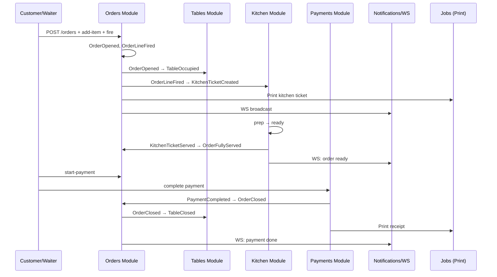

# Akıllı Garson — Production Sistem Mimarisi

**Tarih:** 2 Temmuz 2026  
**Versiyon:** 1.0.0  
**Perspektif:** Staff Software Architect  
**Kapsam:** Mimari tasarım — kod, SQL ve proje iskeleti yok

**Temel referanslar:** [İş Kuralları](./IS-KURALLARI.md) · [Menu Domain](./MENU-DOMAIN-TASARIMI.md) · [Arşiv: Domain Analizi](./archive/DOMAIN-ANALIZI.md)

---

## Yönetici Özeti

Akıllı Garson backend'i **Modular Monolith + Clean/Hexagonal prensipleri** ile tasarlanmalıdır. Tek geliştiriciyle başlanabilir, 10–100 restoranı tek deployment'ta taşır, SaaS geçişi modül sınırları korunarak yapılır.

**Önerilen stack:** NestJS · Prisma · PostgreSQL · Redis · BullMQ · WebSocket Gateway

**Kritik mimari kararlar:**
- Business Action API (CRUD değil)
- Order aggregate kök; KitchenTicket projection
- Domain event'ler in-process (EventEmitter) + outbox pattern hazırlığı
- Multi-tenant: `restaurantId` her sorguda (Row-Level Security opsiyonel Faz 2)
- Tek PostgreSQL, Redis cache/queue/session, horizontal scale hazırlığı

---

## İçindekiler

1. [Teknoloji Kararları](#1-teknoloji-kararları)
2. [Mimari Karşılaştırma ve Seçim](#2-mimari-karşılaştırma-ve-seçim)
3. [Backend Modülleri](#3-backend-modülleri)
4. [Klasör Yapısı](#4-klasör-yapısı)
5. [API Tasarımı](#5-api-tasarımı)
6. [Domain Event Mimarisi](#6-domain-event-mimarisi)
7. [Authentication Mimarisi](#7-authentication-mimarisi)
8. [WebSocket Mimarisi](#8-websocket-mimarisi)
9. [Background Jobs](#9-background-jobs)
10. [Logging Mimarisi](#10-logging-mimarisi)
11. [Deployment ve Ölçekleme](#11-deployment-ve-ölçekleme)
12. [Sonuç](#12-sonuç)

---

# 1. Teknoloji Kararları

## 1.1 NestJS

| | |
|---|---|
| **Neden seçilmeli** | TypeScript native, modüler yapı (Module/Provider/Guard), DI, WebSocket/Bull/Prisma entegrasyonu olgun, tek geliştirici için hızlı iterasyon |
| **Avantajlar** | Feature module organizasyonu, guard/interceptor/pipe altyapısı, Swagger, test harness, büyük ekosistem |
| **Dezavantajlar** | Boilerplate, decorator karmaşıklığı, over-engineering riski (disiplin gerekir) |
| **Alternatifler** | **Express + TS** (daha hafif, daha fazla manuel yapı) · **Fastify + Nest** (performans) · **.NET Minimal API** (TR POS ekosistemi zayıf) · **Go/Fiber** (tek dev için öğrenme eğrisi) |

**Karar:** ✅ Seç — Modular Monolith için en dengeli seçenek.

---

## 1.2 Prisma

| | |
|---|---|
| **Neden seçilmeli** | Type-safe client, migration, schema-first, tek dev için hızlı iterasyon, NestJS `@prisma/client` entegrasyonu kolay |
| **Avantajlar** | Otomatik tip üretimi, relation yönetimi, Prisma Studio (debug), seed script |
| **Dezavantajlar** | Complex query'lerde SQL kadar esnek değil, N+1 riski (dikkat gerekir), büyük migration'larda dikkat |
| **Alternatifler** | **TypeORM** (Nest native ama tip güvenliği zayıf) · **Drizzle** (hafif, SQL'e yakın) · **Kysely** (query builder) · **Raw SQL + sqlc** (ekip büyüyünce) |

**Karar:** ✅ Seç — MVP → Production geçiş hızı kritik.

---

## 1.3 PostgreSQL

| | |
|---|---|
| **Neden seçilmeli** | ACID, JSONB (esnek alanlar), Row-Level Security (multi-tenant), olgun, managed servisler ucuz (Supabase, Neon, RDS) |
| **Avantajlar** | İlişkisel bütünlük (Order/Payment), transaction, full-text search, partitioning (büyüme) |
| **Dezavantajlar** | Operasyonel bilgi gerekir (managed ile azalır), horizontal write scale sınırlı |
| **Alternatifler** | **MySQL** (benzer, RLS yok) · **SQLite** (tek restoran demo) · **MongoDB** (POS için transaction zayıf) · **CockroachDB** (erken aşama overkill) |

**Karar:** ✅ Seç — 10–100 restoran, mali kayıt bütünlüğü için ideal.

---

## 1.4 Redis

| | |
|---|---|
| **Neden seçilmeli** | Cache, session store, BullMQ backend, rate limit, pub/sub (WS scale-out hazırlığı), idempotency key TTL |
| **Avantajlar** | Düşük latency, çok amaçlı, managed (Upstash, ElastiCache) |
| **Dezavantajlar** | Ek altyapı, persistence ayarı (AOF/RDB), memory maliyeti |
| **Alternatifler** | **KeyDB** · **Memcached** (sadece cache) · **PostgreSQL UNLOGGED** (cache için yetersiz) · **In-memory** (scale-out imkansız) |

**Karar:** ✅ Seç — Queue + cache + session tek serviste.

---

## 1.5 BullMQ

| | |
|---|---|
| **Neden seçilmeli** | Redis tabanlı, NestJS `@nestjs/bullmq` resmi destek, retry/delay/priority, job dashboard (Bull Board) |
| **Avantajlar** | Yazıcı, mail, rapor, sync gibi async işler için olgun, tek dev için basit API |
| **Dezavantajlar** | Redis bağımlılığı, çok yüksek throughput'ta Kafka gerekir (100 restoran için yeterli) |
| **Alternatifler** | **Bull v3** (eski) · **Agenda** (Mongo) · **pg-boss** (Postgres queue, Redis'siz) · **Kafka/RabbitMQ** (erken overkill) |

**Karar:** ✅ Seç — Background job ihtiyaçları için yeterli.

---

## 1.6 WebSocket Gateway

| | |
|---|---|
| **Neden seçilmeli** | NestJS `@WebSocketGateway` + Redis adapter ile multi-instance scale, mevcut frontend WS beklentisiyle uyum |
| **Avantajlar** | Role-based room, JWT handshake, aynı process'te REST ile paylaşımlı auth |
| **Dezavantajlar** | Sticky session veya Redis adapter gerekir, bağlantı yönetimi karmaşık |
| **Alternatifler** | **Socket.io** (Nest entegre) · **SSE** (tek yönlü, basit) · **Ably/Pusher** (managed, maliyet) · **Polling** (MVP fallback) |

**Karar:** ✅ Seç — Mutfak/garson real-time kritik.

---

# 2. Mimari Karşılaştırma ve Seçim

## 2.1 Karşılaştırma Tablosu

| Kriter | Layered | Clean | Hexagonal | Modular Monolith | Microservices |
|--------|---------|-------|-----------|------------------|---------------|
| Tek dev hızı | ⭐⭐⭐⭐ | ⭐⭐⭐ | ⭐⭐⭐ | ⭐⭐⭐⭐ | ⭐ |
| 10–100 tenant | ⭐⭐⭐ | ⭐⭐⭐⭐ | ⭐⭐⭐⭐ | ⭐⭐⭐⭐⭐ | ⭐⭐⭐ |
| SaaS geçişi | ⭐⭐ | ⭐⭐⭐⭐ | ⭐⭐⭐⭐ | ⭐⭐⭐⭐⭐ | ⭐⭐⭐⭐⭐ |
| Operasyon yükü | ⭐⭐⭐⭐⭐ | ⭐⭐⭐⭐ | ⭐⭐⭐⭐ | ⭐⭐⭐⭐⭐ | ⭐ |
| Domain odaklılık | ⭐⭐ | ⭐⭐⭐⭐⭐ | ⭐⭐⭐⭐⭐ | ⭐⭐⭐⭐ | ⭐⭐⭐⭐ |
| Test edilebilirlik | ⭐⭐⭐ | ⭐⭐⭐⭐⭐ | ⭐⭐⭐⭐⭐ | ⭐⭐⭐⭐ | ⭐⭐⭐ |

## 2.2 Seçim: **Modular Monolith + Clean/Hexagonal Katmanları**

### Neden?

1. **Tek geliştirici:** Tek repo, tek deploy, tek DB — operasyonel yük minimum. Microservices erken aşamada DevOps felaketi olur.

2. **10–100 restoran:** PostgreSQL + connection pooling + Redis cache ile rahat taşınır. Horizontal scale gerektiğinde stateless API + Redis WS adapter yeterli.

3. **SaaS geçişi:** Her NestJS module = potansiyel bounded context. İleride `PaymentsModule` ayrı servis olabilir; modül sınırları ve domain event'ler sınırı korur.

4. **Domain karmaşıklığı:** Order lifecycle, payment, kitchen projection — Clean Architecture ile domain logic infrastructure'dan izole kalır.

5. **Mevcut frontend:** React SPA action-based API bekliyor; modular monolith'te use case handler'lar doğal karşılık.

### Uygulama Prensipleri

```
┌─────────────────────────────────────────────────────────┐
│  Presentation (Controllers, WS Gateway, DTOs)             │
├─────────────────────────────────────────────────────────┤
│  Application (Use Cases / Command Handlers)             │
├─────────────────────────────────────────────────────────┤
│  Domain (Entities, Value Objects, Domain Services,      │
│          Domain Events, Repository Interfaces)          │
├─────────────────────────────────────────────────────────┤
│  Infrastructure (Prisma Repos, Redis, BullMQ, Mail,     │
│                 Print adapters, External APIs)          │
└─────────────────────────────────────────────────────────┘
```

**Kurallar:**
- Domain katmanı framework/import bağımlılığı taşımaz
- Modüller arası doğrudan repository erişimi yasak — application service veya domain event
- Cross-cutting: Auth, Tenant, Audit, Logging → `shared` veya `core` module

### Neden Microservices Değil?

- 100 restoran × ~50 sipariş/gün = düşük throughput; monolith yeterli
- Distributed transaction (Order + Payment + Fiscal) monolith'te basit
- Tek dev microservices operasyonunu kaldıramaz
- İleride "extract by module" stratejisi uygulanır

---

# 3. Backend Modülleri

## 3.1 Modül Haritası (Genel)

```
                    ┌─────────────┐
                    │    Core     │
                    │ Tenant·Auth │
                    │ Audit·Event │
                    └──────┬──────┘
           ┌───────────────┼───────────────┐
           ▼               ▼               ▼
    ┌──────────┐   ┌──────────┐   ┌──────────┐
    │  Orders  │◄──│  Tables  │   │   Menu   │
    └────┬─────┘   └──────────┘   └──────────┘
         │
    ┌────┼────┬──────────┬────────────┐
    ▼    ▼    ▼          ▼            ▼
 Kitchen Payments Reservations  Inventory
         │
    ┌────┴────┬──────────┬──────────┐
    ▼         ▼          ▼          ▼
 Reports  Notifications Employees Settings
```

---

## 3.2 Modül Detay Tabloları

### Auth Module

| Alan | Detay |
|------|-------|
| **Sorumluluklar** | JWT/refresh, PIN login, device session, RBAC, tenant context |
| **Expose servisler** | `AuthService`, `TokenService`, `PermissionService`, `SessionService` |
| **Entity'ler** | Employee, RefreshToken, DeviceSession, Role, Permission |
| **Publish eventler** | `EmployeeLoggedIn`, `EmployeeLoggedOut`, `SessionRevoked`, `LoginFailed` |
| **Subscribe eventler** | — |

---

### Tenant Module (Core)

| Alan | Detay |
|------|-------|
| **Sorumluluklar** | Restaurant/branch context, tenant isolation, subscription limits |
| **Expose servisler** | `TenantContextService`, `RestaurantService`, `BranchService` |
| **Entity'ler** | Restaurant, Branch, TenantSettings, SubscriptionPlan |
| **Publish eventler** | `RestaurantCreated`, `BranchCreated`, `TenantSettingsUpdated` |
| **Subscribe eventler** | — |

---

### Orders Module ⭐ (Core Domain)

| Alan | Detay |
|------|-------|
| **Sorumluluklar** | Order lifecycle, OrderLine, fire, merge, transfer, split, pricing |
| **Expose servisler** | `OpenOrderUseCase`, `AddItemUseCase`, `FireOrderUseCase`, `CloseOrderUseCase`, `TransferOrderUseCase`, `MergeOrdersUseCase`, `ApplyDiscountUseCase`, `CancelOrderUseCase` |
| **Entity'ler** | Order, OrderLine, OrderDiscount, BillSplit |
| **Publish eventler** | `OrderOpened`, `OrderLineAdded`, `OrderLineFired`, `OrderLineCancelled`, `OrderSentToKitchen`, `OrderFullyServed`, `OrderClosed`, `OrderCancelled`, `OrderVoided`, `OrderTransferred`, `OrdersMerged`, `BillSplitConfigured`, `DiscountApplied` |
| **Subscribe eventler** | `PaymentCompleted`, `KitchenTicketReady`, `KitchenTicketServed`, `TableReleased` |

---

### Tables Module

| Alan | Detay |
|------|-------|
| **Sorumluluklar** | Table lifecycle, QR session, section/floor, combine |
| **Expose servisler** | `SeatGuestUseCase`, `ReleaseTableUseCase`, `StartQrSessionUseCase`, `TransferTableUseCase`, `CombineTablesUseCase` |
| **Entity'ler** | Table, TableSection, QrSession, TableGroup |
| **Publish eventler** | `GuestSeated`, `TableOccupied`, `TableReleased`, `TableClosed`, `TableBlocked`, `QrSessionStarted`, `QrSessionEnded`, `QrSessionConflict` |
| **Subscribe eventler** | `OrderOpened`, `OrderClosed`, `ReservationConfirmed`, `ReservationSeated`, `ReservationCancelled`, `PaymentStarted` |

---

### Kitchen Module

| Alan | Detay |
|------|-------|
| **Sorumluluklar** | KitchenTicket projection, KDS queue, station routing, prep status |
| **Expose servisler** | `CreateTicketFromOrderUseCase`, `AcknowledgeTicketUseCase`, `StartPrepUseCase`, `MarkItemReadyUseCase`, `BumpTicketUseCase`, `HoldTicketUseCase`, `RecallTicketUseCase` |
| **Entity'ler** | KitchenTicket, KitchenTicketLine, KitchenStation |
| **Publish eventler** | `KitchenTicketCreated`, `KitchenTicketReady`, `KitchenTicketBumped`, `KitchenTicketServed`, `KitchenTicketHeld`, `KitchenTicketCancelled`, `KitchenTicketDelayed` |
| **Subscribe eventler** | `OrderLineFired`, `OrderLineCancelled`, `OrderTransferred`, `MenuItem86ed` |

---

### Payments Module

| Alan | Detay |
|------|-------|
| **Sorumluluklar** | Payment lifecycle, split, tip, refund, receipt, fiscal hook |
| **Expose servisler** | `InitiatePaymentUseCase`, `CompleteCashPaymentUseCase`, `ProcessCardPaymentUseCase`, `SplitBillUseCase`, `AddTipUseCase`, `RefundPaymentUseCase`, `VoidPaymentUseCase` |
| **Entity'ler** | Payment, PaymentSplit, Receipt, TipLine |
| **Publish eventler** | `PaymentInitiated`, `PaymentCompleted`, `PaymentFailed`, `PaymentRefunded`, `PaymentVoided`, `ReceiptIssued`, `TipAdded`, `PartialPaymentCompleted` |
| **Subscribe eventler** | `PaymentStarted`, `OrderClosed`, `BillSplitConfigured` |

---

### Reservations Module

| Alan | Detay |
|------|-------|
| **Sorumluluklar** | Reservation lifecycle, conflict check, no-show, reminders |
| **Expose servisler** | `CreateReservationUseCase`, `ConfirmReservationUseCase`, `SeatReservationUseCase`, `CancelReservationUseCase`, `MarkNoShowUseCase` |
| **Entity'ler** | Reservation, ReservationGuest |
| **Publish eventler** | `ReservationCreated`, `ReservationConfirmed`, `ReservationSeated`, `ReservationCancelled`, `ReservationNoShow`, `ReservationLate` |
| **Subscribe eventler** | `OrderClosed` (→ completed), `TableReleased` |

---

### Inventory Module

| Alan | Detay |
|------|-------|
| **Sorumluluklar** | Stock tracking, low stock alert, recipe-based deduction (Faz 2) |
| **Expose servisler** | `AdjustStockUseCase`, `DeductFromOrderUseCase`, `MarkItem86UseCase` |
| **Entity'ler** | InventoryItem, StockMovement, Recipe, RecipeLine |
| **Publish eventler** | `StockAdjusted`, `StockLow`, `StockDepleted`, `MenuItem86ed`, `WasteRecorded` |
| **Subscribe eventler** | `OrderLineFired`, `OrderLineCancelled`, `OrderClosed` |

---

### Menu Module

| Alan | Detay |
|------|-------|
| **Sorumluluklar** | Category, menu item, modifier, pricing, availability |
| **Expose servisler** | `CreateMenuItemUseCase`, `UpdatePriceUseCase`, `ToggleAvailabilityUseCase`, `ManageModifierUseCase` |
| **Entity'ler** | Category, MenuItem, ModifierGroup, Modifier, MenuItemPrice |
| **Publish eventler** | `MenuItemCreated`, `MenuItemUpdated`, `MenuItemAvailabilityChanged`, `MenuPriceChanged` |
| **Subscribe eventler** | `MenuItem86ed` (from Inventory) |

---

### Employees Module

| Alan | Detay |
|------|-------|
| **Sorumluluklar** | Staff CRUD, shift assignment, table assignment, performance projection |
| **Expose servisler** | `CreateEmployeeUseCase`, `AssignTablesUseCase`, `OpenShiftUseCase`, `CloseShiftUseCase` |
| **Entity'ler** | Employee, Shift, TableAssignment |
| **Publish eventler** | `EmployeeCreated`, `ShiftOpened`, `ShiftClosed`, `TablesReassigned` |
| **Subscribe eventler** | `OrderClosed`, `PaymentCompleted` (sales projection) |

---

### Reports Module

| Alan | Detay |
|------|-------|
| **Sorumluluklar** | Read models, daily/hourly stats, export, Z-report prep |
| **Expose servisler** | `DailyReportQuery`, `SalesAnalyticsQuery`, `WaiterPerformanceQuery`, `CategorySalesQuery` |
| **Entity'ler** | DailySalesProjection, HourlySalesProjection (read-only) |
| **Publish eventler** | — (read side) |
| **Subscribe eventler** | `OrderClosed`, `PaymentCompleted`, `PaymentRefunded`, `ShiftClosed` |

---

### Notifications Module

| Alan | Detay |
|------|-------|
| **Sorumluluklar** | In-app notification, push routing, WS broadcast orchestration |
| **Expose servisler** | `NotificationService`, `BroadcastService` |
| **Entity'ler** | Notification, NotificationPreference |
| **Publish eventler** | — |
| **Subscribe eventler** | Tüm operasyonel eventler (filter by role/prefs) |

---

### ServiceCalls Module

| Alan | Detay |
|------|-------|
| **Sorumluluklar** | Garson çağrısı, hesap isteme, SLA/expiry |
| **Expose servisler** | `CreateServiceCallUseCase`, `AcknowledgeCallUseCase`, `ResolveCallUseCase` |
| **Entity'ler** | ServiceCall |
| **Publish eventler** | `ServiceCallCreated`, `ServiceCallAcknowledged`, `ServiceCallResolved`, `ServiceCallExpired` |
| **Subscribe eventler** | `OrderClosed` (auto-resolve) |

---

### Settings Module

| Alan | Detay |
|------|-------|
| **Sorumluluklar** | Restaurant config, tax, service charge, hours, printer config |
| **Expose servisler** | `GetSettingsUseCase`, `UpdateSettingsUseCase` |
| **Entity'ler** | RestaurantSettings, TaxConfig, PrinterConfig |
| **Publish eventler** | `SettingsUpdated` |
| **Subscribe eventler** | — |

---

### Customer Module (QR)

| Alan | Detay |
|------|-------|
| **Sorumluluklar** | QR token validation, customer session, public menu read |
| **Expose servisler** | `ValidateQrTokenUseCase`, `CustomerPlaceOrderUseCase`, `CustomerCancelLineUseCase` |
| **Entity'ler** | QrToken, CustomerSession |
| **Publish eventler** | `CustomerSessionStarted`, `CustomerOrderPlaced` |
| **Subscribe eventler** | `OrderClosed` (session end) |

---

# 4. Klasör Yapısı

Feature-based Modular Monolith. Her modül kendi domain/application/infrastructure katmanına sahip.

```
akilli-garson-api/
├── prisma/
│   ├── schema.prisma
│   ├── migrations/
│   └── seed.ts
├── src/
│   ├── main.ts
│   ├── app.module.ts
│   │
│   ├── core/                          # Cross-cutting
│   │   ├── config/
│   │   │   ├── app.config.ts
│   │   │   ├── database.config.ts
│   │   │   └── redis.config.ts
│   │   ├── tenant/
│   │   │   ├── tenant.module.ts
│   │   │   ├── tenant.context.ts          # AsyncLocalStorage restaurantId
│   │   │   └── tenant.interceptor.ts
│   │   ├── domain/
│   │   │   ├── aggregate-root.ts
│   │   │   ├── domain-event.ts
│   │   │   ├── value-objects/             # Money, OrderStatus, etc.
│   │   │   └── repository.interface.ts
│   │   ├── events/
│   │   │   ├── event-bus.module.ts
│   │   │   ├── domain-event.publisher.ts
│   │   │   └── outbox/                    # Faz 2: transactional outbox
│   │   ├── database/
│   │   │   ├── prisma.module.ts
│   │   │   └── prisma.service.ts
│   │   ├── cache/
│   │   │   └── redis.module.ts
│   │   ├── queue/
│   │   │   ├── bull.module.ts
│   │   │   └── queue.constants.ts
│   │   ├── logging/
│   │   │   ├── logger.module.ts
│   │   │   ├── audit.logger.ts
│   │   │   └── security.logger.ts
│   │   └── exceptions/
│   │       ├── domain.exception.ts
│   │       └── http-exception.filter.ts
│   │
│   ├── modules/
│   │   ├── auth/
│   │   │   ├── auth.module.ts
│   │   │   ├── application/
│   │   │   │   ├── commands/
│   │   │   │   │   ├── login-with-pin.handler.ts
│   │   │   │   │   └── refresh-token.handler.ts
│   │   │   │   └── dto/
│   │   │   ├── domain/
│   │   │   │   ├── employee.entity.ts
│   │   │   │   └── refresh-token.entity.ts
│   │   │   ├── infrastructure/
│   │   │   │   ├── employee.repository.ts
│   │   │   │   └── jwt.strategy.ts
│   │   │   └── presentation/
│   │   │       ├── auth.controller.ts
│   │   │       └── guards/
│   │   │           ├── jwt-auth.guard.ts
│   │   │           ├── roles.guard.ts
│   │   │           └── permissions.guard.ts
│   │   │
│   │   ├── orders/
│   │   │   ├── orders.module.ts
│   │   │   ├── application/
│   │   │   │   ├── commands/
│   │   │   │   │   ├── open-order.handler.ts
│   │   │   │   │   ├── add-item.handler.ts
│   │   │   │   │   ├── fire-order.handler.ts
│   │   │   │   │   ├── close-order.handler.ts
│   │   │   │   │   ├── transfer-order.handler.ts
│   │   │   │   │   └── merge-orders.handler.ts
│   │   │   │   ├── queries/
│   │   │   │   │   ├── get-active-orders.handler.ts
│   │   │   │   │   └── get-order-by-id.handler.ts
│   │   │   │   └── sagas/                 # Multi-step orchestration
│   │   │   │       └── pay-and-close.saga.ts
│   │   │   ├── domain/
│   │   │   │   ├── order.aggregate.ts
│   │   │   │   ├── order-line.entity.ts
│   │   │   │   ├── order.repository.interface.ts
│   │   │   │   └── services/
│   │   │   │       └── pricing.domain-service.ts
│   │   │   ├── infrastructure/
│   │   │   │   └── order.prisma-repository.ts
│   │   │   ├── presentation/
│   │   │   │   └── orders.controller.ts
│   │   │   └── listeners/
│   │   │       └── payment-completed.listener.ts
│   │   │
│   │   ├── tables/
│   │   ├── kitchen/
│   │   ├── payments/
│   │   ├── reservations/
│   │   ├── inventory/
│   │   ├── menu/
│   │   ├── employees/
│   │   ├── reports/
│   │   ├── notifications/
│   │   ├── service-calls/
│   │   ├── settings/
│   │   └── customer/                      # QR public API
│   │
│   ├── gateway/                           # WebSocket
│   │   ├── realtime.module.ts
│   │   ├── realtime.gateway.ts
│   │   ├── room.manager.ts
│   │   └── ws-auth.guard.ts
│   │
│   └── jobs/                              # BullMQ processors
│       ├── print/
│       │   ├── print.processor.ts
│       │   └── print.queue.ts
│       ├── reports/
│       │   └── daily-report.processor.ts
│       ├── notifications/
│       │   ├── email.processor.ts
│       │   └── sms.processor.ts
│       ├── sync/
│       │   └── offline-sync.processor.ts
│       └── audit/
│           └── audit-log.processor.ts
│
├── test/
│   ├── unit/
│   ├── integration/
│   └── e2e/
├── docker/
│   ├── Dockerfile
│   └── docker-compose.yml               # postgres + redis + api
└── docs/
    └── api/                               # OpenAPI export
```

---

# 5. API Tasarımı

## 5.1 Prensipler

- **Business Action** endpoint'leri; generic CRUD yok (Menu/Settings hariç yönetim)
- URL pattern: `/api/v1/{resource}/{id}/{action}`
- Tüm endpoint'ler `restaurantId` tenant context'ten (JWT claim)
- Idempotency-Key header: `POST` fire, payment, order create
- Optimistic locking: `If-Match: {version}` header
- Pagination: cursor-based (reports/listeler)

## 5.2 Auth

| Method | Endpoint | Açıklama |
|--------|----------|----------|
| POST | `/api/v1/auth/login` | Email + PIN |
| POST | `/api/v1/auth/refresh` | Refresh token rotation |
| POST | `/api/v1/auth/logout` | Session revoke |
| POST | `/api/v1/auth/logout-all` | Tüm cihazlar |
| GET | `/api/v1/auth/me` | Aktif kullanıcı + permissions |
| GET | `/api/v1/auth/sessions` | Cihaz oturumları |

## 5.3 Orders ⭐

| Method | Endpoint | Açıklama |
|--------|----------|----------|
| POST | `/api/v1/orders` | Yeni order aç (masa + kaynak) |
| GET | `/api/v1/orders` | Liste (filter: status, table, waiter) |
| GET | `/api/v1/orders/:id` | Detay |
| POST | `/api/v1/orders/:id/add-item` | Kalem ekle |
| PATCH | `/api/v1/orders/:id/items/:lineId` | Miktar/not güncelle |
| DELETE | `/api/v1/orders/:id/items/:lineId` | Kalem sil (fire öncesi) |
| POST | `/api/v1/orders/:id/fire` | Mutfağa gönder |
| POST | `/api/v1/orders/:id/fire-items` | Seçili kalemleri fire |
| POST | `/api/v1/orders/:id/cancel` | Order iptal |
| POST | `/api/v1/orders/:id/items/:lineId/cancel` | Kalem iptal |
| POST | `/api/v1/orders/:id/transfer` | Masa transfer |
| POST | `/api/v1/orders/:id/merge` | Başka order ile birleştir |
| POST | `/api/v1/orders/:id/split-bill` | Hesap böl |
| POST | `/api/v1/orders/:id/apply-discount` | İndirim uygula |
| POST | `/api/v1/orders/:id/request-bill` | Hesap iste |
| POST | `/api/v1/orders/:id/start-payment` | Ödeme kilidi |
| POST | `/api/v1/orders/:id/abort-payment` | Ödeme iptal |
| POST | `/api/v1/orders/:id/close` | Kapat (internal / payment sonrası) |
| POST | `/api/v1/orders/:id/void` | Manager void |
| POST | `/api/v1/orders/:id/reopen` | İkinci round |

## 5.4 Tables

| Method | Endpoint | Açıklama |
|--------|----------|----------|
| GET | `/api/v1/tables` | Floor plan listesi |
| GET | `/api/v1/tables/:id` | Detay + aktif order |
| POST | `/api/v1/tables/:id/seat` | Walk-in oturt |
| POST | `/api/v1/tables/:id/release` | Masayı boşalt |
| POST | `/api/v1/tables/:id/block` | Kilitle |
| POST | `/api/v1/tables/:id/unblock` | Kilidi kaldır |
| POST | `/api/v1/tables/:id/combine` | Masa birleştir |
| POST | `/api/v1/tables/:id/mark-cleaned` | DIRTY → AVAILABLE |
| POST | `/api/v1/tables/:id/qr-session` | QR oturumu başlat |
| DELETE | `/api/v1/tables/:id/qr-session` | QR oturumu sonlandır |

## 5.5 Kitchen

| Method | Endpoint | Açıklama |
|--------|----------|----------|
| GET | `/api/v1/kitchen/tickets` | Aktif ticket listesi |
| GET | `/api/v1/kitchen/tickets/:id` | Ticket detay |
| POST | `/api/v1/kitchen/tickets/:id/acknowledge` | Görüldü |
| POST | `/api/v1/kitchen/tickets/:id/items/:lineId/start` | Hazırlık başla |
| POST | `/api/v1/kitchen/tickets/:id/items/:lineId/ready` | Hazır |
| POST | `/api/v1/kitchen/tickets/:id/bump` | Tüm ticket bump |
| POST | `/api/v1/kitchen/tickets/:id/recall` | Geri al |
| POST | `/api/v1/kitchen/tickets/:id/hold` | Beklet (86) |
| POST | `/api/v1/kitchen/tickets/:id/resume` | Devam |
| PATCH | `/api/v1/kitchen/tickets/:id/priority` | Öncelik |

## 5.6 Payments

| Method | Endpoint | Açıklama |
|--------|----------|----------|
| POST | `/api/v1/payments` | Ödeme başlat |
| GET | `/api/v1/payments/:id` | Detay |
| POST | `/api/v1/payments/:id/complete-cash` | Nakit tamamla |
| POST | `/api/v1/payments/:id/complete-card` | Kart tamamla |
| POST | `/api/v1/payments/:id/add-tip` | Bahşiş ekle |
| POST | `/api/v1/payments/:id/refund` | İade |
| POST | `/api/v1/payments/:id/void` | Void |
| GET | `/api/v1/payments/:id/receipt` | Fiş PDF/data |
| POST | `/api/v1/orders/:id/payments/split` | Split ödeme batch |

## 5.7 Reservations

| Method | Endpoint | Açıklama |
|--------|----------|----------|
| POST | `/api/v1/reservations` | Oluştur |
| GET | `/api/v1/reservations` | Liste |
| POST | `/api/v1/reservations/:id/confirm` | Onayla |
| POST | `/api/v1/reservations/:id/seat` | Check-in |
| POST | `/api/v1/reservations/:id/cancel` | İptal |
| POST | `/api/v1/reservations/:id/no-show` | No-show |

## 5.8 Menu

| Method | Endpoint | Açıklama |
|--------|----------|----------|
| GET | `/api/v1/menu/categories` | Kategoriler |
| GET | `/api/v1/menu/items` | Ürünler (public + staff) |
| POST | `/api/v1/menu/items` | Oluştur (manager) |
| PATCH | `/api/v1/menu/items/:id` | Güncelle |
| POST | `/api/v1/menu/items/:id/toggle-availability` | Stokta var/yok |

## 5.9 Inventory

| Method | Endpoint | Açıklama |
|--------|----------|----------|
| GET | `/api/v1/inventory` | Stok listesi |
| POST | `/api/v1/inventory/:id/adjust` | Manuel düzeltme |
| POST | `/api/v1/inventory/:id/mark-86` | Ürün bitti |

## 5.10 Employees

| Method | Endpoint | Açıklama |
|--------|----------|----------|
| GET | `/api/v1/employees` | Liste |
| POST | `/api/v1/employees` | Oluştur |
| POST | `/api/v1/employees/:id/shift/open` | Vardiya aç |
| POST | `/api/v1/employees/:id/shift/close` | Vardiya kapa |

## 5.11 Service Calls

| Method | Endpoint | Açıklama |
|--------|----------|----------|
| POST | `/api/v1/service-calls` | Talep oluştur |
| GET | `/api/v1/service-calls/pending` | Bekleyenler |
| POST | `/api/v1/service-calls/:id/acknowledge` | Onayla |
| POST | `/api/v1/service-calls/:id/resolve` | Çöz |

## 5.12 Reports

| Method | Endpoint | Açıklama |
|--------|----------|----------|
| GET | `/api/v1/reports/daily` | Günlük özet |
| GET | `/api/v1/reports/sales/by-category` | Kategori satış |
| GET | `/api/v1/reports/sales/by-hour` | Saatlik |
| GET | `/api/v1/reports/waiters/performance` | Garson performans |
| POST | `/api/v1/reports/daily/export` | CSV/PDF export (async job) |

## 5.13 Customer (Public QR)

| Method | Endpoint | Açıklama |
|--------|----------|----------|
| POST | `/api/v1/public/qr/validate` | QR token doğrula |
| GET | `/api/v1/public/menu` | Menü (session token) |
| POST | `/api/v1/public/orders` | Müşteri siparişi |
| GET | `/api/v1/public/orders` | Masa siparişleri |
| POST | `/api/v1/public/service-calls` | Garson çağır |

## 5.14 Settings

| Method | Endpoint | Açıklama |
|--------|----------|----------|
| GET | `/api/v1/settings` | Restoran ayarları |
| PATCH | `/api/v1/settings` | Güncelle |

---

# 6. Domain Event Mimarisi

## 6.1 Event Bus Stratejisi

**Faz 1 (Monolith):** NestJS `EventEmitter2` — in-process, senkron/async handler  
**Faz 2 (Scale):** Transactional Outbox → Redis Stream veya BullMQ — at-least-once delivery  
**Faz 3 (SaaS scale):** Seçili eventler external bus (Kafka/NATS) — module extract hazırlığı

## 6.2 Event Envelope

```
{
  eventId: UUID,
  eventType: "OrderLineFired",
  aggregateId: "order-uuid",
  aggregateType: "Order",
  restaurantId: "tenant-uuid",
  branchId: "branch-uuid",
  occurredAt: ISO8601,
  version: 1,
  payload: { ... },
  metadata: { userId, deviceId, correlationId }
}
```

## 6.3 Publish / Subscribe Matrisi

| Event | Publisher | Subscribers |
|-------|-----------|-------------|
| `OrderOpened` | Orders | Tables, Notifications, WS |
| `OrderLineFired` | Orders | Kitchen, Inventory, Jobs(Print), WS |
| `OrderLineCancelled` | Orders | Kitchen, Inventory, Notifications |
| `OrderFullyServed` | Orders | Notifications, WS |
| `OrderClosed` | Orders | Tables, Reports, Customer, Reservations, Employees |
| `OrderTransferred` | Orders | Kitchen, Tables, WS |
| `OrdersMerged` | Orders | Kitchen, Tables, WS |
| `PaymentCompleted` | Payments | Orders, Reports, WS |
| `PaymentFailed` | Payments | Notifications, WS |
| `ReceiptIssued` | Payments | Jobs(Print), Audit |
| `KitchenTicketReady` | Kitchen | Notifications, WS |
| `KitchenTicketServed` | Kitchen | Orders, WS |
| `KitchenTicketDelayed` | Kitchen | Notifications (SLA job) |
| `TableOccupied` | Tables | WS |
| `TableClosed` | Tables | WS |
| `QrSessionStarted` | Tables/Customer | WS |
| `ReservationConfirmed` | Reservations | Tables, Jobs(Email/SMS), WS |
| `ReservationNoShow` | Reservations | Tables, Jobs |
| `ServiceCallCreated` | ServiceCalls | Notifications, WS |
| `StockLow` | Inventory | Notifications, WS |
| `MenuItem86ed` | Inventory | Menu, Kitchen, WS |
| `EmployeeLoggedIn` | Auth | Audit(Security) |
| `LoginFailed` | Auth | Audit(Security), Jobs(rate limit) |

## 6.4 Event Flow Diyagramı (Happy Path)



## 6.5 Kritik Saga: PayAndClose

```
PaymentStarted
  → PaymentCompleted (1..N split)
  → SUM(payments) >= balance ?
      YES → OrderClosed → TableClosed → QrSessionEnded → ReceiptIssued
      NO  → remain PAYMENT_IN_PROGRESS
```

Tek database transaction: Payment COMPLETED + Order CLOSED + Receipt atomik.

---

# 7. Authentication Mimarisi

## 7.1 Token Stratejisi

| Token | Süre | Depolama | İçerik |
|-------|------|----------|--------|
| Access Token (JWT) | 15 dk | Client memory | sub, restaurantId, branchId, role, permissions[], sessionId |
| Refresh Token | 7 gün | HttpOnly cookie + DB hash | rotation family id |

## 7.2 Refresh Token Rotation

```
1. Login → access + refresh (v1) → DB: hash(refresh_v1), familyId
2. Refresh → validate v1 → revoke v1 → issue v2 → DB: hash(refresh_v2)
3. Reuse detected (v1 tekrar gelirse) → familyId tüm tokenlar revoke → SECURITY ALERT
```

## 7.3 RBAC + Permissions

**Roller (coarse):** `MANAGER`, `WAITER`, `KITCHEN`

**Permissions (fine-grained):**

```
orders:create, orders:fire, orders:cancel, orders:void
payments:take, payments:refund, payments:void
discounts:apply, discounts:override
tables:transfer, tables:merge
menu:manage, inventory:manage
reports:view, employees:manage
settings:manage
```

Endpoint → `@RequirePermissions('orders:fire')` decorator  
Role default permission set; Manager override all.

## 7.4 Device Session

```
DeviceSession {
  id, employeeId, restaurantId,
  deviceType: tablet|phone|kiosk|desktop,
  deviceName, ip, userAgent,
  refreshTokenFamilyId,
  lastActiveAt, createdAt, revokedAt
}
```

- Garson tablet: session persist
- Kiosk: branch-level device token (uzun ömürlü, kısıtlı permissions)
- QR Customer: ayrı `CustomerSession` token (scope: single table, 4h TTL)

## 7.5 PIN Authentication

- PIN bcrypt hash (cost 10+)
- Brute-force: Redis counter, 5 fail → 15 dk lock
- Manager PIN reset audit log

## 7.6 Multi-Tenant Auth

JWT `restaurantId` claim → `TenantInterceptor` → Prisma middleware tüm query'lere `where: { restaurantId }` enjekte eder.

---

# 8. WebSocket Mimarisi

## 8.1 Gateway Tasarımı

- **Path:** `/ws/v1`
- **Auth:** Handshake'te JWT (staff) veya CustomerSession token (QR)
- **Adapter:** `@socket.io/redis-adapter` (multi-instance)
- **Room yapısı:**
  - `restaurant:{restaurantId}` — genel broadcast
  - `branch:{branchId}` — şube
  - `kitchen:{branchId}` — mutfak ekranı
  - `waiter:{employeeId}` — kişisel
  - `table:{tableId}` — QR müşteri
  - `dashboard:{restaurantId}` — admin dashboard

## 8.2 Kim Bağlanabilir?

| Client | Auth | Rooms |
|--------|------|-------|
| Staff (garson/admin) | JWT | branch, waiter(self), table(assigned) |
| Kitchen | JWT (KITCHEN role) | kitchen:{branchId} |
| Dashboard | JWT (MANAGER) | dashboard, branch |
| QR Customer | CustomerSession | table:{tableId} only |

## 8.3 WS Event Payload (Server → Client)

```typescript
// Envelope
{ type: string, payload: object, timestamp: number, restaurantId: string }
```

## 8.4 Dinleme Matrisi

| WS Event | Kitchen | Garson | Dashboard | QR Müşteri |
|----------|---------|--------|-----------|------------|
| `ORDER_CREATED` | ✅ | ✅ | ✅ | ✅ (own table) |
| `ORDER_UPDATED` | ✅ | ✅ | ✅ | ✅ |
| `KITCHEN_TICKET_READY` | ✅ | ✅ | ❌ | ✅ |
| `KITCHEN_TICKET_DELAYED` | ✅ | ✅ | ✅ | ❌ |
| `PAYMENT_COMPLETED` | ❌ | ✅ | ✅ | ✅ |
| `TABLE_UPDATED` | ❌ | ✅ | ✅ | ❌ |
| `CALL_WAITER` | ❌ | ✅ | ✅ | ❌ |
| `SERVICE_CALL_CREATED` | ❌ | ✅ | ✅ | ❌ |
| `STOCK_LOW` | ✅ | ❌ | ✅ | ❌ |
| `RESERVATION_NEW` | ❌ | ✅ | ✅ | ❌ |
| `MENU_ITEM_86ED` | ✅ | ✅ | ❌ | ✅ |

Domain event handler → `BroadcastService.emitToRoom()` — presentation concern ayrı.

---

# 9. Background Jobs

## 9.1 Queue Yapısı

| Queue | Priority | Concurrency | Retry |
|-------|----------|-------------|-------|
| `print` | high | 3 | 3x exponential |
| `notifications` | normal | 5 | 3x |
| `reports` | low | 2 | 2x |
| `sync` | normal | 1 | 5x |
| `audit` | low | 10 | 5x |
| `scheduled` | low | 1 | 1x |

## 9.2 Job Listesi

### Print Queue
| Job | Tetikleyici | Açıklama |
|-----|-------------|----------|
| `print.kitchen-ticket` | OrderLineFired | ESC/POS mutfak fişi |
| `print.receipt` | ReceiptIssued | Adisyon fişi |
| `print.daily-report` | Manual / scheduled | Gün sonu raporu |

### Notifications Queue
| Job | Tetikleyici | Açıklama |
|-----|-------------|----------|
| `notify.email` | ReservationConfirmed | Rezervasyon onay mail |
| `notify.sms` | ReservationReminded | Hatırlatma SMS |
| `notify.push` | ServiceCallCreated | Garson push (mobil Faz 2) |
| `notify.stock-alert` | StockLow | Düşük stok email |

### Reports Queue
| Job | Tetikleyici | Açıklama |
|-----|-------------|----------|
| `report.daily-aggregate` | Cron 04:00 | Günlük projection rebuild |
| `report.export-csv` | API request | Async export |
| `report.z-report-prep` | ShiftClosed | Z raporu hazırlık |

### Sync Queue
| Job | Tetikleyici | Açıklama |
|-----|-------------|----------|
| `sync.offline-orders` | Device reconnect | Offline batch ingest |
| `sync.conflict-resolve` | Sync failure | MANAGER review queue |

### Audit Queue
| Job | Tetikleyici | Açıklama |
|-----|-------------|----------|
| `audit.persist` | All domain events | Async audit write |
| `audit.security-alert` | LoginFailed x5, token reuse | Alert manager |

### Scheduled (Cron)
| Job | Schedule | Açıklama |
|-----|----------|----------|
| `reservation.no-show-check` | */5 min | Grace period → NO_SHOW |
| `session.expire-qr` | */10 min | Idle QR session cleanup |
| `kitchen.sla-check` | */1 min | Delayed ticket alert |
| `report.nightly` | 04:00 daily | Aggregate rebuild |

---

# 10. Logging Mimarisi

## 10.1 Üç Log Katmanı

| Katman | Amaç | Depolama | Retention |
|--------|------|----------|-----------|
| **Application Log** | Debug, trace, performans | stdout → Loki/CloudWatch | 30 gün |
| **Audit Log** | Kim, ne, ne zaman, hangi entity | PostgreSQL `audit_logs` + async job | 7 yıl (mali) |
| **Security Log** | Auth, permission deny, token anomaly | PostgreSQL `security_logs` + alert | 2 yıl |

## 10.2 Application Log

- **Format:** Structured JSON (Pino logger)
- **Alanlar:** level, timestamp, correlationId, restaurantId, userId, message, durationMs
- **Seviyeler:** error, warn, info, debug
- **Kural:** Domain katmanında logger yok; application/infrastructure boundary'de

## 10.3 Audit Log

```
AuditLog {
  id, restaurantId, branchId,
  actorId, actorType: employee|system|customer,
  action: "OrderLineFired",
  entityType: "Order", entityId,
  before: JSON?, after: JSON?,
  ip, deviceId, correlationId,
  createdAt
}
```

**Audit zorunlu aksiyonlar:** Order cancel/void, payment refund/void, discount override, merge/transfer, settings change, employee CRUD, login/logout, reservation no-show.

## 10.4 Security Log

```
SecurityLog {
  id, eventType: LOGIN_FAILED|TOKEN_REUSE|PERMISSION_DENIED|BRUTE_FORCE,
  employeeId?, ip, userAgent, metadata, createdAt
}
```

- 5 LOGIN_FAILED / 15 dk → account lock + alert
- Refresh token reuse → tüm family revoke + MANAGER notification

## 10.5 Correlation ID

- HTTP: `X-Correlation-Id` header (client veya generated)
- Tüm log, event, audit aynı correlationId taşır
- Distributed trace (Faz 2): OpenTelemetry

---

# 11. Deployment ve Ölçekleme

## 11.1 Faz 1 — Tek Geliştirici (10–30 restoran)

```
┌─────────────────────────────────────┐
│  VPS / Railway / Render             │
│  ┌─────────────┐  ┌──────────────┐  │
│  │ NestJS API  │  │ Redis        │  │
│  │ (1 instance)│  │ (managed)    │  │
│  └──────┬──────┘  └──────────────┘  │
│         │                           │
│  ┌──────▼──────┐                    │
│  │ PostgreSQL  │                    │
│  │ (managed)   │                    │
│  └─────────────┘                    │
└─────────────────────────────────────┘
         ▲
    React SPA (Vite static CDN)
```

**Tahmini kaynak:** 2 vCPU, 4GB RAM API · db.t3.small PostgreSQL · Redis 256MB

## 11.2 Faz 2 — Büyüme (30–100 restoran)

- API 2–3 instance (load balancer)
- Redis adapter WS scale-out
- PostgreSQL read replica (reports)
- Connection pooling (PgBouncer)
- CDN static assets

## 11.3 Faz 3 — SaaS

- Tenant onboarding API
- SaaS abonelik faturalandırma modülü
- Per-tenant rate limits
- Optional: extract Payments → ayrı servis
- Optional: extract Reports → read replica + OLAP

---

# 12. Sonuç

## ✅ Kesin Uygulanmasını Önerdiğim Mimari Kararlar

1. **Modular Monolith + Clean Architecture** — tek dev, 100 restoran, SaaS hazırlığı
2. **NestJS + Prisma + PostgreSQL + Redis + BullMQ** — stack
3. **Business Action API** — CRUD değil, use case endpoint'leri
4. **Order aggregate kök** — KitchenTicket projection, split brain yok
5. **Domain events in-process** — EventEmitter2 + handler pattern
6. **Multi-tenant via restaurantId** — JWT claim + Prisma middleware
7. **JWT 15dk + Refresh rotation** — device session tracking
8. **RBAC + fine-grained permissions** — sunucu tarafı guard
9. **WebSocket room-based** — Redis adapter hazırlığı
10. **Audit / Security / Application log ayrımı**
11. **Idempotency-Key + optimistic locking (version)** — concurrency
12. **Transactional PayAndClose saga** — payment + order close atomik

## ⚠️ Daha Sonra Eklenebilecek Yapılar

| Yapı | Ne zaman |
|------|----------|
| Transactional Outbox | WS/notification güvenilirliği kritik olunca |
| PostgreSQL Row-Level Security | Compliance / ekstra tenant izolasyonu |
| Read replica + CQRS projections | Report yükü artınca |
| OpenTelemetry tracing | Production debug ihtiyacı |
| GraphQL (subset) | Mobil app custom query |
| Feature flags (LaunchDarkly) | SaaS A/B test |
| Multi-branch override | Zincir restoran müşterisi |
| Fiscal/ÖKC adapter module | TR mali uyum Faz 3 |
| API rate limiting per tenant | SaaS abuse prevention |
| Kubernetes | 100+ restoran, SLA gereksinimi |

## ❌ Bu Proje İçin Gereksiz Gördüğüm Teknolojiler

| Teknoloji | Neden gereksiz (şimdilik) |
|-----------|---------------------------|
| **Microservices** | Operasyon yükü, tek dev, düşük throughput |
| **Kafka** | BullMQ + Redis yeterli (100 restoran) |
| **MongoDB** | POS transactional bütünlük PostgreSQL'de |
| **Elasticsearch** | PostgreSQL full-text + structured log yeterli |
| **GraphQL (tam)** | SPA action-based API yeterli |
| **Service Mesh (Istio)** | Monolith için overkill |
| **CQRS tam ayrımı** | Reports module projection yeterli |
| **Event Sourcing (full)** | Audit log + domain events yeterli; ES karmaşıklığı |
| **Multiple databases** | Tek PostgreSQL basitlik |
| **Serverless (Lambda)** | WS + long-running jobs uyumsuz |

## 🚀 İlk Implement Edilecek Modüller Sırası

| Sıra | Modül | Gerekçe | Tahmini süre |
|------|-------|---------|--------------|
| **1** | Core (Config, Prisma, Tenant, Events, Logging) | Temel altyapı | 1 hf |
| **2** | Auth (JWT, PIN, RBAC, Session) | Güvenlik önceliği | 1–2 hf |
| **3** | Menu + Settings | Sipariş öncesi catalog | 1 hf |
| **4** | Tables + Customer (QR) | Masa + müşteri oturumu | 1 hf |
| **5** | Orders ⭐ | Çekirdek domain | 2–3 hf |
| **6** | Kitchen | Order'a bağlı projection | 1 hf |
| **7** | Payments | Order close döngüsü | 1–2 hf |
| **8** | Notifications + WebSocket Gateway | Real-time | 1 hf |
| **9** | ServiceCalls | Operasyonel tamamlama | 0.5 hf |
| **10** | Reservations | Bağımsız modül | 1 hf |
| **11** | Reports (projections) | Dashboard verisi | 1 hf |
| **12** | Inventory + Jobs (Print, Audit) | Stok + async | 1–2 hf |
| **13** | Employees + Shifts | Personel yönetimi | 1 hf |

**Toplam tahmini:** 12–16 hafta (tek full-stack dev, mevcut React frontend adaptasyonu paralel)

---

## İlgili Dokümanlar

- [Master Project Report](./MASTER_PROJECT_REPORT.md)
- [Arşiv: Domain Model Analizi](./archive/DOMAIN-ANALIZI.md)
- [İş Kuralları ve State Machines](./IS-KURALLARI.md)

---

*Bu doküman Akıllı Garson v2.0.0 hedef production mimarisidir. Kod, SQL ve proje iskeleti içermez.*
