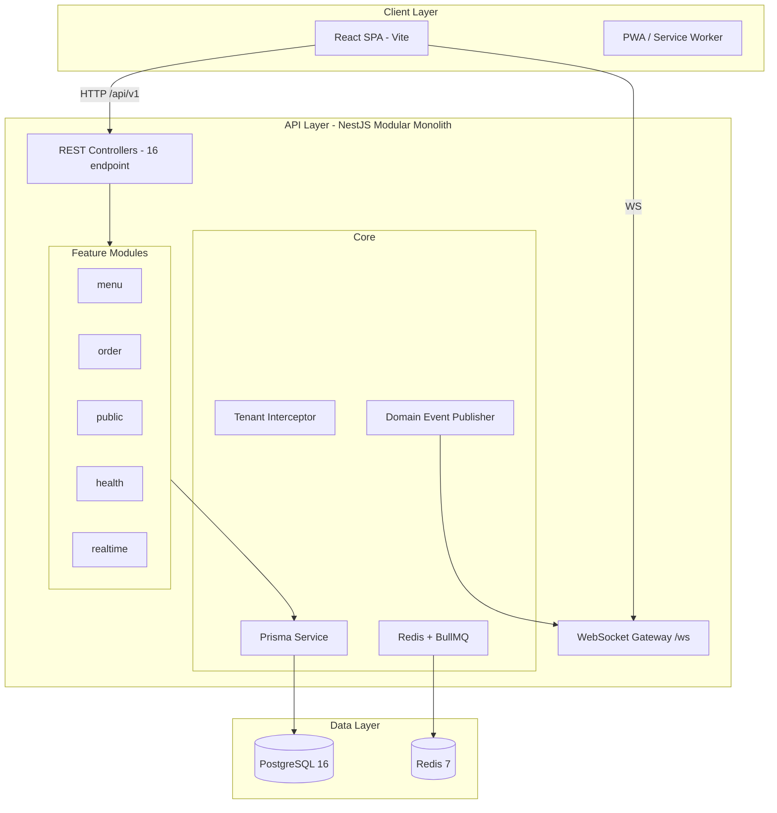
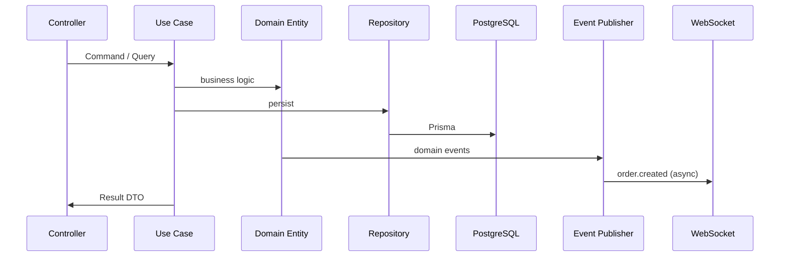
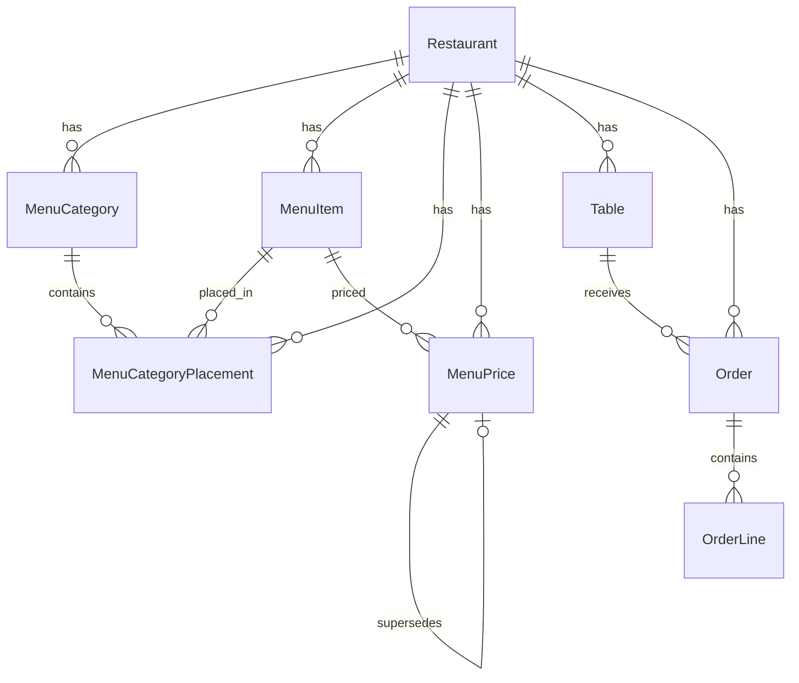
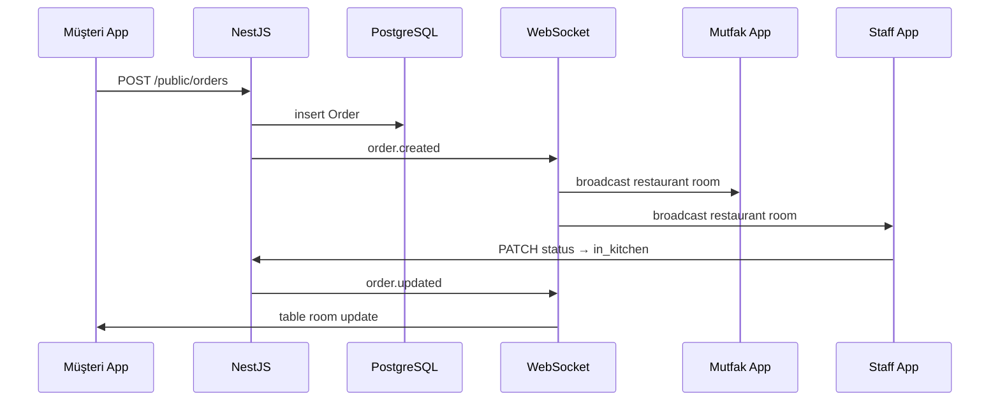

# Akıllı Garson — MASTER PROJECT REPORT

> **Archived document (pre-RC2).** Preserved for historical context. Audience framing below was neutralized in 2026-07; stack details describe the json-server → NestJS transition era.

**Proje:** Akıllı Garson (Smart Waiter)  
**Versiyon:** 2.0.0  
**Rapor Tarihi:** 3 Temmuz 2026  
**Hazırlayan Perspektifi:** Chief Software Architect & Product Owner  
**Kapsam:** Mevcut kod tabanının objektif analizi — kod yazılmamıştır

---

## Doküman Amacı

Bu rapor; ürün değerlendirmesi, teknik inceleme, yatırımcı görüşmeleri ve GitHub README hazırlığı için **tek kaynak** olarak kullanılmak üzere hazırlanmıştır. Övgü değil, **gerçekçi değerlendirme** hedeflenmiştir.

---

# 1. Executive Summary

### Proje Nedir?

**Akıllı Garson**, restoranlarda masa bazlı sipariş yönetimi, QR menü ile müşteri self-servis siparişi, mutfak ekranı (KDS), personel paneli ve operasyonel dashboard sunan **full-stack restoran operasyon platformudur**.

- **Frontend:** React 18 + Vite 6 SPA (Türkçe arayüz, PWA iskeleti)
- **Backend:** NestJS 11 + Prisma 6 + PostgreSQL 16 (Modular Monolith, DDD)
- **Altyapı:** Redis 7, BullMQ (kayıtlı, işlemci yok), WebSocket (`/ws`)

### Hangi Problemi Çözer?

| Problem | Çözüm |
|---------|--------|
| Garson yoğunluğunda sipariş alma gecikmesi | QR menü → müşteri doğrudan sipariş verir |
| Sipariş–mutfak–servis kopukluğu | Tek `Order` aggregate + WebSocket ile anlık güncelleme |
| Kağıt menü ve manuel hesap karmaşası | Dijital menü, sipariş geçmişi, durum takibi |
| Operasyonel görünürlük eksikliği | Dashboard, mutfak ekranı, sipariş listesi |

### Hedef Kullanıcılar

| Segment | Rol |
|---------|-----|
| **Müşteri (dine-in)** | QR ile menü görür, sipariş verir, durumu takip eder |
| **Garson** | Siparişleri görür, durum günceller, masa operasyonu |
| **Mutfak** | Aktif siparişleri görür, hazırlık durumunu yönetir |
| **Kasiyer / Yönetici** | Ödeme, raporlama, menü yönetimi (kısmen) |
| **Restoran sahibi / Admin** | Tüm modüller, ayarlar, analitik (planlı) |

### Olgunluk Seviyesi

| Boyut | Değerlendirme |
|-------|---------------|
| **MVP** | ✅ **Evet** — QR sipariş + menü + sipariş listesi + mutfak (orders üzerinden) çalışır |
| **Demo hazır** | ✅ **Evet** — Lokal ortamda uçtan uca demo akışı mümkün (seed + NestJS + Vite) |
| **Production hazır** | ❌ **Hayır** — Auth, ödeme, masa API, CI/CD, test coverage, güvenlik eksik |
| **SaaS hazır** | ⚠️ **Kısmen** — Şema ve tenant altyapısı var; auth, billing, onboarding yok |

**Özet:** Proje **gelişmiş bir referans implementasyon / mimari referans** ile **erken aşama ürün (MVP+)** arasında bir noktadadır. Backend ciddi mimari yatırım almış; frontend legacy json-server döneminden NestJS'e geçişin ortasındadır.

---

# 2. Business Problem

### Restoranlarda Tipik Problemler

1. **Operasyonel sürtünme:** Garsonlar aynı anda sipariş alma, hesap getirme ve masa yönetimiyle meşgul.
2. **İletişim kaybı:** Sipariş mutfağa geç ulaşır veya kalemler karışır.
3. **Veri kör noktası:** Günlük ciro, popüler ürünler, masa doluluk oranı anlık görülmez.
4. **Ölçeklenemeyen süreçler:** Franchise / çok şube yönetimi Excel ve telefonla yapılır.
5. **Müşteri beklentisi:** Temassız menü ve hızlı sipariş talebi (özellikle post-COVID).

### Bu Sistem Hangilerini Çözüyor?

| Problem | Durum |
|---------|-------|
| QR self-servis sipariş | ✅ Çözüyor (public menu + public order API) |
| Sipariş durum takibi | ✅ Çözüyor (staff + customer ekranları) |
| Mutfak görünürlüğü | ⚠️ Kısmen (sipariş seviyesinde; kalem bazlı KDS backend'de yok) |
| Anlık bildirim | ⚠️ Kısmen (WebSocket + polling) |
| Masa yönetimi | ❌ Henüz (frontend UI var, backend tables API yok) |
| Ödeme / POS | ❌ Henüz |
| Rezervasyon | ❌ Henüz |
| Stok / envanter | ❌ Henüz |
| Çoklu restoran SaaS | ⚠️ Altyapı hazır, ürün değil |

### Klasik Sürece Göre Avantajlar

```
Klasik:  Müşteri → Garson → Kağıt → Mutfak → Garson → Kasa
Akıllı:  Müşteri → QR → Sistem → Mutfak (ekran) → Garson (bildirim) → Kasa
```

- Sipariş girişi **paralelleşir** (her masa bağımsız QR)
- Durum değişiklikleri **merkezi ve izlenebilir**
- Menü güncellemesi **anında** yansır (staff API)
- Gelecekte çok şube için **tek kod tabanı, tenant izolasyonu** mümkün

---

# 3. Product Vision

### Uzun Vadeli Vizyon

**Akıllı Garson**, Türkiye ve benzer pazarlarda KOBİ restoranlar için **uçtan uca operasyon OS'i** olmayı hedefler: siparişten ödemeye, mutfaktan rapora, tek masadan franchise ağına.

### SaaS Dönüşümü

| Katman | Mevcut | Hedef |
|--------|--------|-------|
| Tenant | `Restaurant` modeli + `X-Restaurant-Id` | JWT claim + subdomain |
| Faturalama | Yok | SaaS abonelik faturalandırma entegrasyonu |
| Onboarding | Manuel seed | Self-service kayıt |
| Veri izolasyonu | Uygulama katmanı | RLS (PostgreSQL) opsiyonel |

### Çoklu Restoran & Franchise

- Prisma şemasında `restaurantId` tüm iş tablolarında mevcut
- `branchId`, `salesChannelId` placeholder alanları (Branch / SalesChannel modelleri planlı)
- Franchise için merkezi menü + şube fiyatlandırması (`MenuPrice` context-aware tasarımı)

### QR Ordering

- **Aktif:** `tableToken` → public menu → public order
- **Eksik:** Ödeme entegrasyonu, çoklu dil menü, alerjen filtreleri

### Kitchen Display (KDS)

- **Frontend:** Tam ekran mutfak UI mevcut
- **Backend:** Ayrı `KitchenTicket` aggregate yok; sipariş durum makinesi kullanılıyor
- **Hedef:** Kalem bazlı hazırlık, istasyon yönlendirme (`kitchenStationId` placeholder)

---

# 4. Product Features

| Feature | Açıklama | Durum | Tamamlandı | Planlandı | Demo | Production |
|---------|----------|-------|:----------:|:---------:|:----:|:----------:|
| QR Menü (müşteri) | Token ile menü görüntüleme | ✅ Çalışıyor | ✓ | | ✓ | |
| QR Sipariş | Public order oluşturma | ✅ Çalışıyor | ✓ | | ✓ | |
| Müşteri sipariş takibi | Geçmiş ve durum | ✅ Çalışıyor | ✓ | | ✓ | |
| Staff menü listeleme | Kategori + ürün | ✅ Çalışıyor | ✓ | | ✓ | |
| Menü ürün ekleme | POST menu/items | ✅ Çalışıyor | ✓ | | ✓ | |
| Fiyat güncelleme | PATCH price | ✅ Çalışıyor | ✓ | | ✓ | |
| Stok toggle (menü) | Availability | ❌ API yok | | ✓ | | |
| Ürün silme / arşivleme | Archive use-case | ⚠️ Backend var, HTTP yok | | ✓ | | |
| Sipariş listesi (staff) | GET orders | ✅ Çalışıyor | ✓ | | ✓ | |
| Sipariş durum güncelleme | PATCH status | ✅ Çalışıyor | ✓ | | ✓ | |
| Mutfak ekranı | Orders → KDS map | ✅ Çalışıyor | ✓ | | ✓ | |
| Dashboard | Orders'dan istatistik | ✅ Çalışıyor | ✓ | | ✓ | |
| WebSocket realtime | order.* events | ✅ Çalışıyor | ✓ | | ✓ | |
| Masalar | CRUD + durum | ❌ | | ✓ | UI only | |
| Garson yönetimi | CRUD | ❌ | | ✓ | UI only | |
| Rezervasyon | CRUD | ❌ | | ✓ | UI only | |
| Ödeme / POS | Payment kaydı | ❌ | | ✓ | UI only | |
| Envanter / stok | Inventory | ❌ | | ✓ | UI only | |
| Garson çağırma | Service calls | ❌ | | ✓ | toast | |
| Analitik (legacy API) | dailyStats vb. | ❌ | | ✓ | partial | |
| Auth (JWT) | Gerçek kimlik | ❌ | | ✓ | demo PIN | |
| RBAC | Rol bazlı erişim | ⚠️ Frontend only | | ✓ | demo | |
| i18n | TR/EN | ⚠️ Kısmi | | ✓ | partial | |
| PWA / offline | Service worker | ⚠️ İskelet | | ✓ | | |
| CI/CD | Pipeline | ❌ | | ✓ | | |
| Swagger API docs | OpenAPI | ✅ Çalışıyor | ✓ | | ✓ | |

---

# 5. User Flows

## 5.1 Müşteri Akışı

```mermaid
flowchart TD
    A[QR kodu okut / ?token=qr-masa-1] --> B[/customer - CustomerLogin]
    B --> C[localStorage: customerTable]
    C --> D[/customer/menu - Public Menu API]
    D --> E[Sepete ürün ekle]
    E --> F[Siparişi onayla]
    F --> G[POST /public/orders]
    G --> H[/customer/orders - sipariş takibi]
    H --> I{WebSocket order.updated}
    I --> H
    D --> J[Garson çağır - DEVRE DIŞI]
```

**Adımlar:**
1. QR veya masa token girişi
2. Public menü yüklenir (`GET /api/v1/public/menu/:tableToken`)
3. Sepet lokal state'te tutulur
4. Sipariş `POST /api/v1/public/orders` ile oluşturulur
5. `tableId` sipariş yanıtından kaydedilir
6. Siparişler ekranında filtrelenmiş liste + WebSocket yenileme

## 5.2 Garson Akışı

```mermaid
flowchart TD
    A[/login - demo PIN 1234] --> B[Dashboard]
    B --> C[/orders - aktif siparişler]
    C --> D[Durum güncelle: preparing / ready / served]
    D --> E[PATCH /orders/:id/status]
    E --> F[WebSocket → mutfak + bildirim]
    B --> G[/tables - DEVRE DIŞI]
    C --> H[Ödeme modal - payments API yok, sipariş kapatılır]
```

## 5.3 Kasiyer Akışı

```mermaid
flowchart TD
    A[Login] --> B[/orders]
    B --> C[Aktif / tamamlanan filtre]
    C --> D[Ödeme al modal]
    D --> E{payments API}
    E -->|Yok| F[Sipariş status = completed]
    E -->|Gelecek| G[POST /payments + fiş]
    F --> H[Yazdır - printReceipt tarayıcı]
```

*Not: Gerçek kasa entegrasyonu (ödeme gateway ve POS terminal sağlayıcıları) planlı.*

## 5.4 Mutfak Akışı

```mermaid
flowchart TD
    A[Login - kitchen rolü] --> B[/kitchen]
    B --> C[GET /orders - aktif filtre]
    C --> D[Mutfak kartları göster]
    D --> E[Kalem / sipariş hazır işaretle]
    E --> F[PATCH /orders/:id/status]
    F --> G[WS: order.ready / order.updated]
    G --> H[Garson bildirimi]
```

## 5.5 Admin Akışı

```mermaid
flowchart TD
    A[Login - manager] --> B[Dashboard]
    B --> C[/menu - ürün yönetimi]
    B --> D[/analytics - kısmi client-side]
    B --> E[/waiters - DEVRE DIŞI]
    B --> F[/inventory - DEVRE DIŞI]
    B --> G[/settings]
    C --> H[Ürün ekle / fiyat güncelle]
```

---

# 6. Technical Architecture

## 6.1 Genel Mimari



## 6.2 Teknoloji Matrisi

| Katman | Teknoloji | Versiyon | Rol |
|--------|-----------|----------|-----|
| UI | React | 18.3 | SPA |
| Build | Vite | 6.0 | Dev + prod bundle |
| Routing | React Router | 7.1 | Staff + customer routes |
| Server state | TanStack Query | 5.62 | Cache, mutations, polling |
| Client state | Zustand | 5.0 | UI, auth, cart, filters |
| API client | Axios | 1.7 | HTTP + interceptors |
| Backend | NestJS | 11 | Modular monolith |
| ORM | Prisma | 6 | Schema, migrations |
| DB | PostgreSQL | 16 | ACID, tenant data |
| Cache/Queue | Redis + BullMQ | 7 | Health + queue module (işlemci yok) |
| Realtime | ws + NestJS Gateway | 8.21 | Order events |
| Docs | Swagger | OpenAPI | `/docs` |

## 6.3 DDD & Clean Architecture (Backend)

**Menu modülü** referans implementasyon:

```
menu/
├── domain/          entities, value objects, events, invariants, factories
├── application/     commands, queries, use-cases, ports
├── infrastructure/  prisma repositories, mappers, unit-of-work
└── presentation/    controllers, DTOs, response mappers
```

**Prensipler:**
- **Repository Pattern:** Port (`MenuCategoryRepositoryPort`) → Prisma adapter
- **CQRS (manuel):** Command/Query sınıfları → Use Case `.execute()` — `@nestjs/cqrs` kullanılmıyor
- **Domain Events:** `DomainEventPublisher` + `@nestjs/event-emitter`
- **Unit of Work:** `PrismaUnitOfWork` + transaction context
- **Optimistic Locking:** `version` alanı + `optimistic-lock.helper.ts`

## 6.4 Katman Diyagramı (İstek Akışı)



---

# 7. Domain Design

## 7.1 Bounded Contexts

| Context | Durum | Modül |
|---------|-------|-------|
| **Menu** | ✅ Uygulandı | `api/src/modules/menu` |
| **Order** | ✅ Uygulandı | `api/src/modules/order` |
| **Public (QR)** | ✅ Read model | `api/src/modules/public` |
| **Table** | ⚠️ Sadece Prisma model | tables API yok |
| **Payment** | ❌ Planlı | — |
| **Reservation** | ❌ Planlı | — |
| **Inventory** | ❌ Planlı | — |
| **Auth / Identity** | ❌ Planlı | env placeholder |
| **Analytics** | ❌ Planlı | — |
| **Notification** | ❌ Planlı | WS kısmi |

## 7.2 Aggregates

| Aggregate Root | Child Entities | Tenant Key |
|----------------|----------------|------------|
| `Restaurant` | — (SaaS kök) | — |
| `MenuCategory` | — | `restaurantId` |
| `MenuItem` | `MenuPrice` | `restaurantId` |
| `CategoryPlacement` | N:M link | `restaurantId` |
| `Table` | — | `restaurantId` |
| `Order` | `OrderLine` (snapshot) | `restaurantId` |

## 7.3 Entities (Domain)

| Entity | Dosya alanı |
|--------|-------------|
| `MenuCategory` | `menu/domain/entities/` |
| `MenuItem` | `menu/domain/entities/` |
| `MenuPrice` | `menu/domain/entities/` |
| `CategoryPlacement` | `menu/domain/entities/` |
| `Order` | `order/domain/entities/` |
| `OrderLine` | `order/domain/entities/` |

## 7.4 Value Objects

| Value Object | Amaç |
|--------------|------|
| `Money` | `amountMinor` + `currencyCode` |
| `CategorySlug` | URL-safe kategori kimliği |
| `MenuItemSlug` | Ürün slug validasyonu |
| `Sku` | Stok kodu kuralları |
| `CategoryColor` | Hex renk |
| `DisplayOrder` | Sıralama |
| `MenuItemSnapshot` | Sipariş satırı için menü anlık görüntüsü |

## 7.5 Domain Events (13)

| Event | Modül |
|-------|-------|
| `menu.category.created` | Menu |
| `menu.category.archived` | Menu |
| `menu.item.created` | Menu |
| `menu.item.activated` | Menu |
| `menu.item.archived` | Menu |
| `menu.price.changed` | Menu |
| `menu.category-placement.*` (4 event) | Menu |
| `order.created` | Order |
| `order.opened` | Order |
| `order.status-changed` | Order |

**WebSocket'e bağlı:** `order.created`, `order.status-changed` → `OrderRealtimeHandler`

## 7.6 Use Cases (15)

### Menu (10)
- `CreateCategoryUseCase`
- `ArchiveCategoryUseCase` *(HTTP yok)*
- `ListCategoriesUseCase` / `GetCategoryUseCase`
- `CreateMenuItemUseCase`
- `ArchiveMenuItemUseCase` *(HTTP yok)*
- `GetMenuItemUseCase` / `ListMenuItemsUseCase`
- `AttachMenuItemToCategoryUseCase`
- `ChangeMenuItemPriceUseCase`

### Order (4)
- `CreateOrderUseCase` (public)
- `ChangeOrderStatusUseCase`
- `GetOrderUseCase` / `ListOrdersUseCase`

### Public (1)
- `GetPublicMenuUseCase`

---

# 8. Database Design

## 8.1 ER Diyagramı



## 8.2 Prisma Modelleri (8)

| Model | Tablo | Soft Delete |
|-------|-------|:-----------:|
| `Restaurant` | `restaurants` | — |
| `Table` | `tables` | `deletedAt` |
| `MenuCategory` | `menu_categories` | `deletedAt` |
| `MenuItem` | `menu_items` | `deletedAt` |
| `MenuCategoryPlacement` | `menu_category_placements` | — |
| `MenuPrice` | `menu_prices` | `deletedAt` |
| `Order` | `orders` | `deletedAt` |
| `OrderLine` | `order_lines` | — |

## 8.3 İlişkiler & Kısıtlar

- Tüm iş verisi `restaurantId` ile kapsüllenir
- `OrderLine` → `MenuItem` **FK yok** (snapshot pattern — fiyat/isim değişse bile sipariş korunur)
- Unique: `(restaurantId, slug)`, `(restaurantId, sku)`, `(categoryId, menuItemId)`, `(orderId, lineNumber)`
- `OrderStatus` 10 durumlu makine (draft → closed / cancelled)

## 8.4 Index Stratejisi (~29 index)

| Pattern | Örnek |
|---------|-------|
| Tenant scope | `idx_*_restaurant` |
| Soft delete filtre | `idx_*_restaurant_not_deleted` |
| Liste sorguları | `idx_orders_restaurant_status`, `idx_orders_restaurant_created` |
| Fiyat çözümleme | `idx_menu_prices_resolve` (branch + channel + status) |

## 8.5 Multi-Tenant Yapısı

```
Restaurant (tenant root)
    └── restaurantId → tüm child tablolarda zorunlu
```

- **Uygulama katmanı:** `TenantInterceptor` + `X-Restaurant-Id` header → `AsyncLocalStorage`
- **Public endpoint:** Tenant, `tableToken` üzerinden çözülür
- **Gelecek:** PostgreSQL Row-Level Security, JWT `restaurantId` claim
- **Placeholder:** `branchId`, `salesChannelId`, `taxCategoryId`, `kitchenStationId` (modeller sonra eklenecek)

## 8.6 Migration Geçmişi

| Migration | İçerik |
|-----------|--------|
| `20250703090000_init_menu` | Menu şeması |
| `20250703100000_add_tables` | Table modeli |
| `20250703110000_add_orders` | Order + OrderLine |

---

# 9. API Documentation

## 9.1 Modül Özeti

| Modül | Controller | Endpoint Sayısı |
|-------|------------|:---------------:|
| Health | `health.controller` | 3 |
| Menu Category | `menu-category.controller` | 3 |
| Menu Item | `menu-item.controller` | 5 |
| Order (staff) | `order.controller` | 3 |
| Public Menu | `public-menu.controller` | 1 |
| Public Order | `public-order.controller` | 1 |
| **Toplam REST** | | **16** |

**Swagger:** `GET /docs` — Bearer + `X-Restaurant-Id` dokümante (Bearer henüz işlevsel değil)

## 9.2 Public API (Kimlik doğrulama yok)

| Method | Path | Açıklama |
|--------|------|----------|
| GET | `/api/v1/public/menu/:tableToken` | QR menü |
| POST | `/api/v1/public/orders` | Sipariş oluştur (`tableToken`, `lines`) |

## 9.3 Staff API (`X-Restaurant-Id` zorunlu)

### Menu
| Method | Path |
|--------|------|
| POST | `/menu/categories` |
| GET | `/menu/categories` |
| GET | `/menu/categories/:id` |
| POST | `/menu/items` |
| GET | `/menu/items` |
| GET | `/menu/items/:id` |
| POST | `/menu/items/:menuItemId/categories` |
| PATCH | `/menu/items/:menuItemId/price` |

### Orders
| Method | Path |
|--------|------|
| GET | `/orders` |
| GET | `/orders/:id` |
| PATCH | `/orders/:id/status` |

### Health
| Method | Path |
|--------|------|
| GET | `/health`, `/health/live`, `/health/ready` |

## 9.4 Response Formatı

Tüm REST yanıtları envelope ile sarılır:

```json
{
  "success": true,
  "data": { ... },
  "timestamp": "2026-07-03T..."
}
```

Frontend `axios.js` interceptor bu envelope'u otomatik açar.

## 9.5 HTTP'de Olmayan Use-Case'ler

- `ArchiveCategoryUseCase`
- `ArchiveMenuItemUseCase`

*(Integration testlerde kullanılıyor)*

---

# 10. Frontend Architecture

## 10.1 Yapı

```
src/
├── api/           axios, adapters, services (API_ENABLED)
├── components/    UI, Layout, providers (~23 bileşen)
├── hooks/         19 TanStack Query hook dosyası
├── pages/         16 sayfa (13 staff + 3 customer)
├── store/         useAppStore (Zustand)
├── locales/       tr.js, en.js
└── utils/         print, sound
```

## 10.2 TanStack Query

- **Global:** `staleTime` 5 dk, query retry 3, mutation retry 0
- **Pattern:** Query key factory → `useQuery` / `useMutation` → optimistic update → `invalidateQueries`
- **Combined hooks:** `useMenuWithCategories()`, `useStats()`
- **Disabled queries:** `API_ENABLED` false iken `enabled: false` — global query hatası önlenir

## 10.3 Zustand Store

| State | Persist |
|-------|---------|
| `activeWaiter`, `theme`, `language`, `soundEnabled` | ✅ |
| `carts[tableId]` (staff POS) | ✅ |
| `notificationPrefs`, kitchen refresh | ✅ |
| Server data | ❌ (Query'de) |

## 10.4 Provider Zinciri

```
ErrorBoundary
└── QueryClientProvider
    └── BrowserRouter
        └── ThemeProvider
            └── WebSocketProvider
                └── NotificationProvider
                    └── App
```

## 10.5 Routing

- **Lazy loading:** Tüm sayfalar `React.lazy` + `Suspense`
- **AuthGuard:** Staff rotaları — demo `activeWaiter` kontrolü
- **Customer:** Public rotalar, token tabanlı

## 10.6 Hook Mimarisi

| Hook | Veri kaynağı |
|------|--------------|
| `useMenu`, `useOrders`, `usePublicMenu` | NestJS ✅ |
| `useKitchen` | NestJS orders (mapped) ✅ |
| `useTables`, `usePayments`, `useReservations`... | Disabled / stub ❌ |
| `useAuth` | Hardcoded demo users |
| `useWebSocket` | NestJS `/ws` |

## 10.7 Adapter Katmanı

`adapters.js` NestJS ↔ UI dönüşümü:
- Para: `minorToMajor` / `majorToMinor` (kuruş)
- Sipariş durumu: `open` → `pending`, `in_kitchen` → `preparing`, vb.
- Menü: `ACTIVE` → `isAvailable: true`

---

# 11. Realtime Architecture

## 11.1 Bağlantı

- **URL:** `ws://localhost:3001/ws` (`VITE_WS_URL`)
- **Gateway:** `RealtimeGateway` (NestJS)
- **CORS:** `*` (geliştirme)

## 11.2 Client → Server

| Event | Payload | Açıklama |
|-------|---------|----------|
| `join` | `{ role, restaurantId?, tableToken?, tableId? }` | Odaya katıl |
| `connected` | — | Bağlantı onayı |

## 11.3 Server → Client (Order)

| Event | Tetikleyici |
|-------|-------------|
| `order.created` | `order.created` domain event |
| `order.updated` | `order.status-changed` |
| `order.ready` | Status → `PARTIALLY_SERVED` |
| `order.served` | Status → `SERVED` |

**Envelope:** `{ type, payload, timestamp, restaurantId }`

## 11.4 Room Yapısı

| Room | Üyeler |
|------|--------|
| `restaurant:{restaurantId}` | Staff (`role: staff`) |
| `table:{tableId}` | Customer (`role: customer`) |

## 11.5 Realtime Sipariş Akışı



**Frontend:** `WebSocketProvider` → query invalidation on events; `NotificationProvider` polling ile sipariş değişikliği toast'ları.

---

# 12. Security

| Konu | Durum | Detay |
|------|-------|-------|
| **JWT** | ❌ Yok | Env'de placeholder; Auth modülü planlı |
| **RBAC** | ❌ Backend yok | Frontend `usePermissions.js` — bypass edilebilir |
| **Tenant izolasyonu** | ⚠️ Kısmi | `X-Restaurant-Id` header — spoof edilebilir |
| **Public API** | ⚠️ | `tableToken` bilgisi = sipariş yetkisi |
| **Validation** | ✅ | `class-validator` + `ValidationPipe` (NestJS) |
| **HTTP hardening** | ✅ | helmet, compression, CORS |
| **Rate limiting** | ❌ | Yok |
| **HTTPS** | ❌ | Lokal dev HTTP |
| **Secrets** | ⚠️ | `.env` — commit edilmemeli |
| **SQL injection** | ✅ | Prisma parameterized |
| **XSS** | ⚠️ | React default escape; `dangerouslySetInnerHTML` kontrol edilmeli |

### Kritik Eksikler

1. Gerçek kimlik doğrulama ve oturum yönetimi
2. Tenant header yerine signed JWT claim
3. Public order endpoint için rate limit / abuse koruması
4. Staff endpoint'lerin tamamı header ile açık

---

# 13. Performance

| Teknik | Durum |
|--------|-------|
| **Caching (Redis)** | Modül var; menü/order cache uygulanmamış |
| **Optimistic Lock** | ✅ `version` + helper (menu, order) |
| **Transaction** | ✅ `PrismaUnitOfWork` |
| **Lazy Loading (FE)** | ✅ Route-based code splitting |
| **Query staleTime** | ✅ 5 dk global; orders 10 sn |
| **N+1 riski** | ⚠️ Menü listeleme kategori başına istek |
| **Bundle** | ~464 KB ana chunk (gzip ~152 KB) — Recharts ağır |
| **WebSocket vs polling** | Hibrit; kitchen 5 sn polling opsiyonel |
| **DB indexes** | ✅ Tenant + status indexleri mevcut |

### İyileştirme Fırsatları

- Menü tek endpoint veya DataLoader
- Recharts lazy / daha hafif chart
- Redis cache: public menu by token
- API container + connection pooling tuning

---

# 14. Testing

| Tür | Durum | Detay |
|-----|-------|-------|
| **Unit (backend)** | ❌ 0 test | `*.spec.ts` yok |
| **Integration (backend)** | ⚠️ 1 dosya | `create-category.integration.spec.ts` — 10 case |
| **Integration altyapısı** | ✅ | Testcontainers PG veya local DB |
| **Unit (frontend)** | ❌ | Vitest/Jest yok |
| **E2E** | ❌ | Playwright kurulu, test yazılmamış |
| **Coverage** | ⚠️ | Sadece menu modülü integration coverage config |

**npm scripts (api):** `test:integration`, `test:integration:coverage` — `test:unit` yok

### Test Boşlukları (Risk)

- Order flow integration testi yok
- Public API contract testi yok
- WebSocket integration testi yok
- Frontend regression koruması yok

---

# 15. DevOps

| Konu | Durum |
|------|-------|
| **Docker Compose** | ✅ `api/docker/docker-compose.yml` — Postgres + Redis only |
| **API Dockerfile** | ❌ |
| **Frontend container** | ❌ |
| **CI/CD** | ❌ `.github/workflows` yok |
| **Environment** | `.env.example` (api), root `VITE_*` |
| **Migration** | `prisma migrate deploy` — 3 migration |
| **Seed** | Script ile inline seed (restaurant, table, menu) |
| **Windows dev** | `start-pg.vbs`, embedded PG workaround |
| **Logging** | Pino (NestJS) |
| **Health checks** | `/health/live`, `/health/ready` (Prisma + Redis) |
| **BullMQ** | Kayıtlı; job processor tanımlı değil |

### Ortam Değişkenleri (Özet)

| Değişken | Katman |
|----------|--------|
| `DATABASE_URL` | API |
| `REDIS_URL` | API |
| `API_PREFIX`, `PORT` | API |
| `VITE_API_URL`, `VITE_RESTAURANT_ID`, `VITE_WS_URL` | Frontend |

---

# 16. Current Project Status

## 16.1 Tamamlananlar

- NestJS modular monolith iskeleti
- Menu bounded context (full DDD)
- Order bounded context (create + status)
- Public QR menu + order API
- Prisma multi-tenant şema
- WebSocket order events
- Swagger dokümantasyonu
- React staff + customer UI (zengin)
- Frontend → NestJS migrasyonu (menu, orders, kitchen)
- Integration test altyapısı (menu)
- Optimistic locking + domain events

## 16.2 Devam Edenler

- Frontend legacy modül temizliği (`API_ENABLED` pattern)
- json-server → NestJS tam geçiş
- Realtime entegrasyonu frontend'de

## 16.3 Eksikler

- Auth / JWT / RBAC (backend)
- Tables, Payments, Reservations, Inventory, ServiceCalls API
- Archive menu HTTP endpoint'leri
- Order item ekleme/çıkarma API
- CI/CD pipeline
- E2E testler
- Production deployment (K8s / PaaS)
- Gerçek ödeme entegrasyonu

## 16.4 Teknik Borç

| Borç | Etki |
|------|------|
| Dual backend geçmişi (json-server UI kalıntıları) | Karmaşıklık, yanıltıcı ekranlar |
| Frontend JavaScript (TS yok) | Tip güvenliği, refactor riski |
| Demo auth (PIN 1234) | Güvenlik, production engeli |
| `@nestjs/cqrs` yerine manuel CQRS | Tutarlılık riski büyük ekipte |
| Menu list N+1 HTTP | Performans |
| TEKNIK-DURUM.md güncel değil | json-server hâlâ yazıyor |
| Eski `server/` + `db.json` | Repo kirliliği, karışıklık |

---

# 17. Roadmap

## 1 Ay (Stabilizasyon)

- [ ] Tables REST API + frontend enable
- [ ] JWT auth + role claims
- [ ] Order integration testleri
- [ ] CI: lint + build + integration test
- [ ] README + demo video
- [ ] Legacy json-server kodunu kaldır / arşivle

## 3 Ay (MVP+)

- [ ] Payments modülü (nakit + kart kayıt)
- [ ] Service calls (garson çağır)
- [ ] Archive / availability menu endpoint'leri
- [ ] E2E: QR → order → kitchen → complete
- [ ] API Dockerfile + staging deploy
- [ ] i18n tamamlama

## 6 Ay (Beta SaaS)

- [ ] Multi-restaurant onboarding
- [ ] Branch / channel fiyatlandırma
- [ ] Kitchen station routing
- [ ] Analytics modülü (gerçek aggregation)
- [ ] Rate limiting + audit log
- [ ] Mobile-responsive polish

## 12 Ay (Production SaaS)

- [ ] Billing (abonelik)
- [ ] POS / ödeme sağlayıcı entegrasyonları (TR)
- [ ] Franchise dashboard
- [ ] RLS veya tenant DB stratejisi
- [ ] 99.9% SLA, merkezi izleme ve gözlemlenebilirlik (APM)
- [ ] SOC2 / KVKK uyum çalışması

---

# 18. SWOT Analysis

## Strengths (Güçlü Yönler)

- **Ciddi backend mimarisi:** DDD, domain events, repository pattern — teknik incelemede öne çıkar
- **Doğru teknoloji seçimi:** NestJS + Prisma + PG — endüstri standardı
- **Multi-tenant şema:** SaaS yol haritası düşünülmüş
- **Zengin frontend:** 16 sayfa, animasyonlar, KDS, dashboard — demo etkisi yüksek
- **Realtime:** WebSocket + domain event köprüsü
- **Dokümantasyon:** `docs/` altında mimari analizler mevcut

## Weaknesses (Zayıf Yönler)

- **Yarım migrasyon:** Birçok ekran API'siz
- **Güvenlik boşluğu:** Auth yok
- **Test coverage çok düşük**
- **Frontend TypeScript değil**
- **CI/CD yok**
- **Tek geliştirici riski** — bus factor 1

## Opportunities (Fırsatlar)

- Türkiye'de KOBİ restoran dijitalleşmesi
- QR menü zorunluluğu / alışkanlık artışı
- SaaS abonelik modeli (aylık/restoran)
- White-label franchise çözümü
- POS entegrasyon ortaklıkları

## Threats (Tehditler)

- **Yoğun rekabet alanı:** Yerel ve global restoran yönetim platformları, QR menü çözümleri, kurumsal POS sistemleri
- **Düşük switching cost:** Restoranlar basit QR menüye geçebilir
- **Ödeme regülasyonu:** PCI, KVKK yükü
- **Yarım ürünle pazara çıkma riski** — güven kaybı

---

# 19. Technical Assessment (by experience level)

| Seviye | Uygunluk | Gerekçe |
|--------|----------|---------|
| **Junior** | ⭐⭐⭐⭐⭐ Üst sınır | Bu proje junior beklentisinin çok üzerinde |
| **Mid** | ⭐⭐⭐⭐ Güçlü | Full-stack akış, Query, mimari okuma |
| **Senior** | ⭐⭐⭐ Orta-üst | DDD backend gösterir; test/auth/ops eksikleri senior beklentisini tam karşılamaz |
| **Lead** | ⭐⭐ Zayıf-orta | Vizyon ve mimari doküman var; ekip/ölçek/ops kanıtı yok |

### Neden Mid–Senior Arası İzlenim?

**Olumlu:**
- Bounded context, aggregate, domain event kullanımı
- Modular monolith organizasyonu
- Full-stack uçtan uca düşünülmüş ürün

**Eksik (Senior/Lead için):**
- Production war stories (monitoring, incident, scale)
- Test stratejisi ve coverage
- Security threat modeling uygulaması
- Takım kod standartları (monorepo, CI, ADR)

**Sunum önerisi:** *"Backend'i DDD ile sıfırdan yazdım; frontend legacy'den NestJS'e migrate ettim"* — dürüst çerçeve.

---

# 20. Stakeholder Assessment

## Teknik Ekip Lideri

> *"Mimari okuması iyi, menu modülü temiz. Auth ve test olmadan production'a almam. Ama tek başına bu kadar iş çıkarmış — teknik derinlik gösteriyor."*

**Beğenir:** DDD, Prisma şema, Swagger, event-driven WS  
**Eksik bulur:** Test, auth, yarım feature'lar, JS frontend

## CTO

> *"Ürün vizyonu ve tenant modeli doğru yönde. Teknik borç bilinçli yönetilmeli. Yatırım yapılabilir ama 3–6 ay daha engineering gerekir."*

**Beğenir:** SaaS-ready şema, modular monolith  
**Eksik bulur:** Security, CI/CD, observability, team scalability

## Product Manager

> *"Demo etkileyici — QR sipariş çalışıyor. Ama masa, ödeme, rezervasyon vaat edilip çalışmıyorsa satışta sorun olur. MVP kapsamını daraltıp çalışanı öne çıkarmalı."*

**Beğenir:** Kullanıcı akışları, Türkçe UX, geniş feature yüzeyi  
**Eksik bulur:** Çalışmayan modüller, net MVP sınırı, metrikler

## Kurumsal Teknik Değerlendirici

**Beğenir:**
- Modern stack referansı
- Müşteriye demo edilebilir QR akışı
- Mimari dokümantasyon (teslim edilebilirlik sinyali)

**Eksik bulur:**
- Teslim süresi belirsizliği (yarım modüller)
- Garanti / SLA için production readiness
- Bölgesel ödeme ve mali mevzuat entegrasyonu

---

# 21. Commercial Evaluation

## Hedef Sektörler

| Sektör | Uygunluk |
|--------|----------|
| Bağımsız restoranlar (10–50 masa) | ✅ Yüksek |
| Kafe / fast-casual | ✅ Yüksek |
| Otel restoranları | ⚠️ Orta (rezervasyon gerekir) |
| Zincir / franchise | ⚠️ Düşük-orta (şube yönetimi yok) |
| Dark kitchen | ⚠️ Orta (masa modeli uyumsuz) |

## Potansiyel Kullanıcılar

- Restoran sahipleri (sahip-işletme)
- Operasyon müdürleri
- Garson / mutfak ekipleri (sistem kullanıcıları)

## Rakipler

| Kategori | Not |
|-------|-----|
| **Yerel restoran POS ve operasyon platformları** | Bölgesel pazar, kurulu oyuncular |
| **Dijital menü ve self-order çözümleri** | QR odaklı, düşük maliyet |
| **Teslimat platformu iş ortağı çözümleri** | Entegre ekosistem |
| **Global restoran POS ve ödeme platformları** | Endüstri referans mimarileri |
| **Basit QR menü SaaS'ları** | Düşük maliyet, sadece menü |

## Farklılaşma Potansiyeli

| Fark | Gerçekçilik |
|------|-------------|
| DDD + modern mimari (B2B teknik satış) | ✅ Şimdiden var |
| Tek platform: QR + KDS + POS | ⚠️ Kısmen |
| Türkiye fiyat / KDV / fiş uyumu | ❌ Henüz yok |
| AI garson asistanı (proje adı) | ❌ Henüz yok — isim vaat ediyor |

---

# 22. Presentation Readiness

## Şu Haliyle Sunulabilir mi?

| Hedef | Sunulabilir? |
|-------|:------------:|
| Teknik referans implementasyonu | ✅ Evet |
| Hackathon / demo günü | ✅ Evet |
| Pilot restoran (ücretsiz beta) | ⚠️ Kontrollü |
| Ücretli satış | ❌ Hayır |
| Yatırımcı pitch (seed) | ⚠️ Vizyon + demo ile, metrik olmadan zor |
| Kurumsal satın alma / RFP süreçleri | ❌ Hayır |

## Neden Hayır (Production / Satış)?

1. Kimlik doğrulama ve yetkilendirme yok
2. Ödeme ve yasal fiş akışı yok
3. Çalışmayan modüller sidebar'da hâlâ görünüyor
4. Test ve SLA kanıtı yok
5. Destek / monitoring altyapısı yok

## Sunum Öncesi Yapılacaklar (Öncelik Sırası)

| # | Aksiyon | Etki |
|---|---------|------|
| 1 | **Çalışan akışı videosu** (QR → sipariş → mutfak → tamamla) | Yüksek |
| 2 | **README** — kurulum, mimari diyagram, demo credentials | Yüksek |
| 3 | **Çalışmayan menü öğelerini gizle** veya "Yakında" etiketle | Yüksek |
| 4 | **Auth (minimal JWT)** | Kritik |
| 5 | **3–5 E2E test** (Playwright) | Yüksek |
| 6 | **CI badge** (build + integration) | Orta |
| 7 | **Mimari 1-pager** (bu rapordan özet) | Orta |
| 8 | **Screenshots** (`scripts/capture-screenshots.mjs`) | Orta |
| 9 | **Staging URL** (Railway/Fly.io) | Yüksek |
| 10 | **Metrikler** — demo restoranda X sipariş işlendi | Orta |

---

# 23. Final Score

100 üzerinden — **mevcut kod tabanına** dayalı objektif puanlar:

| Kriter | Puan | Kısa Gerekçe |
|--------|:----:|--------------|
| **Architecture** | 78 | DDD menu/order, modular monolith, event-driven WS; tamamlanmamış bounded context'ler |
| **Backend** | 72 | NestJS kaliteli; auth, tables, payments eksik |
| **Frontend** | 64 | Zengin UI; yarım migrasyon, JS, disabled features |
| **Database** | 82 | İyi normalize, tenant-ready, snapshot pattern, indexler |
| **UX** | 74 | Modern, animasyonlu; kırık ekranlar güveni düşürür |
| **Scalability** | 68 | Mimari izin verir; kanıtlanmamış |
| **Security** | 32 | Kritik boşluk — en düşük alan |
| **Code Quality** | 67 | Backend iyi; frontend tutarsız |
| **Maintainability** | 70 | Modüler; dual-backend borcu |
| **Documentation value** | 80 | Mimari kararlar iyi belgelenmiş |
| **Commercial Value** | 48 | Erken; rakip alanı zor |
| **Overall** | **68** | Güçlü teknik referans, zayıf ürün olgunluğu |

---

## Sonuç: Dış Değerlendirme İçin Uygun mu?

### Kısa cevap: **Evet — doğru kapsam ve doğru anlatımla.**

### Detaylı cevap

**Uygun:**
- **Teknik inceleme** ve **referans implementasyon** sunumu
- **NestJS / Node / TypeScript backend** odaklı değerlendirme
- **Startup** ve **ürün odaklı ekipler** (MVP hızı takdir edilir)
- Canlı demo + mimari açıklama ile

**Zorlanır:**
- **Security-critical** (fintech, health) production devralma
- **"Production sistemlerini devral"** beklentisi olan roller
- **Frontend architect** beklentisi (TS, test, design system eksik)

### Güçlü Yönler (değerlendirmede vurgula)

1. Sıfırdan DDD ile menu bounded context tasarımı
2. Multi-tenant Prisma şeması ve migration disiplini
3. Domain event → WebSocket pipeline
4. Legacy json-server'dan NestJS'e bilinçli migrasyon
5. Full-stack ürün düşüncesi (16 ekran, QR + staff)

### Açık Eksikler (değerlendirmede proaktif belirt)

1. JWT / RBAC uygulanmadı — bilinçli erteleme
2. Test coverage düşük — integration altyapısı hazır
3. Frontend modüllerinin ~%40'ı API bekliyor
4. Production deploy ve monitoring yok
5. Tek kişilik geliştirme — ekip süreçleri deneyimi sınırlı

### Objektif Hüküm

Bu proje **"tutorial CRUD" değil** — gerçek mimari derinliği var. Aynı zamanda **"production SaaS" de değil** — güvenlik ve operasyon katmanları eksik. Dış değerlendirmede **en güçlü nokta**, backend mimari kararlarını somut dosyalarla anlatabilmektir. En büyük risk, çalışmayan ekranları gösterip "hepsi bitti" izlenimi vermektir — **dar ama çalışan demo** ile sunulmalıdır.

---

*Rapor sonu.*  
*Kaynak: `api/src/`, `src/`, `api/prisma/`, `docs/`, build çıktıları — 3 Temmuz 2026.*
