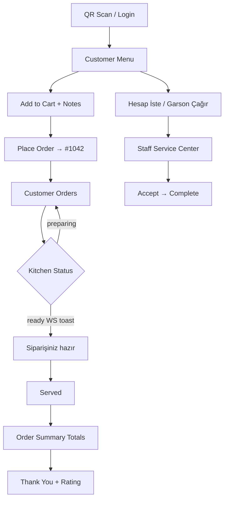

# RC2 Customer Experience Report

**Project:** Akıllı Garson  
**Release:** RC2 — Customer Dining Journey Completion  
**Date:** 2026-07-06  
**Scope:** Complete end-to-end customer workflow without architectural rewrites

---

## Executive Summary

RC2 closes the gaps identified in the Customer Experience Audit (RC1). All ten requested features are implemented against the real NestJS backend, PostgreSQL database, and existing WebSocket infrastructure. No mock APIs, placeholder endpoints, or fake data were introduced.

---

## Implemented Features

| # | Feature | Status | Summary |
|---|---------|--------|---------|
| 1 | **Request Bill** | ✅ | Customer taps **Hesap İste** → `POST /public/service-calls` (type `bill`) → staff notified in real time |
| 2 | **Call Waiter** | ✅ | **Garson Çağır** with reasons: Su, Ekmek, Sos, Yardım, Diğer |
| 3 | **Service Call Center** | ✅ | Staff page `/operations/service-calls` with Waiting / Accepted / Completed workflow |
| 4 | **Order Notes** | ✅ | Notes persisted on `orders.notes`; visible on Kitchen, Orders, and customer order detail |
| 5 | **Short Order Number** | ✅ | Per-restaurant `displayNumber` (e.g. `#1042`); UUID remains internal |
| 6 | **Customer Restaurant Header** | ✅ | Shared `CustomerHeader`: restaurant name, table name, order count |
| 7 | **Ready Notification** | ✅ | WebSocket `order.ready` with message *"Siparişiniz hazır."* on customer routes |
| 8 | **Order Summary** | ✅ | `CustomerOrderSummary`: active total, completed total, grand total |
| 9 | **Thank You Screen** | ✅ | `/customer/thank-you` — Teşekkürler, Yine bekleriz, 5-star rating UI |
| 10 | **Staff Dashboard Widgets** | ✅ | Open service calls, bill requests, waiting customers + nav badge |

---

## Architecture Changes

### Backend (NestJS)

- **New module:** `api/src/modules/service-call/`
  - `ServiceCallService` — create (public), list, status transitions
  - `PublicServiceCallController` — unauthenticated customer API
  - `ServiceCallController` — staff API (tenant via `X-Restaurant-Id`)
- **Order domain extended** — `displayNumber`, `notes` on entity, factory, repository, DTOs
- **Display number allocation** — `PrismaOrderRepository.allocateDisplayNumber()` — `max(displayNumber) + 1`, starting at `1001` per restaurant
- **Realtime** — `ServiceCallRealtimeHandler` listens to domain events and broadcasts via existing `RealtimeBroadcastService`

### Frontend (React)

- **New components:** `CustomerHeader`, `CustomerServiceActions`, `CustomerOrderSummary`
- **New pages:** `CustomerThankYou`, `ServiceCalls` (staff)
- **API layer:** `serviceCallsApi` enabled; `ordersApi.createPublic` sends `notes`
- **Adapters:** `formatOrderRef()`, `mapServiceCall()`, order `displayNumber` / `notes` mapping
- **WebSocket:** Handles `service_call.created`, `service_call.updated`; customer-specific `order.ready` toast

### No Rewrites

- Existing order module DDD pattern preserved
- React Query cache keys and invalidation patterns reused
- WebSocket join rooms (`restaurant:{id}`, `table:{id}`) unchanged
- Staff auth / tenant header flow unchanged

---

## API Changes

### Public (no auth)

| Method | Endpoint | Body | Response |
|--------|----------|------|----------|
| `POST` | `/api/v1/public/service-calls` | `{ tableToken, type: "bill"\|"waiter", reason? }` | `ServiceCallResponseDto` |
| `POST` | `/api/v1/public/orders` | `{ tableToken, lines[], notes? }` | `PublicOrderResponseDto` (+ `displayNumber`, `notes`) |

### Staff (`X-Restaurant-Id` required)

| Method | Endpoint | Description |
|--------|----------|-------------|
| `GET` | `/api/v1/service-calls?status=waiting` | List service calls |
| `PATCH` | `/api/v1/service-calls/:id/status` | `{ status: "accepted"\|"completed" }` |
| `GET` | `/api/v1/orders` | Orders now include `displayNumber`, `notes` |

### Status Transitions (Service Calls)

```
waiting → accepted → completed
waiting → completed (direct complete allowed)
```

---

## WebSocket Events

| Event | Rooms | Payload (key fields) |
|-------|-------|----------------------|
| `service_call.created` | restaurant + table | `serviceCallId`, `tableId`, `tableName`, `type`, `reason`, `status` |
| `service_call.updated` | restaurant + table | Same + `previousStatus` |
| `order.ready` | restaurant + table | `orderId`, `status`, **`message: "Siparişiniz hazır."`** |

Existing order events (`order.created`, `order.updated`, `order.served`) unchanged.

---

## Database Changes

**Migration:** `20250706120000_rc2_customer_experience`

### `orders` table

| Column | Type | Notes |
|--------|------|-------|
| `display_number` | `INTEGER` | Unique per `(restaurant_id, display_number)` |
| `notes` | `TEXT` | Customer order instructions |

Existing orders backfilled with sequential numbers starting at `1001` per restaurant.

### `service_calls` table (new)

| Column | Type |
|--------|------|
| `id` | UUID PK |
| `restaurant_id` | UUID FK |
| `table_id` | UUID FK |
| `type` | ENUM `bill`, `waiter` |
| `reason` | VARCHAR(100) nullable |
| `status` | ENUM `waiting`, `accepted`, `completed` |
| `created_at`, `updated_at` | TIMESTAMP |

---

## Updated Customer Journey



1. Scan QR → menu loads with **restaurant name + table name**
2. Order with optional note → receives **#1042** (not UUID)
3. Track orders with **masa özeti** (active / completed / grand total)
4. **Garson Çağır** or **Hesap İste** anytime from menu or orders
5. Kitchen marks ready → customer gets **instant WebSocket notification**
6. Staff sees requests in **Servis Merkezi** and dashboard widgets
7. When all orders served → **Thank you** screen with rating

---

## Demo Scenario

**Prerequisites:** API on `:3001`, frontend on `:5173`, demo seed (`npm run seed:demo` in `api/`)

| Step | Actor | Action | Expected |
|------|-------|--------|----------|
| 1 | Customer | Open `http://localhost:5173/customer?token=qr-masa-1` | Menu with restaurant + Masa 1 header |
| 2 | Customer | Add items, note *"Az acılı"*, **Sipariş Ver** | Order `#100x` created |
| 3 | Staff | Dashboard → see new order; Kitchen → note visible | Note on kitchen card |
| 4 | Staff | Kitchen → **Sipariş Hazır** | Customer toast: *Siparişiniz hazır.* |
| 5 | Customer | **Garson Çağır** → Su | Staff dashboard +1 waiting; Servis Merkezi badge |
| 6 | Staff | Servis Merkezi → **Kabul Et** → **Tamamla** | Status completed |
| 7 | Customer | **Hesap İste** | Bill request appears on staff dashboard |
| 8 | Staff | Orders → mark **Servis Et** on all table orders | Customer redirected to thank-you |
| 9 | Customer | Rate 5 stars | Rating UI feedback |

**Verified API (2026-07-06):**

```http
POST /api/v1/public/service-calls
{ "tableToken": "qr-masa-1", "type": "bill" }
→ 201, status: waiting, tableName: Masa 1
```

---

## Remaining Roadmap (Post-RC2)

| Priority | Item | Notes |
|----------|------|-------|
| High | Payment flow | "Güvenli Ödeme" on login still informational only |
| High | Persist customer ratings | Thank-you stars are UI-only today |
| Medium | Bill → order link | Service calls independent of order `bill_requested` status |
| Medium | Customer WebSocket-only sync | Orders still poll every 15s as fallback |
| Low | Table management UI | Tables module still roadmap |
| Low | Push notifications (PWA) | Background alerts when app minimized |
| Low | Multi-language service call labels | Reasons stored as English keys (`water`, `bread`) |

---

## Files Touched (Key)

**Backend**
- `api/prisma/schema.prisma`
- `api/prisma/migrations/20250706120000_rc2_customer_experience/`
- `api/src/modules/service-call/**`
- `api/src/modules/order/**` (notes, displayNumber)
- `api/src/modules/realtime/handlers/service-call-realtime.handler.ts`
- `api/src/app.module.ts`

**Frontend**
- `src/api/adapters.js`, `src/api/services.js`
- `src/hooks/useServiceCalls.js`, `src/hooks/useWebSocket.js`
- `src/components/customer/**`
- `src/pages/customer/*`, `src/pages/ServiceCalls.jsx`
- `src/pages/Dashboard.jsx`, `src/pages/Orders.jsx`, `src/pages/Kitchen.jsx`
- `src/config/navigation.js`, `src/App.jsx`

---

## Build Verification

| Check | Result |
|-------|--------|
| `api npm run build` | ✅ Pass |
| `npm run build` (Vite) | ✅ Pass |
| `POST /public/service-calls` | ✅ 201 |
| `GET /service-calls` | ✅ 200 |
| Prisma migrate deploy | ✅ Applied |

---

*RC2 completes the commercial restaurant dining loop: order → kitchen → serve → bill → thank you — on real infrastructure, ready for demo and pilot service.*
